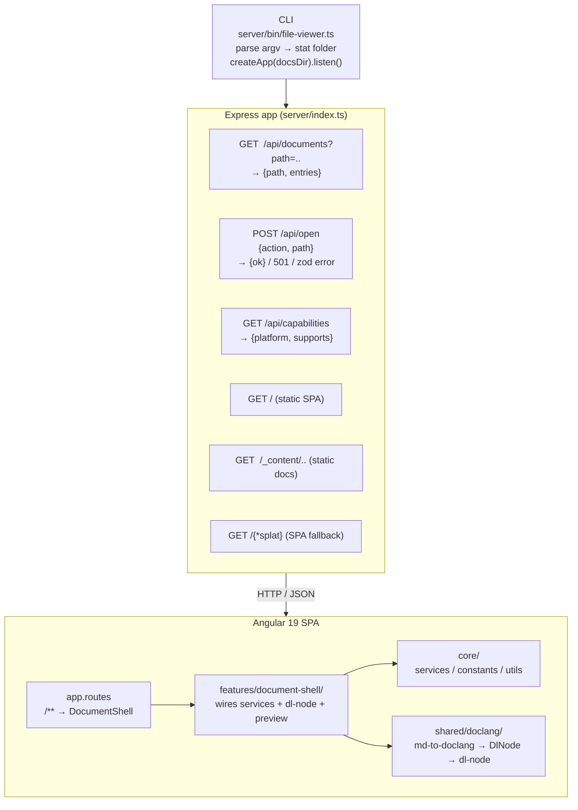

# Architecture

Grove is a monorepo with three TypeScript source roots that
compile into a single `dist/` tree. The Express server serves
both the API and the static Angular SPA; there is no separate
frontend host.

> This page is the **single-file** architecture reference. For a
> layered deep dive by topic (server, frontend, renderer, wiki
> mode, themes, security), see the
> [architecture folder](./architecture/index.md).

## At a glance

For the narrative tour, see [how-it-works](./how-it-works.md).

## Source roots

| Root | Purpose | Compiled to |
| --- | --- | --- |
| `server/` | Express app + CLI entry | `dist/server/` |
| `shared/` | Types shared with the frontend | `dist/shared/` |
| `frontend/` | Angular 19 SPA | `dist/frontend/browser` and `dist/frontend/wiki` |

The server's `tsconfig.json` has `rootDir: "."` + `outDir: "dist"`
and includes both `server/**` and `shared/**`, so both trees
compile as siblings under `dist/`. The server imports shared
types via relative paths (`../shared/types/…`) which resolve at
runtime because `dist/server/*.js` and `dist/shared/*.js` are
siblings.

The frontend imports shared types via the TS path alias
`@shared/*` → `../shared/*`, set in `frontend/tsconfig.json`.
Angular's esbuild pipeline resolves the alias at build time.
No runtime resolver is needed in the browser bundle because
`@shared/types/*` exports compile away to plain TypeScript types.
The one runtime export (`OpenRequestSchema`) is a zod schema and
is only imported by the server.

See [architecture/index#source-roots](./architecture/index.md#source-roots).

## Rendering pipeline

1. The document shell fetches markdown content from
   `_content/<path>.md` (relative URL, resolves via `<base href>`).
2. `<md-node>` wraps the raw markdown.
3. `md-to-doclang.ts` parses it with remark (GFM + math
   extensions) and converts the mdast tree to a canonical
   DocLang (`DlNode`) tree.
4. `<dl-node>` recursively renders the DocLang tree — headings,
   code blocks, tables, lists, inline formatting, images, links,
   math blocks, and mermaid diagrams.
5. URL safety (`core/utils/url-safety.ts`) is applied in both
   the conversion and the render passes; only `http(s):`,
   `mailto:`, and un-schemed (relative) URLs survive.

Full pipeline reference: [architecture/doclang](./architecture/doclang.md).

## Security notes

- Path traversal is rejected at the request validation layer
  (zod `.refine`) **and** at the filesystem layer
  (`absDir.startsWith(docsDir)`).
- External-tool invocations use `execFile` with argument
  arrays, so user input never reaches a shell. The one
  exception is the `claude` action on macOS, which drives
  Terminal.app through an AppleScript string; that string
  escapes both the backslash and quote layers and relies on the
  earlier containment check to keep it pinned inside the docs
  root.
- Markdown link / image URLs are filtered through `isSafeUrl`
  before rendering. `javascript:`, `data:`, `file:`,
  `vbscript:` etc. are rejected.
- The server only serves files inside the docs directory given
  on the command line.

Full security model: [architecture/security](./architecture/security.md).

## See also

- [How it works](./how-it-works.md) — narrative tour
- [Architecture deep dives](./architecture/index.md)
- [Reference](./reference/index.md) — CLI, HTTP API, types
- [Contributing](./contributing.md)
- [Back to docs home](./index.md)
