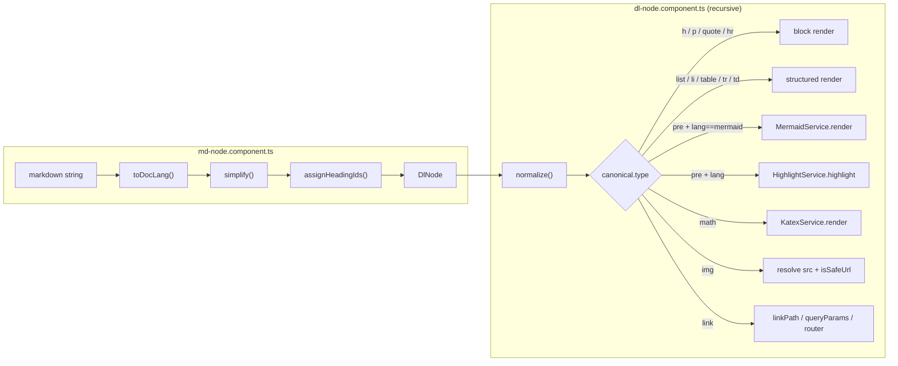
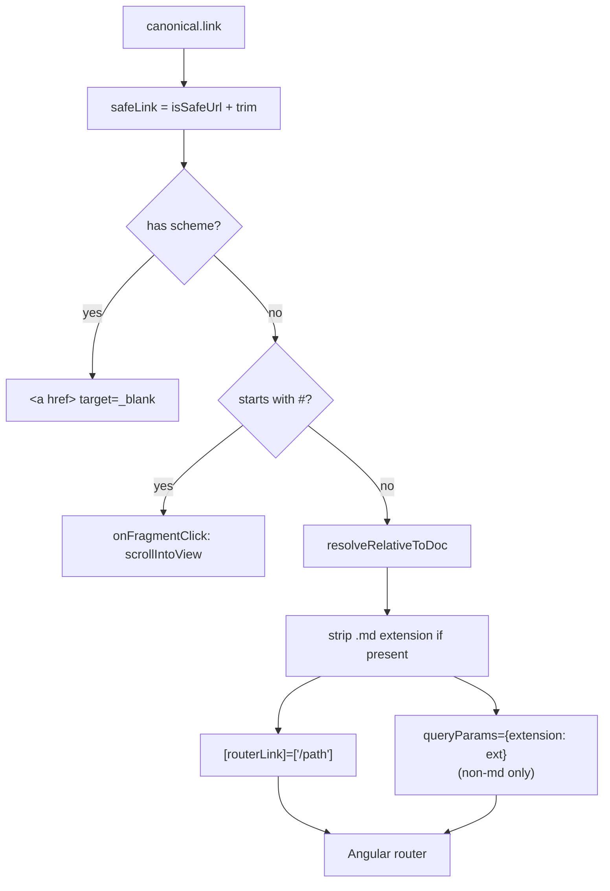

# DocLang renderer

DocLang is Grove's internal intermediate document format. Every
markdown file goes through two transforms before it reaches the
DOM:

```
markdown  ──remark──▶  mdast  ──md-to-doclang──▶  DlNode  ──dl-node──▶  DOM
```

This page explains each stage.

## Why an intermediate tree?

Server-rendering HTML from markdown works fine for a dumb viewer,
but Grove needs three things a raw-HTML pipeline cannot easily
give:

1. **Safety** — every link and image URL is filtered through
   [`isSafeUrl`](./security.md#the-url-filter) during both
   conversion and render. Unsafe schemes (`javascript:`, `data:`,
   `file:`, `vbscript:`) never make it to the DOM.
2. **Re-render without re-parse** — navigation between files
   re-renders the tree without re-hitting the parser. Syntax
   highlighting and math rendering become cache hits.
3. **Non-markdown sources** — the same renderer can consume other
   formats in the future (JSON documents, wiki syntax, etc.)
   without touching the rendering code.

See the [security model](./security.md) for the full trust story.

## Pipeline



Source files:

| Stage | File |
| --- | --- |
| Parse | [`md-to-doclang.ts`](https://github.com/MorizMensi/grove/blob/main/frontend/src/app/shared/doclang/md-to-doclang.ts) |
| Simplify | same file, `simplify()` |
| Heading IDs | [`slug.ts`](https://github.com/MorizMensi/grove/blob/main/frontend/src/app/shared/doclang/slug.ts) |
| Normalize | [`dl-normalize.ts`](https://github.com/MorizMensi/grove/blob/main/frontend/src/app/shared/doclang/dl-normalize.ts) |
| Render | [`dl-node.component.ts`](https://github.com/MorizMensi/grove/blob/main/frontend/src/app/shared/doclang/dl-node.component.ts) |
| Highlight | [`highlight.service.ts`](https://github.com/MorizMensi/grove/blob/main/frontend/src/app/shared/doclang/highlight.service.ts) |
| KaTeX | [`katex.service.ts`](https://github.com/MorizMensi/grove/blob/main/frontend/src/app/shared/doclang/katex.service.ts) |
| Mermaid | [`mermaid.service.ts`](https://github.com/MorizMensi/grove/blob/main/frontend/src/app/shared/doclang/mermaid.service.ts) |

## Stage 1 — Parse (remark)

`toDocLang()` dynamically imports `unified`, `remark-parse`,
`remark-gfm`, and `remark-math`, parses the markdown into an
mdast tree, and hands that tree to `convertMdast()`. `remark` is
loaded lazily so the module stays importable even without it.

GFM (GitHub-flavored markdown) enables tables, task lists,
strikethrough, and footnotes. Math enables `$inline$` and
`$$block$$` (via `remark-math`).

## Stage 2 — Convert (mdast → DlNode)

`convertNode()` is a flat dispatch over mdast `type`. The shape
rules:

- `root` and `paragraph` stay as wrapper nodes.
- `heading` becomes `{ type: 'h', level, children }`.
- `code` becomes `{ type: 'pre', language, children: [text] }`.
- `list` and `listItem` keep the `ordered` flag; tight list items
  get their wrapping paragraph unwrapped.
- `table`, `tableRow`, `tableCell` produce `table`/`tr`/`td` nodes
  with `header` on the first row and `align` pulled from the mdast
  `align` array.
- `image` becomes `{ type: 'img', src, alt }` — but only if
  `isSafeUrl(src)` passes. Unsafe images are dropped entirely.
- `link` becomes `{ link, children }` — but if the URL fails the
  safety filter, the children are emitted as plain inline content
  so the text survives.
- `math` (block) and `inlineMath` both become
  `{ type: 'math', text, displayMode }`.
- `html` is dropped.

See the [DlNode model](#dlnode-model) below for the full type.

## Stage 3 — Simplify

`simplify()` walks the tree once, in place, and:

- Merges adjacent text nodes that share the same formatting.
- Unwraps single-child wrappers with no own properties.
- Unwraps paragraph wrappers around a single block child (for
  example `<p></p>` → ``).
- Flattens `{ bold: true, children: [{ text: 'x' }] }` to
  `{ text: 'x', bold: true }`.

This keeps the downstream renderer trivial — it never has to
walk past empty intermediate wrappers.

## Stage 4 — Assign heading IDs

`assignHeadingIds()` uses a `SlugTracker` to produce
GitHub-compatible slugs:

1. Lowercase, spaces to hyphens, strip non-alphanumerics.
2. Collapse repeats.
3. Disambiguate duplicates with `-1`, `-2`, … suffixes.

Slugs are written onto the node as `id`. At render time they
become the `<h1>` / `<h2>` … element id, which enables fragment
navigation (`file.md#section-heading`).

## Stage 5 — Render (`<dl-node>`)

`DlNodeComponent` is a recursive Angular component. Its input is
the current `DlNode`; for every block-level type it renders a
matching element and recursively embeds `<dl-node>` for each
child. The template branches on `canonical.type` (after
normalization).

Key bits:

- **Code blocks** (`type === 'pre'`): if `language` is set,
  `HighlightService.highlight()` produces colored HTML via
  highlight.js. The registered grammar set lives in
  `highlight.service.ts` and currently covers json, ts, js, xml,
  css, bash, python, java, yaml, sql (plus aliases html/ts/js/…).
  A **Copy** button calls `navigator.clipboard.writeText()` with
  a 2-second confirmation state.
- **Mermaid** (`type === 'pre' && language === 'mermaid'`):
  `MermaidService.render()` runs mermaid off-screen and returns a
  `SafeHtml` SVG, which is injected with `[innerHTML]`. Mermaid
  is initialized with `securityLevel: 'strict'`.
- **Math** (`type === 'math'`): `KatexService.render()` returns
  KaTeX-rendered HTML, again wrapped in `SafeHtml`.
- **Images** (`type === 'img'`): relative `src` values are
  rewritten to `/_content/<resolved path>` using
  `resolveRelativeToDoc()`, which is the same resolver used for
  links (see below). External schemes pass through unchanged.

### Link resolution

Links are the most interesting case because Grove needs to turn
**relative markdown links** into Angular router navigations.
`DlNodeComponent` exposes three derived properties that the
template passes to `[routerLink]` and friends:



`resolveRelativeToDoc()` walks the current route URL, pops the
last segment (because relative links resolve against the *folder*
containing the current file, not the file itself), then joins the
raw link path and normalizes `.` / `..` segments. The result is
turned into a `routerLink` array.

For `.md` links the extension is stripped — Grove URLs do not
carry extensions. For other extensions, a `?extension=<ext>`
query param is attached so `DocumentShellComponent` can pick the
right preview widget. See
[`file-types` reference](../reference/file-types.md).

Fragment-only links (`#section`) bypass the router and directly
scroll to the target element.

## DlNode model

Source:
[`dl-node.model.ts`](https://github.com/MorizMensi/grove/blob/main/frontend/src/app/shared/doclang/dl-node.model.ts)

```ts
export type BlockType =
  | 'p' | 'h' | 'quote' | 'pre' | 'list' | 'li'
  | 'table' | 'tr' | 'td' | 'hr' | 'img' | 'bi' | 'math';

export interface DlNode {
  text?: string;
  children?: DlNode[];
  type?: BlockType;
  id?: string;

  // Inline formatting
  bold?: boolean;
  italic?: boolean;
  underline?: boolean;
  strikethrough?: boolean;
  code?: boolean;

  // Text styling
  color?: string;          // hex — validated before CSS
  background?: string;     // hex — validated before CSS
  fontSize?: FontSize;
  fontFamily?: FontFamily;
  align?: Alignment;

  // Links / media
  link?: string;
  src?: string;
  alt?: string;
  width?: number;
  height?: number;

  // Block-specific
  level?: number;          // headings
  ordered?: boolean;       // lists
  header?: boolean;        // table cells
  language?: string;       // code blocks
  displayMode?: boolean;   // math (block vs inline)
  icon?: string;           // validated against /^[a-z0-9-]+$/
}
```

The **extended** form (`DlExtendedValue`) allows bare strings and
bare arrays anywhere a node is expected. `dl-normalize.ts#normalize`
promotes every incoming value to canonical form before rendering,
so downstream code only ever deals with `DlNode` objects.

## See also

- [Security model](./security.md) — the URL filter in detail
- [Frontend layer](./frontend.md) — where `md-node` is embedded
- [Rendering pipeline in how-it-works](../how-it-works.md) — the
  narrative version
- [Back to architecture index](./overview.md)
