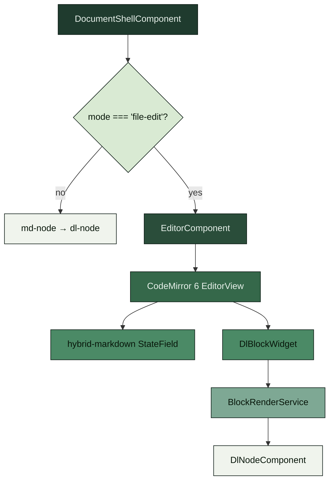

# Editor architecture

Grove's in-browser markdown editor is a **Typora-style hybrid** built
on CodeMirror 6. A single editable canvas sits in the same visual
frame as view mode; inline markdown syntax reveals only when the
caret enters its range, and block-level structures (fenced code,
tables, Mermaid, images) render through Grove's existing
`DlNodeComponent` pipeline as block widgets. There is no separate
source pane.

The editor is gated at the server by `--allow-edits`. When the flag
is absent, Grove runs exactly as it did before the editor landed: no
write routes, no pencil, no sidebar CRUD affordances.

For the design document that led to this implementation, see
[`editor-design.md`](https://github.com/MorizMensi/grove/blob/main/editor-design.md)
at the repo root.

## Why CodeMirror 6

The research phase concluded that CodeMirror 6's decoration system
is the only approach that reliably handles:

- IME composition (CJK, Korean, Thai) without dropped characters.
- macOS dictation (Fn+Fn) and system-level text replacements.
- Cross-block selection and copy/paste round-trips.
- Cross-line replace decorations (hide/reveal of inline syntax).

Obsidian Live Preview and `codemirror-rich-markdoc` validate the
same pattern in production. Monaco was rejected because its
tokenizer is per-line and cannot hide syntax across line boundaries.
The EditContext API was rejected because browser support is not
cross-compatible until 2027 at earliest.

The wrapper around `EditorView` is hand-rolled (~30 lines in
`editor.component.ts`) rather than pulling in a third-party Angular-
for-CM6 package. The dependency surface is thin enough that owning
it is cheaper than auditing a wrapper, and it lets the component
speak Angular signals directly.

## Component tree



## Source layout

```
frontend/src/app/features/editor/
├── editor.component.ts         # EditorView lifecycle, signals I/O
├── editor.component.scss
├── editor.component.spec.ts
├── save.service.ts             # PUT wrapper, mtime tracking, 409 handling
├── save.service.spec.ts
├── extensions/
│   ├── hybrid-markdown.ts      # StateField<DecorationSet>: hide/reveal
│   ├── hybrid-markdown.spec.ts
│   ├── block-widgets.ts        # Block-widget decoration producer
│   ├── block-widgets.spec.ts
│   ├── dl-block-widget.ts      # DlBlockWidget mounting DlNodeComponent
│   └── dl-block-widget.spec.ts
└── services/
    ├── block-render.service.ts # LRU cache keyed by block-source hash
    └── block-render.service.spec.ts
```

## `EditorComponent`

Standalone Angular component; OnPush change detection; owns the
`EditorView` lifecycle.

**Inputs** (signals):

- `content: string` — initial buffer. Read once at mount; subsequent
  changes are ignored (the CM view is the source of truth after
  mount).
- `path: string` — document path, used for block-widget link
  resolution.
- `mtime: number` — initial mtime, threaded through to `SaveService`.
- `theme: 'light' | 'dark'` — selects the CM theme extension.

**Outputs** (signals):

- `contentChange(content: string)` — emitted on every CM transaction
  that changes the doc.
- `dirtyChange(isDirty: boolean)` — emitted when the dirty state
  crosses a boundary (clean → dirty, dirty → clean after save).
- `save()` — emitted when the user triggers save (⌘S, toolbar
  button). The shell forwards to `SaveService`.

**Extensions loaded**:

- `defaultKeymap`, `historyKeymap`, `searchKeymap` from CM6.
- `markdown()` from `@codemirror/lang-markdown` (Lezer parser).
- `hybridMarkdown()` — Grove's custom StateField.
- `dlBlockWidgets(blockRender)` — block-widget decorations.
- `keymap.of([{ key: 'Mod-s', run: …emit save… }, { key: 'Escape', …dirty-check… }])`
- A small set of EditorView themes keyed off Grove's theme tokens.

Per the research document's macOS section, **no `Ctrl-<letter>`
shortcuts are bound on macOS** — those belong to Emacs-style text
navigation and must pass through to the native behaviour.

## Hybrid-markdown StateField

Source: `extensions/hybrid-markdown.ts`.

The heart of the Typora-style experience. A `StateField<DecorationSet>`
that rebuilds its decoration set on every transaction that changes
selection or document:

```ts
export const hybridMarkdown = StateField.define<DecorationSet>({
  create(state) { return build(state); },
  update(value, tr) {
    if (!tr.docChanged && !tr.selection) return value.map(tr.changes);
    return build(tr.state);
  },
  provide: f => [
    EditorView.decorations.from(f),
    EditorView.atomicRanges.from(f, hideRangesOnly),
  ],
});
```

The decoration builder walks the Lezer-markdown parse tree over the
visible range and produces:

- **Mark decorations** (`Decoration.mark({ class })`) — attach
  styling classes (`.dl-heading-1`, `.dl-strong`, `.dl-em`,
  `.dl-inline-code`, `.dl-link`) that reuse the existing DocLang
  CSS so inline elements look identical whether rendered in view
  mode or inside the editor.
- **Replace decorations** (`Decoration.replace({})`) — hide syntax
  characters (`**`, `_`, `` ` ``, `[`, `]`, `(url)`, leading `#`)
  whenever the caret is **not** inside their range. When the caret
  enters the containing mark, the replace decorations are dropped
  and the raw syntax appears.

Replace decorations for inline syntax are the **only** ranges
contributed to `EditorView.atomicRanges`. The outer mark ranges
(styling the full `**bold**` / `` `code` ``) are deliberately
**not** atomic — otherwise Backspace would delete the entire span
and the caret could not land inside. This was the root cause of an
early regression: contributing the whole decoration set to
`atomicRanges` broke caret placement and character-at-a-time
editing inside styled spans.

### Caret-aware reveal

The builder tests each inline mark against the current selection:

```ts
const { from: selFrom, to: selTo } = state.selection.main;
const insideMark =
  (selFrom >= markFrom && selFrom <= markTo) ||
  (selTo >= markFrom && selTo <= markTo);
if (!insideMark) {
  add replace-decoration over syntax characters
}
```

When the caret enters the mark, the replace decorations are omitted
and the syntax characters become visible and editable. Moving the
caret out triggers a transaction, which rebuilds the decoration set
and hides them again.

### Visible-range optimization

The builder is cheap but not free on large docs. A `RangeSetBuilder`
walks only the visible ranges (from `view.visibleRanges`), so
off-screen content never contributes decorations. The cost of a
transaction scales with what's on screen, not with document size.

## Block widgets

Source: `extensions/dl-block-widget.ts`, `extensions/block-widgets.ts`.

Fenced code, tables, Mermaid, and images render as block widgets:

```ts
Decoration.replace({
  widget: new DlBlockWidget({ node, path, blockRender }),
  block: true,
  inclusive: false,
})
```

`DlBlockWidget.toDOM(view)`:

1. Obtains a rendered DOM element from `BlockRenderService` (either
   from the LRU cache or freshly produced by
   `ApplicationRef.createComponent(DlNodeComponent, …)`).
2. Wraps the element in a host `<div>` with class
   `cm-dl-widget` and `aria-hidden="true"` (the widget is a visual
   representation of source that is already in the document).
3. Attaches a `mousedown` handler that dispatches
   `{ selection: { anchor: widgetStart } }` (top half of the widget)
   or `{ selection: { anchor: widgetEnd } }` (bottom half) so clicks
   land consistently.
4. Attaches a `ResizeObserver` that calls
   `view.requestMeasure()` on host resize, so CodeMirror's
   heightmap stays in sync with Mermaid's asynchronous SVG layout.

`DlBlockWidget.destroy()` returns the cached component to the LRU
cache. Frequently re-rendered blocks (e.g., the same Mermaid
diagram while typing elsewhere in the doc) get served from cache
rather than re-rendered.

### The `display: contents` incident

An early regression: clicking a line below a rendered block widget
placed the caret 5–7 lines further down than intended. Root cause:
`DlNodeComponent`'s host used `:host { display: contents }`, which
gives the host element a 0×0 box even when its rendered content
(say, a 140 px Mermaid SVG) occupies substantial vertical space.
CodeMirror's heightmap measured 0 px for the widget and fell back
to the widget's `estimatedHeight` (48 px). Every line below the
widget was located `(realHeight − estimatedHeight) / line-height ≈
5–7` lines earlier in the height map than in the actual DOM, so
`posAtCoords` resolved clicks accordingly.

The fix scopes a `:host(.cm-dl-widget) { display: block }` override
in `dl-node.component.scss` so the host becomes a real layout box
inside the editor. Additional hardening: the widget's vertical
rhythm uses `padding` rather than `margin` so margin-collapse
cannot cause the same problem.

### `BlockRenderService`

Source: `services/block-render.service.ts`.

An LRU cache keyed by a hash of the block's source string. Inputs
that produce identical output (same source, same path context) hit
the cache and return the previously rendered component. Cache size
is bounded; eviction destroys the component ref.

The cache is essential during typing: a 5-line edit to a paragraph
shouldn't re-render every Mermaid diagram below it. Without the
cache, wide-documents-with-many-diagrams had per-keystroke jank.

### Async widget rendering

`toDocLang()` is async (it runs remark parsing). Block widgets show
a min-height placeholder for a ~120 ms debounce before swapping in
the rendered DOM, which avoids flicker while typing. The placeholder
height is estimated from the block's source length so the heightmap
doesn't jump when the real content arrives.

## Math blocks

Math blocks (`$$…$$`) are **not** rendered as block widgets in v1.
Lezer-markdown has no native `$$` parser, and writing a reliable
custom node would be multiple days of work with parser-edge-case
risk. Math blocks stay as raw source while editing and render
through KaTeX on save.

Inline math (`$…$`) inside the buffer renders through the same
mark/replace flow as other inline elements — the raw `$` markers
show while the caret is inside and hide when it leaves.

## Save service

Source: `save.service.ts`.

```ts
@Injectable({ providedIn: 'root' })
export class SaveService {
  readonly mtime = signal<number | null>(null);
  readonly state = signal<SaveState>('idle'); // idle | saving | stale | error

  async save(path: string, content: string): Promise<SaveResult> { … }
  async reload(path: string): Promise<string> { … }
  async overwrite(path: string, content: string): Promise<SaveResult> { … }
}
```

**Save flow:**

1. `state = 'saving'`; disable the save button (prevents debounced
   re-clicks).
2. `PUT /api/documents?path=<path>` with
   `If-Unmodified-Since: <mtime>` and `{ content }` body.
3. On `200`: store new `mtime`, `state = 'idle'`, emit "Saved"
   through the live region.
4. On `409 stale`: `state = 'stale'`; show the
   **Reload / Overwrite / Cancel** banner. Keep the dirty flag set
   — the buffer still has unsaved work.
5. On `413 too-large`, `415 unsupported-media-type`, `400 bad-body`:
   `state = 'error'`; show a generic "Could not save" banner.
6. On `403 edits-disabled`: state transitions to `error`; realistically
   unreachable because the pencil is hidden, but covered for
   defence-in-depth.

**Reload:** Re-fetch via `GET /api/documents/raw`, replace the
buffer via a CodeMirror transaction, store the new `mtime`, clear
dirty.

**Overwrite:** Re-send the PUT without `If-Unmodified-Since`? No —
Grove sends the current on-disk `mtime` (from the 409 response) so
the server treats the overwrite as a fresh save rather than a
bypass. This keeps the security-relevant comparison intact.

## Dirty-navigation guards

### `canDeactivate` route guard

Functional guard on the document-shell route (standalone-route
convention, not a class). Intercepts in-app navigation while the
buffer is dirty and opens the confirm modal.

### `beforeunload` listener

Covers tab close and full-page refresh. Sets `returnValue` on the
event object when dirty, which triggers the browser's native
"Leave site?" confirmation. Browsers ignore the custom message
string — only the presence of `returnValue` matters.

Both paths open the same modal with focus trap, `role="dialog"`,
`aria-modal="true"`, Esc to cancel, Enter to activate the default
action (Save).

## Capabilities gating

The pencil toggle, sidebar inline `+`, and context-menu
Create/Delete items are gated on `supports.edits`. The status-bar
"auto-commit" pill is gated on `supports.gitCommit`.

UI gating is **cosmetic** — `requireEdits(allowEdits)` middleware
is the real gate. A hostile tab or browser extension that forges
requests without the capabilities check still gets `403
edits-disabled`.

## Accessibility

Every surface the editor adds ships with explicit ARIA + keyboard
support, not retrofitted:

| Surface | Contract |
| --- | --- |
| Pencil toggle | `aria-pressed`, visible "Edit"/"Done" text beside the icon, `aria-label` for icon-only viewports, Enter/Space activation. Icon swaps `bi-pencil` → `bi-pencil-fill` on activation. |
| Sidebar context menu | `role="menu"` with `role="menuitem"` children; ArrowUp/Down/Home/End navigation; Esc returns focus to the opener; Enter/Space activates. Right-click and Shift+F10 both open. Positioning avoids viewport edges. |
| Inline `+` on directory rows | Focusable via Tab, `aria-label="New file in <folder>"`, `:focus-visible` reveal so keyboard users can see the affordance even when not hovered. |
| Confirm dialog | `role="dialog"`, `aria-modal="true"`, `aria-labelledby`, `aria-describedby`; focus trap; Esc cancels; Enter activates default; focus returns to invoker on close. |
| Singleton live region | `<div aria-live="polite" aria-atomic="true">`. Announces "Saving…", "Saved", "File changed on disk", "Deleted `<name>`". Never hijacks focus. |
| New-file inline input | Standard input with `aria-label`; Enter commits, Esc cancels. `.md` is appended if the user omits the extension. |

Patterns follow the
[WAI-ARIA APG menu](https://www.w3.org/WAI/ARIA/apg/patterns/menu/),
[dialog-modal](https://www.w3.org/WAI/ARIA/apg/patterns/dialog-modal/),
and [toggle button](https://www.w3.org/WAI/ARIA/apg/patterns/button/)
specifications. Focus rings use the existing `:focus-visible`
selector; no colour-only meaning is introduced. Animations respect
`prefers-reduced-motion`.

`Alt+N` creates a new file (browsers reserve `Cmd+N`). `F2`
announces "Rename is not available yet" via the live region —
rename is deferred to a future release because useful rename
requires rewriting inbound wiki links, which is its own design
problem.

## Testing

- `hybrid-markdown.spec.ts` — fixture buffer + cursor position →
  decoration set matches snapshot. Covers every inline reveal
  pattern plus cross-line selections.
- `block-widgets.spec.ts` — produces expected block-widget ranges
  for each recognised block type.
- `dl-block-widget.spec.ts` — widget `toDOM` mounts the component,
  `destroy` returns it to the cache, click-to-caret works.
- `block-render.service.spec.ts` — LRU eviction destroys component
  refs; cache hit returns the exact previous element.
- `editor.component.spec.ts` — signal inputs/outputs, keymap
  wiring, theme swap.
- `save.service.spec.ts` — 200/409/413/415/403 handling, `mtime`
  tracking, Reload/Overwrite/Cancel flows.

Server-side editor-path tests live in
`server/documents.test.ts`, `server/git.test.ts`,
`server/fs-atomic.test.ts`, and `server/path-sandbox.test.ts`.

## Out of scope for v1

- **Rename and move** — requires inbound-link rewriting.
- **`.markdown` extension and non-markdown editing** — `.md` only.
- **Math blocks as CM6 widgets** — raw `$$…$$` in editor; KaTeX on
  save. Revisited for v1.1 once a reliable Lezer `$$` extension
  exists.
- **Image paste, drag-drop upload, in-editor image resizing, table
  UI, slash-commands** — deferred.
- **Collaborative or multi-tab editing** — out of scope; single-user
  tool.
- **Commit author override, signed commits, branching, push** —
  Grove only produces local commits; push is left to the user.
- **Full keyboard map (F2/Delete/Cmd+N), WCAG AA contrast/motion
  audit** — follow-up polish.
- **Explicit performance budget** — measured post-ship against real
  vaults.
- **Windows runtime support** — targets macOS and Linux.
- **EditContext API** — not cross-browser until ≥2027.

## See also

- [Editing guide](../guides/editing.md) — user-facing how-to
- [Server layer](./server.md) — the routes the editor calls
- [Security model](./security.md) — the gates the editor sits behind
- [Frontend layer](./frontend.md) — how the shell routes to edit mode
- [DocLang renderer](./doclang.md) — the pipeline block widgets reuse
- [editor-design.md](https://github.com/MorizMensi/grove/blob/main/editor-design.md)
  — the original design doc
- [Back to architecture index](./overview.md)
