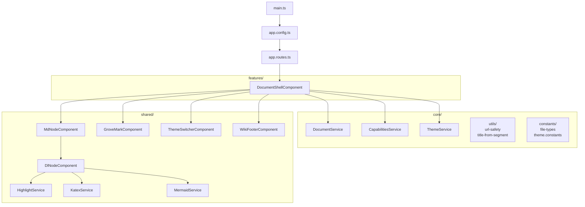
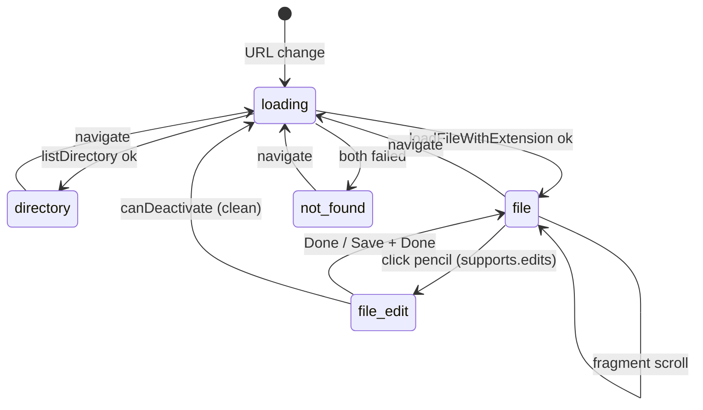
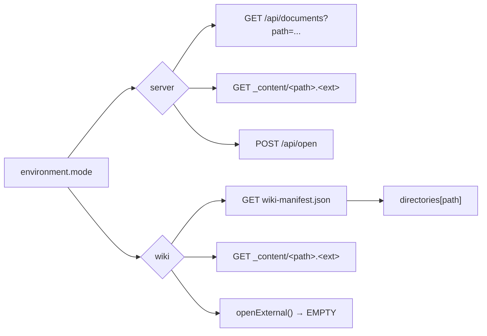

# Frontend layer

Grove's frontend is a single Angular 19 standalone application
with exactly one route and one feature component. Rendering
complexity lives in the **DocLang renderer** — see
[doclang.md](./doclang.md). Editing complexity lives in the
**editor feature** — see [editor.md](./editor.md).

## Module map



Source: [`frontend/src/app/`](https://github.com/MorizMensi/grove/tree/main/frontend/src/app)

## Routing

There is exactly one route:

```ts
// frontend/src/app/app.routes.ts
export const routes: Routes = [
  {
    path: '**',
    loadComponent: () =>
      import('./features/document-shell/document-shell.component')
        .then(m => m.DocumentShellComponent),
  },
];
```

The catch-all wildcard (`'**'`) hands every URL to
`DocumentShellComponent`, which inspects the URL segments itself
and decides what to render. This keeps the router config trivial
and lets deep links like `/architecture/server` work without any
per-page route config.

`withInMemoryScrolling({ anchorScrolling: 'enabled' })` is set in
`app.config.ts`, which enables `#fragment` scrolling when
navigating via the router. The document shell also has a manual
fragment retry (`scrollToFragment()`) for the first markdown
render, because the fragment target may not exist at the moment
the navigation completes — see
[anchor navigation](#anchor-navigation) below.

## DocumentShellComponent

File:
[`frontend/src/app/features/document-shell/document-shell.component.ts`](https://github.com/MorizMensi/grove/blob/main/frontend/src/app/features/document-shell/document-shell.component.ts)

The component is a state machine over its `mode` field:



Modes:

| Mode | Rendered | Source of truth |
| --- | --- | --- |
| `loading` | spinner | — |
| `directory` | entries list | `GET /api/documents` |
| `file` | `<md-node>` + media viewer | `GET /_content/<path>.<ext>` |
| `file-edit` | `<grove-editor>` (CodeMirror 6) | `GET /api/documents/raw` |
| `not_found` | 404 panel | — |

`file-edit` is only reachable when `supports.edits === true`. The
pencil toggle flips mode between `file` and `file-edit`, running
the dirty-check modal on the `file-edit → file` transition.

### Resolution algorithm

```mermaid
flowchart TD
  URL[URL segments joined as filePath] --> EXT{"?extension set?"}
  EXT -->|yes & not md| MEDIA[loadFileWithExtension(ext)]
  EXT -->|no or md| LIST["listDirectory(filePath)"]
  LIST -->|ok| DIR[render directory listing]
  LIST -->|error| FB[loadFileWithExtension('md')]
  FB --> KIND{"previewKindFor(ext)"}
  KIND -->|image/video/audio/pdf| MEDIA2[set mediaUrl, fileType]
  KIND -->|svg| BOTH[set mediaUrl + fetch adjacent md]
  KIND -->|null / 'text'| TEXT["getFileContent(path, ext)"]
  TEXT --> MD{"ext == md?"}
  MD -->|yes| RENDER[md-node renders markdown]
  MD -->|no| FENCE[wrap content in fenced code block]
```

The **directory-or-file** guess is deliberate:

1. First try `listDirectory(path)` — cheap and succeeds when the
   URL really is a directory.
2. On failure, assume the path is a file and fetch
   `_content/<path>.md` (or the extension from `?extension=…`).

This is why the URL for `docs/getting-started.md` is just
`/getting-started` with no extension query param.

### Media files

Non-markdown files live inside the same URL namespace; the
extension is preserved via a `?extension=<ext>` query param that
`entryQueryParams()` builds when rendering a listing. That way
the browser URL matches the file identity but the SPA still
knows which extension to render.

For PDF embedding, the URL is passed through Angular's
`DomSanitizer.bypassSecurityTrustResourceUrl` (required for
`<iframe src>`). Other media types — images, video, audio —
bind the URL directly because Angular doesn't mark them as
dangerous. See
[file-types reference](../reference/file-types.md) for the full
matrix.

### Action buttons

The header shows up to three buttons plus a status-bar pill,
gated on `capabilities().supports.*`:

| Button / UI | Gate |
| --- | --- |
| **Terminal** | `supports.terminal` (darwin only) |
| **Claude Code** | `supports.claude` (darwin only) |
| **Edit** (pencil toggle) | `supports.edits` (from `--allow-edits`) |
| **auto-commit** pill | `supports.gitCommit` (from `--git-commit`) |

The `CapabilitiesService` either:

- Calls `GET /api/capabilities` in server mode.
- Hard-codes every field to `false` in wiki mode — see
  [wiki-mode.md](./wiki-mode.md). Wiki deployments are always
  read-only.

Terminal / Claude buttons fire `POST /api/open` with
`{ action, path: <folder> }`. The pencil toggle does **not** hit
the network — it flips `DocumentShellComponent.mode` between
`file` and `file-edit`. In wiki mode every capability is false,
so the buttons never render.

> The previous Zed button was removed when the in-browser editor
> landed. `supports.zed` is no longer exposed.

## Services

### DocumentService

Source:
[`core/services/document.service.ts`](https://github.com/MorizMensi/grove/blob/main/frontend/src/app/core/services/document.service.ts)

Two runtime modes, selected via the environment file at build time:



The manifest is loaded once, cached via `shareReplay(1)`, and
reused for every listing lookup. Raw file content uses the same
relative URL (`_content/<path>.<ext>`) in both modes — see
[wiki-mode.md](./wiki-mode.md) for why.

The service also owns a `siteName` signal; in wiki mode it picks
up `manifest.siteName` when the manifest loads. `DEFAULT_SITE_NAME`
is `"Grove"` for server mode.

### CapabilitiesService

Source:
[`core/services/capabilities.service.ts`](https://github.com/MorizMensi/grove/blob/main/frontend/src/app/core/services/capabilities.service.ts)

- **Optimistic default**: hides everything platform-gated and
  the editor toggle until the HTTP call lands. Prevents a flash
  of buttons on boot.
- **Wiki default**: `{ terminal: false, claude: false, edits: false, gitCommit: false }`.
  No HTTP call made.
- **On error**: keeps the optimistic default; `POST /api/open`
  would 501 if a button shouldn't have shown, and
  `PUT/POST/DELETE /api/documents` would 403 `edits-disabled` if
  edits shouldn't have been available. The server's gates are
  still load-bearing; the capabilities call is a UI hint.

### DocumentService — write methods

Under `--allow-edits`, the service exposes:

- `getRawFile(path)` → `GET /api/documents/raw` — returns
  `{ content, mtime }`. Used when entering edit mode so the
  editor has the canonical `mtime` for the next save.
- `saveFileContent(path, content, mtime)` → `PUT /api/documents`
  with `If-Unmodified-Since`. Resolves to `{ mtime }` on 200;
  rejects with a typed error on 409 / 413 / 415 / 403 / 400.
- `createFile(path)` → `POST /api/documents?kind=file`.
- `createDirectory(path)` → `POST /api/documents?kind=dir`.
- `deleteEntry(path)` → `DELETE /api/documents`.

All write methods throw structured errors that the
`SaveService` and sidebar CRUD flows discriminate on (`stale`,
`not-found`, `exists`, `parent-missing`, `edits-disabled`,
`bad-origin`, etc.).

In wiki mode the write methods are still defined but throw
`new Error('wiki-read-only')` synchronously — no network call is
made. Wiki deployments should never reach a write method because
`supports.edits === false` hides every affordance.

### ThemeService

Source:
[`core/services/theme.service.ts`](https://github.com/MorizMensi/grove/blob/main/frontend/src/app/core/services/theme.service.ts)

Two signals — `palette` and `modeSelection` — plus a computed
`resolvedMode` signal that folds `system` into light/dark via
`prefers-color-scheme`. Writes apply `data-theme=<palette>` and
`data-mode=<light|dark>` to `<html>` and persist to
`localStorage`. See [design/themes.md](../design/themes.md) for
the palette catalog and SCSS token layout.

## Anchor navigation

Heading IDs are assigned at parse time, not at render time:

1. `md-to-doclang` converts the mdast tree to a DocLang tree.
2. `md-node.component.ts` calls `simplify(dlNode)` and then
   `assignHeadingIds(dlNode)` — the slug tracker walks the tree
   and assigns GitHub-compatible slugs (`slug.ts`).
3. `dl-node.component.ts` renders `<h1>`/`<h2>`/… with the `id`
   attribute.

Router navigation to `/some/page#anchor` triggers the Angular
`withInMemoryScrolling` logic, but the heading may not yet be in
the DOM when navigation completes (markdown is parsed
asynchronously). `DocumentShellComponent.scrollToFragment()`
retries `getElementById(fragment)` until it resolves or 2 seconds
elapse, then smooth-scrolls.

## Sidebar

Under `--allow-edits` the sidebar grows three affordances:

- **Right-click / Shift+F10 context menu** with **New file**,
  **New folder**, **Delete**. Implemented as a `role="menu"` with
  `role="menuitem"` children; ArrowUp/Down, Home/End, Esc return
  focus to the opener.
- **Inline `+` on directory rows** — focusable via Tab,
  `aria-label="New file in <folder>"`, `:focus-visible` reveal so
  keyboard users see the affordance even when not hovering.
- **Confirm-delete modal** with focus trap, `role="dialog"`, and
  `aria-modal="true"`. Esc cancels; Enter activates the default
  (Cancel) to prevent accidental deletes.

All three are hidden (not just disabled) in wiki mode and in
server mode without `--allow-edits`.

## Live region

A singleton `LiveRegionComponent` with `aria-live="polite"` and
`aria-atomic="true"` announces editor state transitions and CRUD
outcomes:

- "Saving…", "Saved", "Could not save"
- "File changed on disk" (on 409)
- "Created `<name>`", "Deleted `<name>`"
- "Rename is not available yet" (on F2)

The region never hijacks focus. It lives under
`shared/a11y/live-region.component.ts` and is provided at the
app level so every surface can inject and call it.

## See also

- [Editor architecture](./editor.md) — CodeMirror 6, StateField,
  block widgets, SaveService, dirty-navigation guards
- [DocLang renderer deep dive](./doclang.md)
- [Wiki bundle mode](./wiki-mode.md)
- [Themes](../design/themes.md)
- [Security model](./security.md) — the URL filter used during
  markdown conversion and rendering
- [HTTP API reference](../reference/http-api.md)
- [File-types reference](../reference/file-types.md)
- [Back to architecture index](./overview.md)
