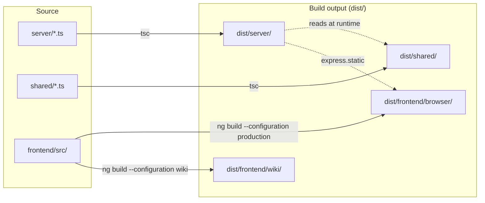

# Architecture

Deep-dive docs for Grove's internals. For a conceptual tour
written for first-time readers, start with
[how-it-works](../how-it-works.md).

## The four layers

```mermaid
flowchart TD
  CLI["CLI (server/bin/file-viewer.ts)"]:::cli
  EXP["Express app (server/index.ts)"]:::exp
  SPA["Angular SPA (frontend/src/app)"]:::spa
  DL["DocLang renderer (shared/doclang/)"]:::dl

  CLI -->|createApp(docsDir).listen(port)| EXP
  EXP -->|static SPA + /api/*| SPA
  SPA -->|raw markdown| EXP
  SPA -->|embedded| DL

  classDef cli fill:#1f3b2e,stroke:#0a1812,color:#e8f1eb;
  classDef exp fill:#2a4d3a,stroke:#0a1812,color:#e8f1eb;
  classDef spa fill:#35684a,stroke:#0a1812,color:#e8f1eb;
  classDef dl  fill:#4b8a66,stroke:#0a1812,color:#071509;
```

Each layer has its own deep-dive page:

| Layer | Page | Key source |
| --- | --- | --- |
| CLI + Express | [server.md](./server.md) | [`server/`](https://github.com/MorizMensi/grove/tree/main/server) |
| Angular SPA | [frontend.md](./frontend.md) | [`frontend/src/app/`](https://github.com/MorizMensi/grove/tree/main/frontend/src/app) |
| Renderer | [doclang.md](./doclang.md) | [`frontend/src/app/shared/doclang/`](https://github.com/MorizMensi/grove/tree/main/frontend/src/app/shared/doclang) |
| Wiki bundle mode | [wiki-mode.md](./wiki-mode.md) | [`server/wiki/`](https://github.com/MorizMensi/grove/tree/main/server/wiki) |

Cross-cutting:

- **Theming** — moved to [../design/themes.md](../design/themes.md). The design system has its own section; start at [design/overview.md](../design/overview.md).
- [security.md](./security.md) — trust boundaries and the URL filter

## Source roots



| Root | Purpose | Compiled to |
| --- | --- | --- |
| `server/` | Express app + CLI entry | `dist/server/` |
| `shared/` | Types shared with frontend | `dist/shared/` |
| `frontend/` | Angular 19 SPA | `dist/frontend/browser` (server mode) and `dist/frontend/wiki` (wiki mode) |

The server's `tsconfig.json` has `rootDir: "."` + `outDir: "dist"`
and includes both `server/**` and `shared/**`, so both trees compile
as siblings under `dist/`. The server imports shared types via
relative paths (`../shared/types/…`) which resolve at runtime because
`dist/server/*.js` and `dist/shared/*.js` are siblings.

The frontend imports shared types via the TS path alias
`@shared/*` → `../shared/*`, set in `frontend/tsconfig.json`. Angular's
esbuild pipeline resolves the alias at build time.

## See also

- [Rendering pipeline](../how-it-works.md#the-four-layers) — the same
  flow from a narrative angle
- [CLI reference](../reference/cli.md)
- [HTTP API reference](../reference/http-api.md)
- [Shared types reference](../reference/types.md)
- [Back to docs home](../overview.md)
