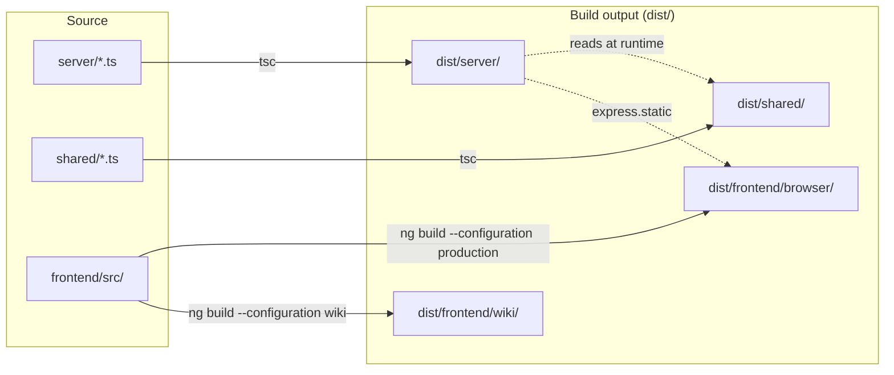
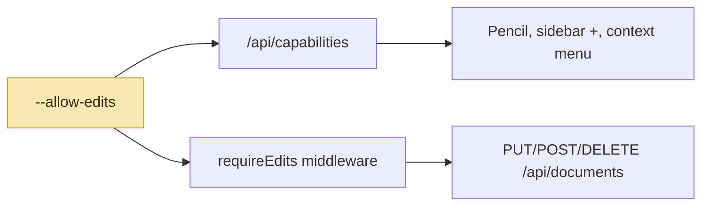

# Architecture

Deep-dive docs for Grove's internals. For a conceptual tour
written for first-time readers, start with
[how-it-works](../how-it-works.md).

## The five layers

```mermaid
flowchart TD
  CLI["CLI (server/bin/file-viewer.ts)"]:::cli
  EXP["Express app (server/index.ts)"]:::exp
  SPA["Angular SPA (frontend/src/app)"]:::spa
  DL["DocLang renderer (shared/doclang/)"]:::dl
  ED["Editor (CodeMirror 6 + StateField)"]:::ed

  CLI -->|createApp(docsDir, flags).listen(port)| EXP
  EXP -->|static SPA + /api/*| SPA
  SPA -->|raw markdown / writes| EXP
  SPA -->|embedded| DL
  SPA -->|edit mode| ED
  ED -->|block widgets| DL

  classDef cli fill:#1f3b2e,stroke:#0a1812,color:#e8f1eb;
  classDef exp fill:#2a4d3a,stroke:#0a1812,color:#e8f1eb;
  classDef spa fill:#35684a,stroke:#0a1812,color:#e8f1eb;
  classDef dl  fill:#4b8a66,stroke:#0a1812,color:#071509;
  classDef ed  fill:#7ea894,stroke:#0a1812,color:#071509;
```

Each layer has its own deep-dive page:

| Layer | Page | Key source |
| --- | --- | --- |
| CLI + Express | [server.md](./server.md) | [`server/`](https://github.com/MorizMensi/grove/tree/main/server) |
| Angular SPA | [frontend.md](./frontend.md) | [`frontend/src/app/`](https://github.com/MorizMensi/grove/tree/main/frontend/src/app) |
| Renderer | [doclang.md](./doclang.md) | [`frontend/src/app/shared/doclang/`](https://github.com/MorizMensi/grove/tree/main/frontend/src/app/shared/doclang) |
| Editor | [editor.md](./editor.md) | [`frontend/src/app/features/editor/`](https://github.com/MorizMensi/grove/tree/main/frontend/src/app/features/editor) |
| Wiki bundle mode | [wiki-mode.md](./wiki-mode.md) | [`server/wiki/`](https://github.com/MorizMensi/grove/tree/main/server/wiki) |

Cross-cutting:

- **[Security model](./security.md)** — trust boundaries, the URL
  filter, path containment, write-route middleware, atomic writes,
  and the CSP story for HTML previews.
- **Theming** — moved to [../design/themes.md](../design/themes.md).
  The design system has its own section; start at
  [design/overview.md](../design/overview.md).

## Source roots



| Root | Purpose | Compiled to |
| --- | --- | --- |
| `server/` | Express app + CLI entry + editor-backing routes | `dist/server/` |
| `shared/` | Types shared with frontend (documents, open, content-url) | `dist/shared/` |
| `frontend/` | Angular 19 SPA with CodeMirror 6 editor | `dist/frontend/browser` (server mode) and `dist/frontend/wiki` (wiki mode) |

The server's `tsconfig.json` has `rootDir: "."` + `outDir: "dist"`
and includes both `server/**` and `shared/**`, so both trees compile
as siblings under `dist/`. The server imports shared types via
relative paths (`../shared/types/…`) which resolve at runtime because
`dist/server/*.js` and `dist/shared/*.js` are siblings.

The frontend imports shared types via the TS path alias
`@shared/*` → `../shared/*`, set in `frontend/tsconfig.json`. Angular's
esbuild pipeline resolves the alias at build time.

## Server-side module inventory

```
server/
├── bin/file-viewer.ts      # CLI entry + flag parsing
├── index.ts                # createApp() — wires everything
├── documents.ts            # GET/PUT/POST/DELETE /api/documents + /raw
├── capabilities.ts         # GET /api/capabilities
├── open.ts                 # POST /api/open
├── path-sandbox.ts         # ensureInside() — realpath containment
├── edits-middleware.ts     # requireEdits + csrfOrigin
├── fs-atomic.ts            # atomicWrite() — tmp+rename
├── git.ts                  # commitChange, validateGitRepo
├── security-options.ts     # --disable-security parsing
└── wiki/
    ├── build.ts            # grove build-wiki implementation
    └── manifest.ts         # directory walk → wiki-manifest.json
```

Every module has a sibling `*.test.ts`. See
[server.md#testing](./server.md#testing) for the test matrix.

## Frontend module inventory

```
frontend/src/app/
├── features/
│   ├── document-shell/          # the only route component
│   ├── editor/
│   │   ├── editor.component.ts  # CodeMirror 6 EditorView host
│   │   ├── save.service.ts      # PUT wrapper, mtime tracking
│   │   ├── extensions/          # hybrid-markdown, block-widgets
│   │   └── services/            # block-render (LRU cache)
│   └── sidebar/                 # tree + context menu + inline +
├── shared/
│   ├── doclang/                 # md → DocLang → DOM pipeline
│   ├── a11y/                    # live region, focus trap
│   └── ui/                      # modal, toast, icon
└── core/
    ├── services/                # DocumentService, CapabilitiesService, ThemeService
    ├── utils/                   # url-safety, slugger, classes
    └── models/                  # type-only re-exports from @shared
```

## Editor gate



`--allow-edits` is read at CLI boot and threaded through
`createApp` to two places:

1. **`capabilitiesRouter`** — reports `supports.edits` so the SPA
   can show/hide UI affordances.
2. **`requireEdits` middleware** — the actual gate. Returns
   `403 edits-disabled` on every write verb when the flag is off.

UI hiding is cosmetic. A hostile tab that knows Grove is running on
`localhost:3000` cannot flip the flag from the browser.

## Build output

`dist/` after `npm run build:all`:

```
dist/
├── server/
│   ├── bin/file-viewer.js      # `grove` binary entry point
│   ├── index.js
│   ├── documents.js
│   ├── open.js
│   ├── capabilities.js
│   ├── path-sandbox.js
│   ├── edits-middleware.js
│   ├── fs-atomic.js
│   ├── git.js
│   ├── security-options.js
│   └── wiki/build.js
├── shared/
│   ├── types/documents.js
│   ├── types/open.js
│   └── content-url.js
└── frontend/
    ├── browser/                # server-mode SPA
    │   ├── index.html
    │   ├── main-*.js
    │   └── …
    └── wiki/                   # wiki-mode SPA
        ├── index.html          # with __GROVE_BASE__ placeholder
        └── …
```

The npm `bin` entry maps `grove` → `dist/server/bin/file-viewer.js`.
Note: **do not** prefix with `./` — `normalize-package-data`
silently strips bin entries with a leading `./`, leaving the
published tarball with no bin.

## See also

- [Rendering pipeline](../how-it-works.md#the-four-layers) — the
  same flow from a narrative angle
- [CLI reference](../reference/cli.md)
- [HTTP API reference](../reference/http-api.md)
- [Shared types reference](../reference/types.md)
- [Back to docs home](../overview.md)
