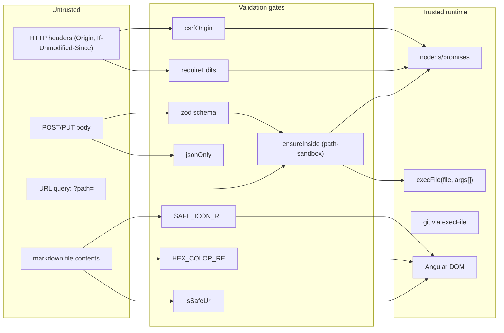
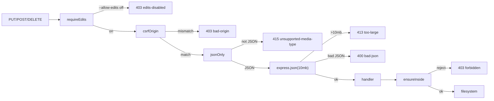

# Security model

Grove is designed to serve **local, trusted** content to a single user
on localhost. That threat model is modest — but Grove still enforces
strict trust boundaries so that hostile markdown cannot escape the
renderer, hostile URLs cannot escape the docs folder, and hostile web
tabs cannot drive writes behind the user's back.

## Threat model

| In-scope | Out-of-scope |
| --- | --- |
| A hostile web page trying to `fetch()` or submit forms to `localhost:3000` to read or modify docs. | A local attacker with shell access, or malware already running as the user. |
| A hostile markdown file trying to escape the renderer (XSS, exfil, script injection). | Physical access to the machine. |
| A hostile symlink inside `docsDir` pointing outside it. | A user who intentionally symlinks their docs root to `/etc`. |
| A hostile URL in a link or image (`javascript:`, `data:`, `file:`). | Traffic interception on localhost. |
| Path-traversal via `?path=../../etc/passwd`. | DoS from a local user pointing Grove at `/`. |
| CSRF from a known-origin page (knowing `localhost:3000` exists). | Remote exploitation — Grove does not listen on 0.0.0.0 by default. |

Grove is **not** a multi-user service. Treat it as a CLI tool with a
web UI rather than as a web application.

## Trust boundaries



## Path containment (`ensureInside`)

Source:
[`server/path-sandbox.ts`](https://github.com/MorizMensi/grove/blob/main/server/path-sandbox.ts)

Every user-supplied path flows through `ensureInside(docsDir, userPath)`
before any filesystem call. The check has **two layers**:

1. **Lexical containment.** `resolve(docsDir, userPath)` collapses
   `..` segments at the string level. If the result is not `docsDir`
   itself and does not start with `docsDir + sep`, the request is
   rejected. This catches both `..` traversal and the sibling-prefix
   bypass (`docsDir="/tmp/foo"` vs `/tmp/foobar`) without hitting the
   filesystem.

2. **Realpath containment.** `realpath(resolved)` resolves symlinks.
   The resulting path must also be inside `realpath(docsDir)`. This
   closes the case where the addressed path is inside `docsDir` but
   resolves (via symlinks within `docsDir`) to a target outside it.

Both checks run by default. `--disable-security allow-symlinks`
retains the lexical check and **skips** the realpath check.

NUL bytes (`\0`) in the input are rejected outright — some
filesystems truncate at a NUL, so a name like `../etc/passwd\0.md`
could otherwise bypass an extension allow-list.

The returned path is the **realpath** (or the symlink-resolved
parent + basename for `allowMissing` flows). Callers use it for
every subsequent `fs` call to avoid TOCTOU: if a symlink were
swapped in between `ensureInside` and the `readFile`, the realpath
we already resolved would still point at the original target.

### `allowMissing`

Create flows set `allowMissing: true` so a target path pointing at a
non-existent file doesn't fail containment. In that mode,
`realpath` is applied to the **parent** directory, and the basename
is re-joined:

```ts
const parent = await realpath(dirname(resolved));
real = join(parent, basename(resolved));
```

A missing parent still fails — `dirname(resolved)` has to exist and
resolve inside `docsDir`.

### `allowSymlinks` (`--disable-security allow-symlinks`)

Skips only the realpath containment check. The *addressed* path
still has to sit inside `docsDir` lexically. Symlinks inside
`docsDir` whose targets live outside `docsDir` will resolve to
their targets — the realpath may point anywhere.

Use when Grove is pointed at a directory that intentionally
symlinks into sibling repos (monorepo vendor dirs, workspace
mirrors). The escape hatch is per-flag rather than a blanket
"disable security" because future escape hatches will have to
justify their own name.

### Regression coverage

`server/path-sandbox.test.ts` covers:

- `..` traversal → `forbidden`
- Absolute paths starting with `/` → `forbidden` unless they equal
  `docsDir` (root).
- NUL in input → `forbidden`.
- Symlink from inside `docsDir` to `/etc/passwd` → `forbidden`
  without the flag, resolves with `allowSymlinks`.
- Sibling-prefix bypass (`docsDir="/tmp/foo"` → `/tmp/foobar`) →
  `forbidden`.
- `allowMissing` on a path whose parent exists → resolves.
- `allowMissing` on a path whose parent is missing → `forbidden`.

## Write-route middleware



Source:
[`server/edits-middleware.ts`](https://github.com/MorizMensi/grove/blob/main/server/edits-middleware.ts),
[`server/documents.ts`](https://github.com/MorizMensi/grove/blob/main/server/documents.ts)

### `requireEdits(allowEdits)`

Short-circuits every state-changing request with
`403 edits-disabled` when `--allow-edits` is off. This is the
**real** gate — the UI pencil and sidebar affordances are only
cosmetic. A hostile tab that knows Grove is on `localhost:3000`
cannot flip the flag from the browser.

### `csrfOrigin`

Compares `req.headers.origin` host:port to `req.headers.host` on
every state-changing verb. Missing or unparseable Origin is
treated as a mismatch and returns `403 bad-origin`.

This blocks drive-by writes from malicious pages that know Grove
is running on a predictable localhost port. The sandboxed
`/_content/` iframe and the strict CSP (see below) prevent an
attacker from hijacking Grove's own origin.

No cookies, no sessions — the Origin/Host equality check **is** the
CSRF story. Localhost-grade, but appropriate for the threat model.

### `jsonOnly`

Runs before `express.json()` and rejects any request whose
`Content-Type` is not `application/json` with 415. Without this
middleware, `express.json` silently leaves `req.body = {}` for
non-JSON bodies — a handler checking for a JSON shape would then
see "missing field" errors instead of a clear type error.

### Per-route body parser

There is no app-level `express.json()`. Each write route declares
its own:

- `PUT /api/documents` — 10 MB JSON limit.
- `POST /api/open` — default 100 KB JSON limit.
- `POST`/`DELETE /api/documents` — no body parser (create and
  delete are path-only).

Size-cap policy is visible at the route definition rather than
buried in app setup. `jsonErrorHandler` normalizes
`entity.too.large` to `413 too-large` and `entity.parse.failed` to
`400 bad-json` — without it, Express would send an HTML stack
trace.

## Atomic writes

Source:
[`server/fs-atomic.ts`](https://github.com/MorizMensi/grove/blob/main/server/fs-atomic.ts)

`PUT /api/documents` never overwrites the target file in place.
Instead:

```ts
const tmp = `${absPath}.grove-${randomSuffix()}.tmp`;
await fs.writeFile(tmp, content, { encoding: 'utf8', flag: 'wx' });
await fs.rename(tmp, absPath);   // atomic on same filesystem
```

A `finally` block unlinks `tmp` if any step fails. A crash
mid-write therefore leaves the original file untouched:

- `writeFile` with `flag: 'wx'` fails if the tmp file already
  exists (random suffix makes collisions unlikely).
- `rename` is atomic on every POSIX filesystem Grove runs on (HFS+,
  APFS, ext4, btrfs, xfs). The target's old inode is replaced
  atomically; readers see either the old or the new bytes, never a
  partial write.
- The `.tmp` suffix can briefly appear in `git status` during a
  slow write on a slow FS — an acceptable race for a local tool.

## Conflict detection (`If-Unmodified-Since`)

Grove's conflict-detection story is explicit save with optimistic
locking. The client:

1. `GET /api/documents/raw` — receives `{ content, mtime }`.
2. Edits in-browser.
3. `PUT /api/documents` — sends `If-Unmodified-Since: <mtime>`.
4. Server stats the file and compares the client's `mtime` to the
   current `mtimeMs`. Difference → `409 stale, mtime`.

The comparison runs at **second precision**:

```ts
const currentSec  = Math.floor(currentMs / 1000);
const expectedSec = Math.floor(expectedMs / 1000);
if (currentSec > expectedSec) reject();
```

HTTP dates have only second granularity. Comparing a parsed
HTTP-date back against `mtimeMs` (fractional ms) would spuriously
trip within the same second of a save. The server accepts
`If-Unmodified-Since` as either a decimal ms value or an HTTP date;
either parses to a ms value for the comparison.

There is a 1-second race window where two writers saving in the
same second could clobber each other. That's acceptable for a
single-user local wiki — collaborative editing is explicitly
out-of-scope.

## Git auto-commit

Source:
[`server/git.ts`](https://github.com/MorizMensi/grove/blob/main/server/git.ts)

When `--git-commit` is on, every successful write emits one commit
scoped to the changed file:

```
git -C <docsDir> add -- <rel>
git -C <docsDir> commit -m "grove: <verb> <rel>" --only -- <rel>
```

Security-relevant properties:

- `execFile('git', [...args])`, never `exec`. No shell, no string
  interpolation of user paths.
- `GIT_TERMINAL_PROMPT=0` is set on every invocation. A
  misconfigured credential helper cannot wedge the server by
  popping an interactive prompt.
- `--only -- <rel>` restricts the commit to the changed file —
  uncommitted changes elsewhere in the repo are not swept in.
- "Nothing to commit" exit codes are swallowed; any other git
  failure returns `500 git-failed` *after* the disk write
  succeeded. Rolling back on git failure was considered and
  rejected — a visible warning is safer than an inconsistent
  on-disk state.
- Startup validates `git rev-parse --is-inside-work-tree` plus
  `user.name` and `user.email` so the flag never silently no-ops.

## The URL filter (`isSafeUrl`)

Source:
[`frontend/src/app/core/utils/url-safety.ts`](https://github.com/MorizMensi/grove/blob/main/frontend/src/app/core/utils/url-safety.ts)

```ts
export const ALLOWED_SCHEME_RE = /^(https?:\/\/|mailto:)/i;
export const HAS_SCHEME_RE     = /^[a-zA-Z][a-zA-Z0-9+.-]*:/;
export const CONTROL_CHAR_RE   = /[\x00-\x1f\x7f]/;

export function isSafeUrl(url: string): boolean {
  const trimmed = url.trim();
  if (!trimmed || CONTROL_CHAR_RE.test(trimmed)) return false;
  if (HAS_SCHEME_RE.test(trimmed)) return ALLOWED_SCHEME_RE.test(trimmed);
  return true;
}
```

Decision table:

| Input | Outcome |
| --- | --- |
| `https://example.com` | allowed |
| `http://localhost` | allowed |
| `mailto:hi@example.com` | allowed |
| `./other.md` (relative) | allowed (no scheme) |
| `#section` (fragment) | allowed |
| `javascript:alert(1)` | rejected (scheme, not in allow list) |
| `data:text/html,…` | rejected |
| `file:///etc/passwd` | rejected |
| `vbscript:…` | rejected |
| `http://ex\x00.com` | rejected (control char) |
| `  ` (whitespace) | rejected (empty after trim) |

The filter is called in four places:

1. `md-to-doclang.ts#imageNode` — before producing `{ type: 'img', src }`.
   Unsafe images are **dropped**.
2. `md-to-doclang.ts#linkNode` — before producing `{ link, children }`.
   Unsafe links are emitted as **plain text** so the label survives.
3. `dl-node.component.ts#safeLink` getter — rendering pass, second
   enforcement.
4. `dl-node.component.ts#safeSrc` getter — rendering pass, before
   rewriting a relative src to the `_content` URL.

Double enforcement is deliberate: the converter runs once per
load, the renderer runs on every change detection pass, and a
regression in either one should not silently open the door.

## CSS value filtering

Every style value written via `[ngStyle]` is regex-validated:

- `HEX_COLOR_RE` — matches `#rgb`, `#rrggbb`, `#rrggbbaa`.
- `SAFE_ICON_RE` — `/^[a-z0-9-]+$/` for Bootstrap Icons class
  suffixes.
- `FONT_FAMILY_MAP` — a constant allow-list of font family names.

No arbitrary strings flow into CSS.

## Iframe sandbox (`/_content/` HTML previews)

Source:
[`server/index.ts`](https://github.com/MorizMensi/grove/blob/main/server/index.ts),
[`scripts/check-sandbox-invariant.mjs`](https://github.com/MorizMensi/grove/blob/main/scripts/check-sandbox-invariant.mjs)

HTML and SVG responses from `/_content/` ship with:

```
Content-Security-Policy: sandbox allow-same-origin; script-src 'none'; object-src 'none'; base-uri 'none'
X-Content-Type-Options: nosniff
```

The `allow-same-origin` token is **load-bearing**: without it the
browser forces the response into an opaque origin, which blocks the
parent frame from reading `iframe.contentDocument` and injecting
theme CSS variables. Previews then rendered with unthemed colours.

Scripts are blocked by **two** independent mechanisms:

1. `script-src 'none'` in the CSP.
2. The **absence** of `allow-scripts` in both the iframe `sandbox`
   attribute and the CSP sandbox directive.

The iframe invariant (`allow-same-origin`, never `allow-scripts`)
is enforced at prepublish by `scripts/check-sandbox-invariant.mjs`
— a static scan over the frontend source tree. Adding
`allow-scripts` anywhere fails `npm publish`.

## Dotfile deny

`/_content/` is mounted with:

```ts
express.static(docsDir, {
  redirect: false,
  dotfiles: 'deny',     // 403 on .env, .git/config, etc.
  fallthrough: false,   // don't fall back to SPA catch-all on 403
})
```

`fallthrough: false` is critical: without it, Express calls `next()`
on the 403, which the Angular catch-all then answers with
`index.html` — turning the 403 into a 200 serving the SPA. With the
flag, the 403 is surfaced to the error handler.

## External tools

`server/open.ts#buildExec` returns a `[file, args]` pair per
action:

| Action | Platform | Command |
| --- | --- | --- |
| `terminal` | darwin | `open -a Terminal <absDir>` |
| `claude` | darwin | `osascript -e 'tell application "Terminal" to do script "cd \"<absDir>\" && claude"'` |

The `claude` action is the only one that builds a command string,
because AppleScript has no other way to drive Terminal.app. The
path is double-escaped:

```ts
const escapedForAppleScript = absDir
  .replace(/\\/g, '\\\\')
  .replace(/"/g, '\\"');
```

Backslashes stay as backslashes in the AppleScript string literal;
double quotes are escaped so the enclosing quotes don't terminate
early. The AppleScript string is then wrapped in a shell string in
the `do script` payload, which is also fenced in escaped double
quotes. The `ensureInside` check is still the load-bearing safety —
the escaping just prevents an accidental string-injection that
would change *which* directory is targeted.

### Zed was removed

The previous `zed` action invoked a user-configurable Zed binary
via `ZED_BIN` and a short fallback list. The in-browser editor
replaced Zed as the pencil-toolbar destination. `zed` was removed
entirely — from `OpenAction`, `shared/types/open.ts`,
`server/open.ts`, `server/capabilities.ts`, and all frontend
references. Keeping Zed alive added a child-process attack surface
(binary path resolution, spawning user-controlled executables)
with no remaining use case.

## Frontend rendering

Grove uses Angular's built-in sanitization everywhere except three
clearly-marked escape hatches:

1. **Highlight.js output** — `[innerHTML]` binding. Safe because
   highlight.js emits a fixed grammar of `<span class="hljs-…">`
   tags; there is no user-controlled tag structure.
2. **KaTeX output** —
   `DomSanitizer.bypassSecurityTrustHtml(katex.renderToString(…))`.
   KaTeX has no script / event-handler output by design.
3. **Mermaid output** —
   `DomSanitizer.bypassSecurityTrustHtml(mermaidSvg)` with
   `securityLevel: 'strict'` set on the mermaid init call. Strict
   mode disables `click` handlers and HTML injection inside
   diagrams.

PDF previews use `bypassSecurityTrustResourceUrl` on the
`_content` URL, which is required because Angular treats
`<iframe src>` as a dangerous resource URL. The URL is local and
validated by the server-side path containment — not arbitrary.

## Editor widget mounts

The CodeMirror editor's block widgets mount `DlNodeComponent`
instances via `ApplicationRef.createComponent`. Each widget:

- Passes a `DlNode` already produced by the existing `toDocLang()`
  pipeline — the same pipeline view mode uses, so every safety
  check (URL filter, CSS validation, sanitization escape hatches)
  applies identically.
- Mounts into a dedicated host element that CodeMirror controls. A
  `destroy()` call tears the component down when the widget leaves
  the visible range.
- Responds to `mousedown` by moving the caret into the widget's
  source range (top half) or past it (bottom half), so user
  interaction stays inside the buffer — no escape path into DOM
  event handlers the document could otherwise install.

No additional sanitization is needed in the editor path because
the rendering pipeline is identical to view mode.

## Error leakage

Every response body is a `{ error: <code> }` object — clients match
on a small, enumerated vocabulary. Stack traces, absolute paths,
and raw Node errors never reach the client. The one exception is
`POST /api/open` 500 responses, which include the raw
`execFile` error message to help users distinguish "command not
found" from "no such directory" — these errors are about the
server's own environment, not about user-supplied content, so
they leak no information a user doesn't already have.

## See also

- [HTTP API reference](../reference/http-api.md)
- [Environment variables](../reference/environment.md)
- [Shared types reference](../reference/types.md)
- [Server layer](./server.md)
- [Editor architecture](./editor.md)
- [DocLang renderer](./doclang.md)
- [Back to architecture index](./overview.md)
