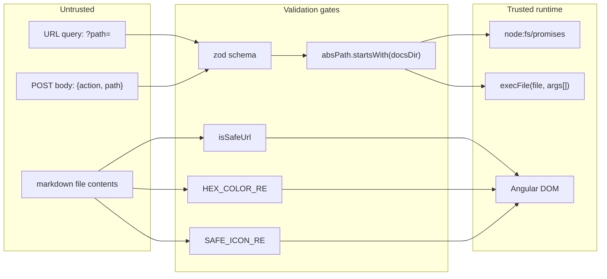

# Security model

Grove is designed to serve **local, trusted** content, but it
still enforces strict trust boundaries so that hostile markdown
can't escape the renderer and hostile URLs can't escape the
docs folder.

## Trust boundaries



The rules:

- **Every filesystem path** is validated at two layers: request
  validation (zod on the body, query-string check on
  `/api/documents`) **and** the filesystem layer
  (`resolve(docsDir, relPath).startsWith(docsDir)`). The zod
  `.refine` cannot cover all symlink / resolved-path edge cases,
  so the containment check is always redundant — on purpose.
- **Every external-tool invocation** uses
  [`execFile`](https://nodejs.org/api/child_process.html#child_processexecfilefile-args-options-callback)
  with an **argument array**. No command string ever reaches a
  shell. The one exception is `claude` on macOS, see
  [below](#external-tools).
- **Every markdown link and image URL** passes through
  `isSafeUrl` during both the mdast → DocLang conversion and the
  DOM render. Unsafe schemes are rejected.
- **Every CSS value** written via `[ngStyle]` is regex-validated:
  `HEX_COLOR_RE` for colors, `SAFE_ICON_RE` (`/^[a-z0-9-]+$/`)
  for icon class suffixes, and the `FONT_FAMILY_MAP` constant for
  font family names. No arbitrary strings flow into CSS.

## The URL filter

Source:
[`frontend/src/app/core/utils/url-safety.ts`](https://github.com/MorizMensi/grove/blob/main/frontend/src/app/core/utils/url-safety.ts)

```ts
export const ALLOWED_SCHEME_RE = /^(https?:\/\/|mailto:)/i;
export const HAS_SCHEME_RE     = /^[a-zA-Z][a-zA-Z0-9+.-]*:/;
export const CONTROL_CHAR_RE   = /[\x00-\x1f\x7f]/;

export function isSafeUrl(url: string): boolean {
  const trimmed = url.trim();
  if (!trimmed || CONTROL_CHAR_RE.test(trimmed)) return false;
  if (HAS_SCHEME_RE.test(trimmed)) return ALLOWED_SCHEME_RE.test(trimmed);
  return true;
}
```

Decision table:

| Input | Outcome |
| --- | --- |
| `https://example.com` | ✅ allowed |
| `http://localhost` | ✅ allowed |
| `mailto:hi@example.com` | ✅ allowed |
| `./other.md` (relative) | ✅ allowed (no scheme) |
| `#section` (fragment) | ✅ allowed |
| `javascript:alert(1)` | ❌ rejected (scheme, not in allow list) |
| `data:text/html,…` | ❌ rejected |
| `file:///etc/passwd` | ❌ rejected |
| `vbscript:…` | ❌ rejected |
| `http://ex\x00.com` | ❌ rejected (control char) |
| `  ` (whitespace) | ❌ rejected (empty after trim) |

The filter is called in four places:

1. `md-to-doclang.ts#imageNode` — before producing `{ type: 'img', src }`.
   Unsafe images are **dropped**.
2. `md-to-doclang.ts#linkNode` — before producing `{ link, children }`.
   Unsafe links are emitted as **plain text** so the label survives.
3. `dl-node.component.ts#safeLink` getter — rendering pass, second
   enforcement.
4. `dl-node.component.ts#safeSrc` getter — rendering pass, before
   rewriting a relative src to the `_content` URL.

Double enforcement is deliberate: the converter runs once per
load, the renderer runs on every change detection pass, and a
regression in either one should not silently open the door.

## Path containment

Both `/api/documents` and `/api/open` do the same dance:

```ts
if (relPath.includes('..') || relPath.startsWith('/')) { reject(); }
const absPath = relPath ? resolve(docsDir, relPath) : docsDir;
if (!absPath.startsWith(docsDir)) { reject(); }
```

`/api/open` adds a zod `.refine` that repeats the string-level
check before it even hits the router body. See
[`shared/types/open.ts`](https://github.com/MorizMensi/grove/blob/main/shared/types/open.ts).

Symlinks outside the docs root **are** followed by
`express.static` at `/_content/`, since `readFile` walks the
resolved real path. If you care about that (you probably don't,
since this is a local wiki server), serve only a folder you own
end-to-end.

## External tools

All three actions go through
[`server/open.ts#buildExec`](https://github.com/MorizMensi/grove/blob/main/server/open.ts),
which returns a `[file, args]` pair:

| Action | Platform | Command |
| --- | --- | --- |
| `terminal` | darwin | `open -a Terminal <absDir>` |
| `zed` | any | resolved binary, `<absDir>` appended |
| `claude` | darwin | `osascript -e 'tell application "Terminal" to do script "cd \"<absDir>\" && claude"'` |

The `claude` action is the only one that builds a command string,
because AppleScript has no other way to drive Terminal.app. The
path is double-escaped:

```ts
const escapedForAppleScript = absDir
  .replace(/\\/g, '\\\\')
  .replace(/"/g, '\\"');
```

This escapes backslashes (so they stay as backslashes in the
AppleScript string literal) and double quotes (so the enclosing
quotes don't terminate early). The AppleScript string is then
wrapped in a shell string in the `do script` payload, which is
also fenced in escaped double quotes. The containment check from
step 2 is still the load-bearing safety — the escaping just
prevents an accidental string-injection that would change *which*
directory is targeted.

## Frontend rendering

Grove uses Angular's built-in sanitization everywhere except
three clearly-marked escape hatches:

1. **Highlight.js output** — `[innerHTML]` binding. Safe because
   highlight.js emits a fixed grammar of `<span class="hljs-…">`
   tags; there is no user-controlled tag structure.
2. **KaTeX output** —
   `DomSanitizer.bypassSecurityTrustHtml(katex.renderToString(…))`.
   KaTeX has no script / event-handler output by design.
3. **Mermaid output** —
   `DomSanitizer.bypassSecurityTrustHtml(mermaidSvg)` with
   `securityLevel: 'strict'` set on the mermaid init call. Strict
   mode disables `click` handlers and HTML injection inside
   diagrams.

PDF previews use `bypassSecurityTrustResourceUrl` on the
`_content` URL, which is required because Angular treats
`<iframe src>` as a dangerous resource URL. The URL is local and
validated by the server-side path containment — not arbitrary.

## Zed resolver

`server/zed-resolver.ts` exists because `execFile('zed', …)`
without an absolute path relies on the server process's `PATH`,
which is often minimal when launched via npx / launchd / Finder
and does not include `/opt/homebrew/bin`. The resolver:

1. Trusts `ZED_BIN` if set.
2. On darwin, prefers `open -a Zed` via LaunchServices (no PATH
   dependency at all).
3. Checks a short allow-list of known absolute install paths.
4. Falls back to bare `zed` — unverified.

`canResolveZed()` returns `false` for the bare fallback so the
capability endpoint hides the button. If a user manually calls
`POST /api/open` with `{action: 'zed'}` anyway, the server still
tries the bare name as a last-ditch effort.

## See also

- [HTTP API reference](../reference/http-api.md)
- [Environment variables](../reference/environment.md)
- [Shared types reference](../reference/types.md)
- [Server layer](./server.md)
- [DocLang renderer](./doclang.md)
- [Back to architecture index](./index.md)
