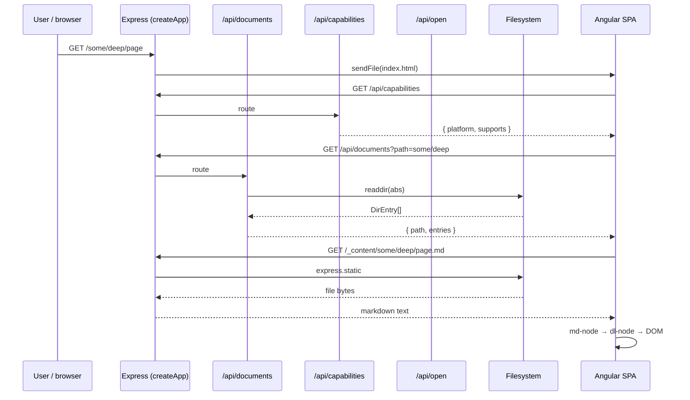
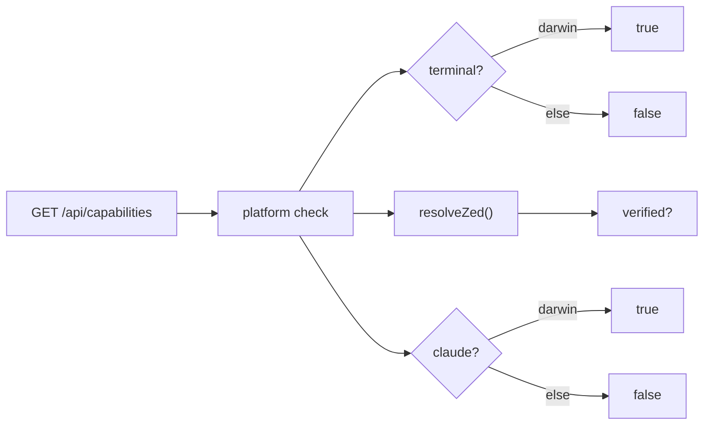

# Server layer

The server is a tiny Express 5 app that does four things:

1. Serves a **JSON API** for directory listings, platform
   capabilities, and external-tool invocations.
2. Serves the **Angular SPA** as static files.
3. Serves the **raw docs folder** under an internal `_content/`
   prefix so the SPA can fetch markdown and media by relative URL.
4. Falls back to `index.html` for any unknown path so the SPA's
   client-side router can take over.

The CLI entry (`server/bin/file-viewer.ts`) wires argv parsing and
process lifecycle around it.

## Request flow



## `createApp(docsDir)`

Defined in
[`server/index.ts`](https://github.com/MorizMensi/grove/blob/main/server/index.ts).
Wires everything together:

```ts
export function createApp(docsDir: string): express.Application {
  const app = express();
  app.use(express.json());

  // JSON APIs
  app.use('/api/documents', documentsRouter(docsDir));
  app.use('/api/open', openRouter(docsDir));
  app.use('/api/capabilities', capabilitiesRouter());

  // Static SPA (dist/frontend/browser/)
  const frontendDir = join(__dirname, '../frontend/browser');
  app.use(express.static(frontendDir));

  // Raw docs — internal namespace so user paths cannot collide
  app.use(`/${CONTENT_URL_PREFIX}`, express.static(docsDir, { redirect: false }));

  // SPA catch-all
  app.get('/{*splat}', (_req, res) => {
    res.sendFile(join(frontendDir, 'index.html'));
  });

  return app;
}
```

Important invariants:

- `docsDir` is the absolute path captured at CLI boot. Every
  downstream handler resolves user-supplied paths against it and
  re-checks containment before any filesystem call.
- `CONTENT_URL_PREFIX` (`"_content"`) is the single source of truth
  for the raw-docs mount. It lives in
  [`shared/content-url.ts`](https://github.com/MorizMensi/grove/blob/main/shared/content-url.ts)
  so the server, the wiki builder, and the frontend agree.
- The SPA catch-all uses `'/{*splat}'` syntax (Express 5 named
  wildcards) so any deep link like `/getting-started` lands on
  `index.html` and the Angular router takes over.

## JSON API modules

Every endpoint is documented mechanically in
[reference/http-api.md](../reference/http-api.md). The source files
live next to `index.ts`:

| File | Exports | Endpoint |
| --- | --- | --- |
| `documents.ts` | `documentsRouter(docsDir)` | `GET /api/documents` |
| `capabilities.ts` | `capabilitiesRouter()` | `GET /api/capabilities` |
| `open.ts` | `openRouter(docsDir)` | `POST /api/open` |

### `/api/documents`

Reads a directory listing with zero caching. The handler:

1. Reads `?path=` from the query string (default: empty = root).
2. Rejects `..` segments and leading `/` (path traversal).
3. Resolves the path against `docsDir` and re-checks
   `absPath.startsWith(docsDir)`.
4. `readdir(absPath, { withFileTypes: true })`.
5. Filters out dot-files, then maps each entry to
   `{ name, type, extension? }` using `extname()`/`basename()`.
6. Sorts directories first, then alphabetical.

Shape:
[`shared/types/documents.ts`](https://github.com/MorizMensi/grove/blob/main/shared/types/documents.ts)
— see [reference/types](../reference/types.md#documentlisting).

### `/api/capabilities`

Probes the host and reports which `/api/open` actions work:



The Zed probe (`server/zed-resolver.ts`) checks, in order:

1. `ZED_BIN` env var (trusted)
2. `/Applications/Zed.app` (darwin, LaunchServices — PATH-independent)
3. `~/Applications/Zed.app` (darwin)
4. `/usr/local/bin/zed`
5. `/opt/homebrew/bin/zed`
6. `~/.local/bin/zed`
7. Bare `zed` on `PATH` (unverified)

Only the first six are reported as `verified: true`. The frontend
hides the button for anything unverified, so it never displays a
button that 500s. See
[reference/environment](../reference/environment.md#zed_bin).

### `/api/open`

`POST /api/open` with `{ action, path }`:

1. `OpenRequestSchema.safeParse(req.body)` — zod rejects unknown
   actions and path-traversal strings.
2. Resolve `absDir = resolve(docsDir, relPath)` and re-check
   `absDir.startsWith(docsDir)`.
3. `stat(absDir)` — `terminal` and `claude` require a directory;
   `zed` can open a file or a folder.
4. Dispatch to `buildExec(action, absDir)`:
   - `terminal` (darwin) → `open -a Terminal <dir>`
   - `zed` → resolved zed command with `absDir` appended
   - `claude` (darwin) → `osascript -e 'tell application "Terminal"
     to do script "cd \"<dir>\" && claude"'`
5. Unsupported platform combos return **HTTP 501**; the frontend
   should have hidden that button but the endpoint is still
   defensive.
6. `execFile(file, [...args])` — **argument array**, never a shell
   string. The one exception is the AppleScript `claude` payload;
   see [security](./security.md#external-tools).

## CLI

The CLI entry is
[`server/bin/file-viewer.ts`](https://github.com/MorizMensi/grove/blob/main/server/bin/file-viewer.ts).
It dispatches on the first positional arg:

```mermaid
flowchart TD
  START([argv]) --> CHK{"argv[0]"}
  CHK -->|"build-wiki"| BW[parse wiki flags → buildWiki()]
  CHK -->|else| SRV[parse serve flags]
  SRV --> STAT["stat(folderPath)"]
  STAT -->|OK| APP["createApp()<br/>.listen(port)"]
  STAT -->|fail| ERR[exit 1]
  APP --> OPEN{"--no-open?"}
  OPEN -->|no| BROWSER["exec open / xdg-open / start"]
  OPEN -->|yes| DONE([running])
  BROWSER --> DONE
```

Full flag reference: [reference/cli](../reference/cli.md).

The `build-wiki` subcommand is covered in [wiki-mode](./wiki-mode.md).

## See also

- [Frontend layer](./frontend.md)
- [DocLang renderer](./doclang.md)
- [Wiki bundle mode](./wiki-mode.md)
- [Security model](./security.md)
- [HTTP API reference](../reference/http-api.md)
- [Shared types reference](../reference/types.md)
- [Back to architecture index](./overview.md)
