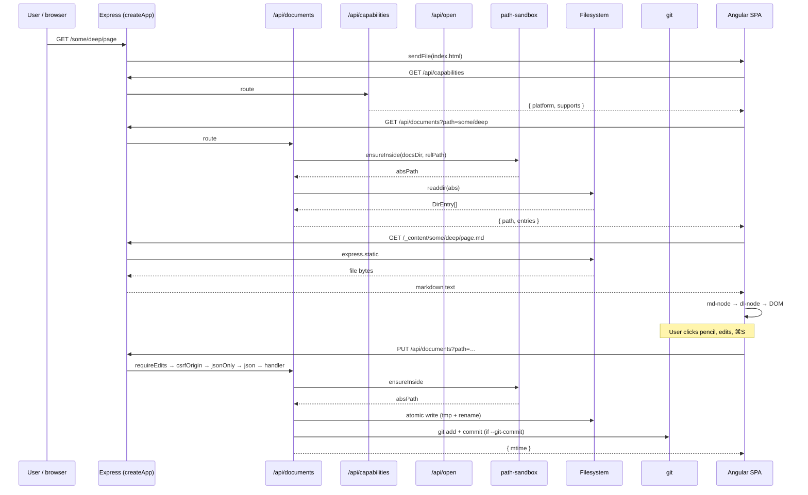

# Server layer

The server is an Express 5 app that does six things:

1. Serves a **read API** for directory listings and raw file content.
2. Serves a **write API** (gated by `--allow-edits`) for create,
   update, and delete on `.md` files and empty directories.
3. Serves a **capabilities API** so the SPA can hide buttons that
   would 501.
4. Serves an **open API** for macOS integrations (Terminal, Claude).
5. Serves the **Angular SPA** and the **raw docs folder** as static
   files.
6. Falls back to `index.html` for any unknown path so the SPA's
   client-side router can take over.

The CLI entry (`server/bin/file-viewer.ts`) wires argv parsing and
process lifecycle around it.

## Request flow



## `createApp(docsDir, options)`

Defined in
[`server/index.ts`](https://github.com/MorizMensi/grove/blob/main/server/index.ts).
Wires everything together:

```ts
export interface CreateAppOptions {
  allowEdits?: boolean;
  gitCommit?: boolean;
  disabledSecurity?: DisabledSecuritySet;
}

export function createApp(
  docsDir: string,
  options: CreateAppOptions = {},
): express.Application {
  const app = express();

  // No app-level express.json() — each write route declares its own
  // body parser with an explicit size limit.

  app.use('/api/documents', documentsRouter(docsDir, {
    allowEdits: options.allowEdits,
    gitCommit: options.gitCommit,
    disabledSecurity: options.disabledSecurity,
  }));
  app.use('/api/open', openRouter(docsDir, {
    disabledSecurity: options.disabledSecurity,
  }));
  app.use('/api/capabilities', capabilitiesRouter({
    allowEdits: options.allowEdits,
    gitCommit: options.gitCommit,
  }));

  const frontendDir = join(__dirname, '../frontend/browser');
  app.use(express.static(frontendDir));

  app.use(`/${CONTENT_URL_PREFIX}`, express.static(docsDir, {
    redirect: false,
    dotfiles: 'deny',
    fallthrough: false,
    setHeaders: (res, filePath) => {
      if (/\.(html?|svg)$/i.test(filePath)) {
        res.setHeader(
          'Content-Security-Policy',
          "sandbox allow-same-origin; script-src 'none'; object-src 'none'; base-uri 'none'",
        );
        res.setHeader('X-Content-Type-Options', 'nosniff');
      }
    },
  }));

  app.get('/{*splat}', (_req, res) => {
    res.sendFile(join(frontendDir, 'index.html'));
  });

  return app;
}
```

### Invariants

- `docsDir` is the absolute path captured at CLI boot. Every
  downstream handler resolves user-supplied paths against it via
  `ensureInside` before any filesystem call.
- `CONTENT_URL_PREFIX` (`"_content"`) is the single source of truth
  for the raw-docs mount. It lives in
  [`shared/content-url.ts`](https://github.com/MorizMensi/grove/blob/main/shared/content-url.ts)
  so the server, the wiki builder, and the frontend agree.
- The SPA catch-all uses `'/{*splat}'` (Express 5 named
  wildcards) so deep links like `/getting-started` land on
  `index.html` and the Angular router takes over.
- `/_content/` is mounted with `fallthrough: false` so the
  `dotfiles: 'deny'` 403 surfaces instead of being masked by the
  SPA catch-all.

## Module map

| File | Exports | Endpoint(s) |
| --- | --- | --- |
| `index.ts` | `createApp`, `CreateAppOptions` | — |
| `documents.ts` | `documentsRouter`, `DocumentsOptions` | `GET`, `PUT`, `POST`, `DELETE /api/documents`, `GET /api/documents/raw` |
| `capabilities.ts` | `capabilitiesRouter`, `Capabilities`, `CapabilitiesOptions` | `GET /api/capabilities` |
| `open.ts` | `openRouter`, `OpenRouterOptions` | `POST /api/open` |
| `path-sandbox.ts` | `ensureInside`, `PathError`, `EnsureInsideOpts` | — |
| `edits-middleware.ts` | `requireEdits`, `csrfOrigin` | — |
| `fs-atomic.ts` | `atomicWrite` | — |
| `git.ts` | `commitChange`, `validateGitRepo`, `CommitVerb`, `CommitOutcome` | — |
| `security-options.ts` | `parseDisabledSecurity`, `DisabledSecurity`, `DisabledSecuritySet`, `DISABLED_SECURITY_VALUES` | — |
| `bin/file-viewer.ts` | — (executable) | CLI entry |
| `wiki/build.ts` | `buildWiki` | `grove build-wiki` subcommand |

## `GET /api/documents`

Reads a directory listing with zero caching. The handler:

1. Reads `?path=` from the query string (default: empty = root).
2. `ensureInside(docsDir, relPath, { allowSymlinks })`. Rejection →
   `403 forbidden`.
3. `stat(absPath)` — must be a directory.
4. `readdir(absPath, { withFileTypes: true })`.
5. Filters out dot-files and non-regular entries (sockets, FIFOs).
6. Maps each entry to `{ name, type, extension? }` using
   `extname()` / `basename()`.
7. Sorts directories first, then alphabetical within each group.

Shape:
[`shared/types/documents.ts`](https://github.com/MorizMensi/grove/blob/main/shared/types/documents.ts)
— see [reference/types](../reference/types.md#documentlisting).

## `GET /api/documents/raw`

Returns the file's content and current `mtime`:

```json
{ "content": "# Title\n\n…", "mtime": 1714654321987.654 }
```

Sets `Last-Modified` and a weak `ETag` derived from
`"<mtime-ms-floor>-<size>"`. The ETag is weak because atomic
rename keeps byte-exact comparisons unreliable — clients use
`mtime` for conflict detection, not the ETag.

The `mtime` value is the fractional-millisecond `stat.mtimeMs`. The
client stores it verbatim and sends it back as
`If-Unmodified-Since` on the next write.

## `PUT /api/documents`

The only mutation route with a body. Middleware chain:

```
requireEdits(allowEdits)
  → csrfOrigin
  → jsonOnly
  → express.json({ limit: '10mb' })
  → jsonErrorHandler
  → handler
```

Handler flow:

1. `ensureInside(docsDir, relPath)`; `PathError` → 403 `forbidden`.
2. Validate body shape (`{ content: string }`). Missing → 400
   `bad-body`.
3. Parse `If-Unmodified-Since` as decimal ms or HTTP-date. Missing
   → 400 `missing-if-unmodified-since`; unparseable → 400
   `bad-if-unmodified-since`.
4. Stat the current file. Missing → 404 `not-found`; non-file → 409
   `not-a-file`.
5. Compare at **second** precision:
   `Math.floor(currentMs / 1000) > Math.floor(expectedMs / 1000)` →
   `409 stale, mtime`.
6. `atomicWrite(absPath, content)`.
7. Re-stat; return `{ mtime }`.
8. If `--git-commit`, `commitChange(docsDir, absPath, 'edit')`.
   "Nothing to commit" → success; any other failure → 500
   `git-failed`.

### Conflict detection

Second-precision comparison is a deliberate trade-off. HTTP dates
have only second granularity; comparing `mtimeMs` (fractional ms)
against a parsed HTTP date would fail spuriously within the same
second of a save. The cost: a 1-second race window where two
writers in the same second could clobber each other. That's
acceptable for a single-user local tool.

The client's `If-Unmodified-Since` is always the `mtime` from the
previous `GET /raw` (or the previous `PUT` response). After a
successful `PUT`, the server returns the new `mtime` and the client
updates its copy, so the next save will compare against the latest
state.

### Atomic write

`atomicWrite(absPath, content)` in `server/fs-atomic.ts`:

```ts
const tmp = `${absPath}.grove-${randomSuffix()}.tmp`;
try {
  await fs.writeFile(tmp, content, { encoding: 'utf8', flag: 'wx' });
  await fs.rename(tmp, absPath);
} finally {
  // unlink(tmp) if it still exists — the rename may have moved it.
}
```

`flag: 'wx'` fails if the tmp file already exists — random suffix
makes collisions unlikely in practice. `rename` is atomic on every
POSIX filesystem Grove runs on (HFS+, APFS, ext4, btrfs, xfs).

## `POST /api/documents`

Create a file or empty directory. Middleware chain:

```
requireEdits(allowEdits) → csrfOrigin → handler
```

No body parser — create is path-only. Kind defaults to `file`.

Flow:

1. Validate `kind` query (`"file"` or `"dir"`); else 400
   `bad-kind`.
2. Validate the basename (`isValidName`); else 400 `bad-name`.
3. Resolve the **parent** with `ensureInside(docsDir, parentRel)`.
   Failure → 409 `parent-missing` (not 403 `forbidden` — the user
   got the name right, the parent just doesn't exist yet).
4. `stat(parentAbs)`; non-directory → 409 `parent-missing`.
5. `kind=file`: `writeFile(absPath, '', { flag: 'wx' })`. `wx`
   fails on `EEXIST` → 409 `exists`.
6. `kind=dir`: `mkdir(absPath)`.
7. File creates under `--git-commit`: `commitChange(..., 'create')`.
   Directory creates do **not** commit — empty dirs are not
   tracked by git.

## `DELETE /api/documents`

Middleware chain:

```
requireEdits(allowEdits) → csrfOrigin → handler
```

Flow:

1. `ensureInside(docsDir, relPath, { allowMissing: true })`.
2. Refuse to delete `docsDir` itself (403 `forbidden`).
3. Stat the target. Missing → 404 `not-found`.
4. `rmdir` or `unlink`. `ENOTEMPTY`/`EEXIST` on a directory → 409
   `not-empty`.
5. File deletes under `--git-commit`: `commitChange(..., 'delete')`.
   Directory deletes do **not** commit (same rationale as creates).

## `/api/capabilities`

Reports what the server can do. Read at bootstrap by the SPA so
action buttons, the pencil toggle, and the auto-commit pill are
only rendered when they'd work.

```ts
{
  platform: process.platform,
  supports: {
    terminal:  process.platform === 'darwin',
    claude:    process.platform === 'darwin',
    edits:     options.allowEdits === true,
    gitCommit: options.gitCommit === true,
  }
}
```

The `supports.edits` and `supports.gitCommit` fields reflect CLI
flags — they are UI hints, not security gates. The real gate on
writes is `requireEdits(allowEdits)` middleware.

## `/api/open`

`POST /api/open` with `{ action, path }`:

1. `OpenRequestSchema.safeParse(req.body)` — zod rejects unknown
   actions and path-traversal strings.
2. `ensureInside(docsDir, relPath, { allowSymlinks })`. Rejection
   → 403 `forbidden`.
3. `stat(absDir)` — both actions require a directory.
4. `buildExec(action, absDir)`:
   - `terminal` (darwin) → `open -a Terminal <dir>`
   - `claude` (darwin) → `osascript -e 'tell application "Terminal"
     to do script "cd \"<dir>\" && claude"'`
5. Unsupported platform combos return **HTTP 501**; the frontend
   should have hidden that button, but the endpoint is still
   defensive.
6. `execFile(file, [...args])` — **argument array**, never a shell
   string. The AppleScript `claude` payload is the one string
   exception; see [security](./security.md#external-tools).

> The previous `zed` action was removed when the in-browser editor
> landed. Any request with `action: 'zed'` now returns 400 with the
> zod error format.

## CLI

The CLI entry is
[`server/bin/file-viewer.ts`](https://github.com/MorizMensi/grove/blob/main/server/bin/file-viewer.ts).
It dispatches on the first positional arg:

```mermaid
flowchart TD
  START([argv]) --> CHK{"argv[0]"}
  CHK -->|"build-wiki"| BW[parse wiki flags → buildWiki()]
  CHK -->|else| SRV[parse serve flags]
  SRV --> GUARD{"--git-commit && !--allow-edits?"}
  GUARD -->|yes| ERRG[exit 1]
  GUARD -->|no| STAT["stat(folderPath)"]
  STAT -->|fail| ERR[exit 1]
  STAT -->|OK| GIT{"--git-commit?"}
  GIT -->|yes| VALIDATE[validateGitRepo]
  VALIDATE -->|fail| ERRG2[exit 1 with actionable message]
  VALIDATE -->|OK| APP
  GIT -->|no| APP["createApp({allowEdits,gitCommit,disabledSecurity}).listen(port)"]
  APP --> WARN{"disabledSecurity non-empty?"}
  WARN -->|yes| STDERR["stderr: 'WARNING: security features disabled: …'"]
  WARN -->|no| OPEN
  STDERR --> OPEN{"--no-open?"}
  OPEN -->|no| BROWSER["exec open / xdg-open / start"]
  OPEN -->|yes| DONE([running])
  BROWSER --> DONE
```

Full flag reference: [reference/cli](../reference/cli.md).

The `build-wiki` subcommand is covered in
[wiki-mode](./wiki-mode.md).

## Testing

Server tests use `node --test` with the `tsx` loader:

```bash
npm run test:server
```

Every module sits beside the file it covers:

| Module | Test file | What it covers |
| --- | --- | --- |
| `path-sandbox.ts` | `path-sandbox.test.ts` | traversal, symlinks, `allowMissing`, `allowSymlinks`, NUL bytes, sibling-prefix bypass |
| `fs-atomic.ts` | `fs-atomic.test.ts` | tmp+rename success, failure cleanup, permission errors |
| `documents.ts` | `documents.test.ts` | every verb, every error code, conflict detection, atomic write integration, name validation |
| `git.ts` | `git.test.ts` | happy-path commit, nothing-to-commit swallow, failure surfacing, validateGitRepo |
| `edits-middleware.ts` | `edits-middleware.test.ts` | requireEdits off/on, csrfOrigin match/mismatch |
| `security-options.ts` | `security-options.test.ts` | parse, merge, unknown-value rejection |
| `open.ts` | `open.test.ts` | zod validation, platform dispatch, 501, ensureInside integration |
| `capabilities.ts` | `capabilities.test.ts` | shape, edit/git flag reflection |
| `index.ts` | `index.test.ts` | end-to-end integration — middleware chain, CSP headers, SPA fallback |

Tests use a temp directory per test; they never touch a real docs
folder.

## See also

- [Frontend layer](./frontend.md)
- [Editor architecture](./editor.md)
- [DocLang renderer](./doclang.md)
- [Wiki bundle mode](./wiki-mode.md)
- [Security model](./security.md)
- [HTTP API reference](../reference/http-api.md)
- [Shared types reference](../reference/types.md)
- [Back to architecture index](./overview.md)
