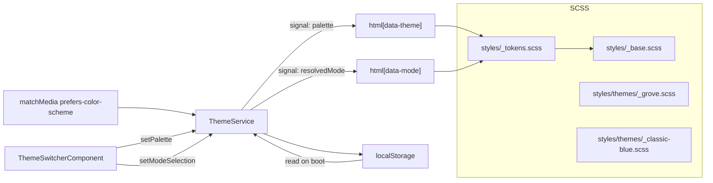

# Theme system

Grove ships with a tiny design-token system: two **palettes**
(`grove`, `classic-blue`), two **modes** (`light`, `dark`), and a
`system` mode that tracks `prefers-color-scheme`. All six
combinations are first-class.

## Moving parts



Sources:

| File | Purpose |
| --- | --- |
| [`core/constants/theme.constants.ts`](https://github.com/MorizMensi/grove/blob/main/frontend/src/app/core/constants/theme.constants.ts) | Palette + mode enums, labels, storage keys, defaults |
| [`core/services/theme.service.ts`](https://github.com/MorizMensi/grove/blob/main/frontend/src/app/core/services/theme.service.ts) | Signals, effect, localStorage persistence, system listener |
| [`shared/theme-switcher/`](https://github.com/MorizMensi/grove/tree/main/frontend/src/app/shared/theme-switcher) | Popover UI with click-outside + Escape handling |
| [`styles/themes/_grove.scss`](https://github.com/MorizMensi/grove/blob/main/frontend/src/styles/themes/_grove.scss) | Grove palette tokens |
| [`styles/themes/_classic-blue.scss`](https://github.com/MorizMensi/grove/blob/main/frontend/src/styles/themes/_classic-blue.scss) | Classic Blue palette tokens |
| [`styles/_tokens.scss`](https://github.com/MorizMensi/grove/blob/main/frontend/src/styles/_tokens.scss) | Token variable declarations + `:root[data-theme][data-mode]` selectors |

## The service

`ThemeService` is a signals-only service:

```ts
readonly palette:       Signal<Palette>;
readonly modeSelection: Signal<ModeSelection>;
readonly resolvedMode:  Signal<ResolvedMode>; // computed
```

A single `effect()` writes two attributes to `<html>` whenever
the palette or resolved mode changes:

```ts
root.setAttribute('data-theme', palette);
root.setAttribute('data-mode', mode);
```

The SCSS selectors then look like:

```scss
:root[data-theme='grove'][data-mode='dark'] {
  --grove-surface-0: #0b1410;
  --grove-text-primary: #e8f1eb;
  // ...
}
```

## Storage contract

Two `localStorage` keys, defined in `theme.constants.ts`:

| Key | Value |
| --- | --- |
| `grove-theme` | `'grove' \| 'classic-blue'` |
| `grove-mode` | `'light' \| 'dark' \| 'system'` |

The defaults (if missing or unreadable) are `grove` and
`system`. Values that don't match the registered unions are
ignored.

`readStorage` and `writeStorage` are wrapped in try/catch so
private-mode / quota errors don't crash boot.

## System mode

When `modeSelection` is `'system'`, `resolvedMode` is computed
from `window.matchMedia('(prefers-color-scheme: dark)')`. A
`change` listener updates the `systemDarkSignal` so the UI
reflows live if the user toggles their OS appearance.

The listener is set up once in the service constructor and is
never torn down because `ThemeService` is
`providedIn: 'root'` — it lives for the lifetime of the app.

## Switcher UI

`ThemeSwitcherComponent` is a popover:

- **Click outside** — `@HostListener('document:click', …)` closes
  the popover when the click lands outside the host element.
- **Escape** — `@HostListener('document:keydown.escape')` closes
  it.
- **Signal-bound** — the currently-selected palette and mode
  come from `ThemeService` signals, so the UI stays in sync even
  if another code path changes the theme.

## Adding a palette

1. Add the name to `PALETTES` in `theme.constants.ts` and a
   matching entry in `PALETTE_LABELS`.
2. Create `styles/themes/_<name>.scss` with the token overrides
   inside `:root[data-theme='<name>'][data-mode='light']` and
   `:root[data-theme='<name>'][data-mode='dark']` selectors.
3. Import it in `styles.scss` alongside the existing palettes.

Because the palette list is a TypeScript literal union, adding
an entry automatically surfaces it in the switcher.

## See also

- [Style guide](../styleguide.md) — narrative reference for the
  visual design system
- [Color schemes](../color-schemes.md) — every palette, every
  token, every theme × mode combination
- [Spacing, type, and motion](../spacing.md) — metric reference
- [Frontend layer](./frontend.md) — where the service fits in
  the component tree
- [Contributing](../contributing.md) — code style rules for
  theme changes
- [Back to architecture index](./index.md)
