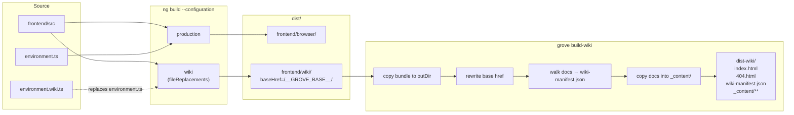

# Wiki bundle mode

Grove has **two** build targets that share 99% of the code path:

- **Server mode** — the default. The CLI boots Express and
  serves the SPA + API on localhost. Every directory listing is
  a live `readdir()`.
- **Wiki mode** — a static bundle. The SPA reads a
  pre-computed `wiki-manifest.json` instead of calling the API,
  and there is no server at all. Perfect for GitHub Pages.

This page documents both the build pipeline and the code switch
that makes mode selection work.

## Build topology



## Environment switch

The Angular build uses
[`fileReplacements`](https://angular.dev/reference/configs/workspace-config#fileReplacements)
to swap `environment.ts` for `environment.wiki.ts` when building
with the `wiki` configuration:

```ts
// environment.ts
export const environment = { mode: 'server', manifestUrl: '' };

// environment.wiki.ts
export const environment = { mode: 'wiki', manifestUrl: 'wiki-manifest.json' };
```

Every runtime mode check reads `environment.mode`:

- [`DocumentService`](https://github.com/MorizMensi/grove/blob/main/frontend/src/app/core/services/document.service.ts)
  branches between `loadManifest()` and `GET /api/documents`.
- [`CapabilitiesService`](https://github.com/MorizMensi/grove/blob/main/frontend/src/app/core/services/capabilities.service.ts)
  short-circuits to a seeded `{ terminal: false, zed: false,
  claude: false }` so the header never flashes a disabled button.
- [`DocumentShellComponent`](https://github.com/MorizMensi/grove/blob/main/frontend/src/app/features/document-shell/document-shell.component.ts)
  uses `isWikiMode` to decide whether to render the `<wiki-footer>`
  attribution.

## The `<base href>` placeholder

The wiki bundle is compiled with
`baseHref: '/__GROVE_BASE__/'`. That sentinel is rewritten at
bundle-copy time by `server/wiki/build.ts#buildWiki`:

```ts
const PLACEHOLDER_BASE_HREF = '/__GROVE_BASE__/';
// ...
const rewritten = indexContent.split(PLACEHOLDER_BASE_HREF).join(baseHref);
await writeFile(indexPath, rewritten, 'utf-8');
await writeFile(join(outDir, '404.html'), rewritten, 'utf-8');
```

Both `index.html` and `404.html` receive the same rewritten
content. GitHub Pages serves `404.html` for unmatched paths, and
when that page bootstraps the SPA, the Angular router recovers
the actual URL from `location.pathname` and loads the right
document. Deep links to `/grove/architecture/server` therefore
work even though no file at that literal path exists on disk.

## Manifest

`server/wiki/manifest.ts#buildManifest` recursively walks the
docs folder and emits:

```json
{
  "version": 1,
  "generatedAt": "2026-04-14T12:00:00.000Z",
  "root": "",
  "siteName": "Grove",
  "directories": {
    "": { "path": "", "entries": [...] },
    "architecture": { "path": "architecture", "entries": [...] },
    "reference": { "path": "reference", "entries": [...] }
  }
}
```

The entry shape is **identical** to
`GET /api/documents`'s response (`DocumentListing` in
[shared/types](../reference/types.md#documentlisting)), which is
why the frontend can treat the two modes as interchangeable — it
swaps the source, not the consumer.

The manifest sort function is documented to stay in sync with
the server's sort (`server/documents.ts` line ~50). See
[`manifest.ts`](https://github.com/MorizMensi/grove/blob/main/server/wiki/manifest.ts).

## `grove build-wiki` subcommand

```
grove build-wiki --docs <path> [--out <path>] [--base-href <href>] [--site-name <name>]
```

See the full reference in [reference/cli](../reference/cli.md#build-wiki).

Behavior:

1. Normalize the base-href to have leading + trailing slash.
2. Verify the docs folder exists.
3. Locate the pre-built wiki bundle at
   `dist/frontend/wiki/index.html`. If missing, fail with a
   pointer to `npm run build:wiki`.
4. **Destructively** wipe and recreate the output directory.
5. `cp -r` the bundle into the output directory.
6. Rewrite the `<base href>` placeholder in
   `index.html` and write `404.html`.
7. Build the manifest and write `wiki-manifest.json`.
8. Copy the docs folder into `<outDir>/_content/` so the
   **same** relative URL (`_content/<path>.<ext>`) works in both
   modes. `CONTENT_URL_PREFIX` is the single source of truth.

Output tree:

```
dist-wiki/
├── index.html           (<base href> rewritten)
├── 404.html             (identical to index.html)
├── main-*.js            (Angular bundle)
├── styles-*.css
├── wiki-manifest.json
└── _content/
    ├── index.md
    ├── getting-started.md
    └── architecture/...
```

## GitHub Actions pipeline

The `.github/workflows/build-wiki.yml` reusable workflow wraps
the whole thing. Any repo can consume it with a ten-line
`workflow_call` — see [wiki-for-other-repos](../wiki-for-other-repos.md)
for the end-user view and
[guides/wiki-deployment](../guides/wiki-deployment.md) for the
cookbook version.

Relevant steps:

1. `actions/checkout@v5` — the consumer repo.
2. `actions/checkout@v5` with `repository: MorizMensi/grove` and
   `path: .grove` — Grove is checked out beside it.
3. `actions/setup-node@v5` — Node matching `.grove/.nvmrc` with
   npm caching on both lockfiles.
4. `npm ci` in `.grove` and `.grove/frontend`.
5. `npm run build:all` — produces both bundles.
6. Resolve `base-href` default (`/<repo-name>/`) and `site-name`
   default (`<repo-name>`) via shell `steps.base`/`steps.site`.
7. `node .grove/dist/server/bin/file-viewer.js build-wiki …`.
8. `actions/upload-pages-artifact@v4` + `actions/deploy-pages@v4`.

## See also

- [Reusable wiki workflow (user guide)](../wiki-for-other-repos.md)
- [Wiki deployment cookbook](../guides/wiki-deployment.md)
- [CLI reference](../reference/cli.md#build-wiki)
- [HTTP API reference](../reference/http-api.md)
- [Frontend layer](./frontend.md) — the code path on the SPA side
- [Back to architecture index](./overview.md)
