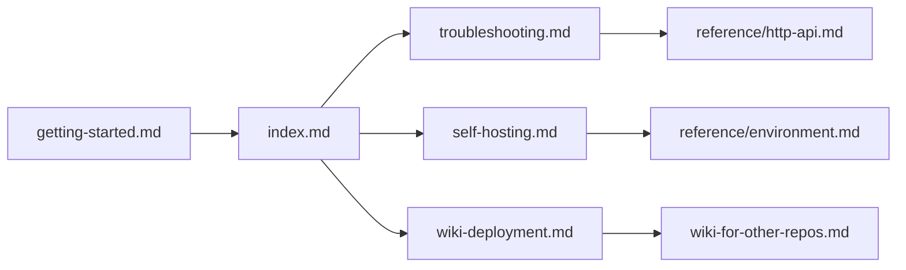

# Guides

Task-based how-to documentation. For conceptual material see
[architecture](../architecture/index.md); for mechanical reference
see [reference](../reference/index.md).

## Pages

- **[Troubleshooting](./troubleshooting.md)** — common issues
  and fixes
- **[Self-hosting](./self-hosting.md)** — run Grove as a
  persistent background service on macOS, Linux, Windows, or
  Docker
- **[Wiki deployment](./wiki-deployment.md)** — deploy a repo's
  `docs/` folder to GitHub Pages using Grove's reusable
  workflow

## Quick links

## See also

- [Getting started](../getting-started.md)
- [Usage](../usage.md)
- [Back to docs home](../index.md)
