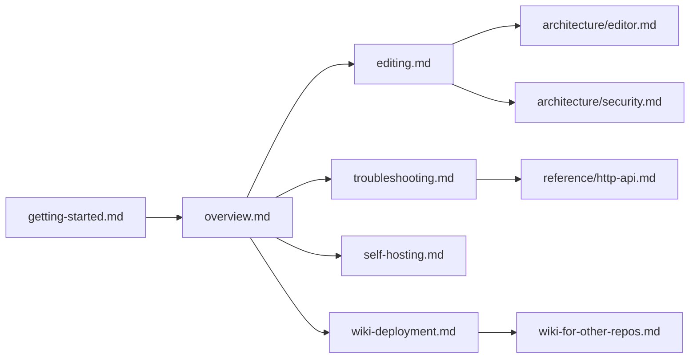

# Guides

Task-based how-to documentation. For conceptual material see
[architecture](../architecture/overview.md); for mechanical reference
see [reference](../reference/overview.md).

## Pages

- **[Editing](./editing.md)** — enable `--allow-edits`, use the
  Typora-style editor, save with conflict handling, manage files
  through the sidebar, enable `--git-commit` for auto-versioning.
- **[Troubleshooting](./troubleshooting.md)** — common issues and
  fixes, including the editor-specific failure modes
  (409 conflicts, bad-origin CSRF, git-commit validation).
- **[Self-hosting](./self-hosting.md)** — run Grove as a
  persistent background service on macOS, Linux, Windows, or
  Docker. Includes `--allow-edits` considerations for persistent
  deployments.
- **[Wiki deployment](./wiki-deployment.md)** — deploy a repo's
  `docs/` folder to GitHub Pages using Grove's reusable
  workflow. Wiki bundles are always read-only (the capabilities
  endpoint is compile-time constant).

## Quick links

## See also

- [Getting started](../getting-started.md)
- [Usage](../usage.md)
- [Editor architecture](../architecture/editor.md)
- [Back to docs home](../overview.md)
