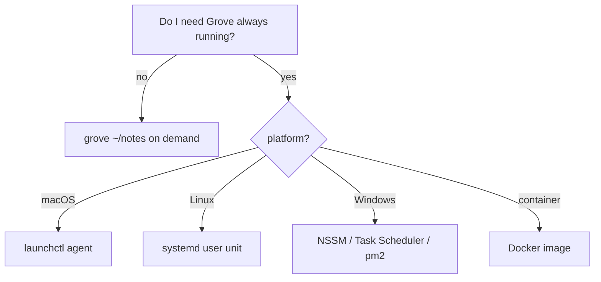

# Self-hosting

Grove is a plain Node CLI — you can run it any way you run
Node. This guide collects the standard self-hosted deployment
patterns.

## Picking a deploy style



## On-demand

```bash
npx grovemd ~/notes                # no install
npm install -g grovemd && grove ~/notes
```

See [getting-started](../getting-started.md) and
[reference/cli](../reference/cli.md).

## macOS — launchctl

Grove ships an **example** launch agent and two helper scripts
in
[`scripts/local-deploy/`](https://github.com/MorizMensi/grove/tree/main/scripts/local-deploy).
Nothing runs unless you opt in.

Files:

- `com.grove.plist.example` — template agent
- `deploy.sh` — `npm run build` then `restart.sh`
- `restart.sh` — `launchctl unload` + `launchctl load`

### Install

```bash
cp scripts/local-deploy/com.grove.plist.example \
   ~/Library/LaunchAgents/com.grove.plist
$EDITOR ~/Library/LaunchAgents/com.grove.plist
```

Replace the two `/ABSOLUTE/PATH/TO/...` strings with:

- the path to `dist/server/bin/file-viewer.js` in your local
  clone, and
- the path to the folder you want to serve.

Optionally set `ZED_BIN` inside the `EnvironmentVariables` dict
if you want the Zed action to use a non-default binary — see
[reference/environment#zed_bin](../reference/environment.md#zed_bin).

Load it:

```bash
launchctl load ~/Library/LaunchAgents/com.grove.plist
open http://localhost:3000
```

### Day-to-day

After pulling new code:

```bash
bash scripts/local-deploy/deploy.sh
```

Override the plist path:

```bash
PLIST_PATH=/some/other/path bash scripts/local-deploy/restart.sh
```

See [reference/environment#plist_path](../reference/environment.md#plist_path).

## Linux — systemd user unit

There is no shipped template, but the pattern is a one-pager.
Save as `~/.config/systemd/user/grove.service`:

```ini
[Unit]
Description=Grove local wiki
After=network.target

[Service]
Type=simple
ExecStart=/usr/bin/node /absolute/path/to/dist/server/bin/file-viewer.js /absolute/path/to/docs --port 3000 --no-open
Restart=on-failure
Environment=ZED_BIN=/usr/bin/zed

[Install]
WantedBy=default.target
```

Enable + start:

```bash
systemctl --user daemon-reload
systemctl --user enable --now grove.service
journalctl --user -u grove.service -f
```

Note: on Linux the `terminal` and `claude` buttons are
automatically hidden by the frontend — they're macOS-only. See
[architecture/security#external-tools](../architecture/security.md#external-tools).

## Windows

Any of:

- [NSSM](https://nssm.cc/) — wrap the node command as a service
- **Task Scheduler** — run at login
- [pm2](https://pm2.keymetrics.io/) — `pm2 start node -- <args>`

The process invocation is always the same:

```
node C:\path\to\dist\server\bin\file-viewer.js C:\path\to\docs --port 3000 --no-open
```

## Docker

No official image yet. A minimal Dockerfile:

```dockerfile
FROM node:20-alpine
WORKDIR /app
COPY dist ./dist
# Docs mounted at runtime via -v
ENTRYPOINT ["node", "/app/dist/server/bin/file-viewer.js"]
CMD ["/docs", "--port", "3000", "--no-open"]
```

Build + run:

```bash
docker build -t grove .
docker run --rm -p 3000:3000 -v /path/to/docs:/docs grove
```

Caveats:

- You're running as a regular Node process, so no macOS-only
  actions are supported (Terminal / Claude are hidden; Zed
  requires `ZED_BIN` pointing at a binary in the image or a
  mounted volume, which usually doesn't make sense in a
  container).
- Use a bind mount for the docs folder so edits show up without
  rebuilding the image.

## Upgrading

```bash
git pull
npm ci
(cd frontend && npm ci)
npm run build
bash scripts/local-deploy/deploy.sh  # macOS
# or: systemctl --user restart grove.service
```

## Related

- [scripts/local-deploy/README.md](https://github.com/MorizMensi/grove/blob/main/scripts/local-deploy/README.md)
- [Environment variables](../reference/environment.md)
- [CLI reference](../reference/cli.md)
- [Security model](../architecture/security.md)
- [Back to guides index](./overview.md)
