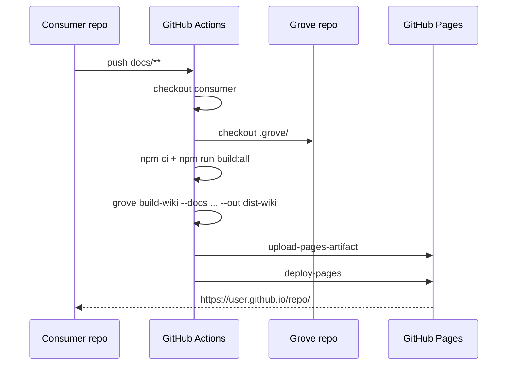

# Wiki deployment

How to deploy any repo's `docs/` folder as a static wiki on
GitHub Pages using Grove's reusable workflow. This is the
cookbook version; for background see
[wiki-for-other-repos](../wiki-for-other-repos.md) and
[architecture/wiki-mode](../architecture/wiki-mode.md).

## Flow



## Minimal setup

Add `.github/workflows/docs.yml`:

```yaml
name: docs
on:
  push:
    branches: [main]
    paths: [docs/**]
  workflow_dispatch:
permissions:
  contents: read
  pages: write
  id-token: write
jobs:
  wiki:
    uses: MorizMensi/grove/.github/workflows/build-wiki.yml@main
    with:
      docs: docs
```

Enable Pages: **Settings → Pages → Source: GitHub Actions**.

Push a commit touching `docs/`. The workflow runs, builds, and
deploys to `https://<user>.github.io/<repo>/`.

## Inputs

Full table from the reusable workflow
[`build-wiki.yml`](https://github.com/MorizMensi/grove/blob/main/.github/workflows/build-wiki.yml):

| Input | Default | Description |
| --- | --- | --- |
| `docs` | `docs` | Path to the markdown folder inside the consumer repo |
| `out` | `dist-wiki` | Output directory (rarely worth changing) |
| `base-href` | `/<repo-name>/` | Deploy base path. If empty, falls back to the repo name |
| `grove-ref` | `main` | Grove git ref to build against (branch, tag, or SHA) |
| `site-name` | `<repo-name>` | Brand text in the breadcrumb bar and browser title |

### Custom paths + branded name

```yaml
jobs:
  wiki:
    uses: MorizMensi/grove/.github/workflows/build-wiki.yml@main
    with:
      docs: documentation
      base-href: /my-lib/
      site-name: My Cool Library
      grove-ref: main
```

### Pin to a specific Grove release

During the `v0.x` series, **pin to `@main`** — it is kept green
by CI. Once a `v1` tag ships, switch to `@v1` or a specific
SHA for reproducible builds.

```yaml
uses: MorizMensi/grove/.github/workflows/build-wiki.yml@abc1234
```

## What lands on Pages

```
/                      →  index.html
/404.html              →  same content as index.html (SPA fallback)
/main-*.js             →  Angular bundle
/styles-*.css          →  styles
/wiki-manifest.json    →  pre-computed directory listings
/_content/**           →  raw docs tree (markdown + media)
```

Deep links work via the `404.html === index.html` trick: Pages
returns 404 for unknown static paths, the SPA loads, the
Angular router reads `location.pathname`, and the renderer
kicks in. The URL bar keeps the right path the whole time; the
HTTP status is technically 404. For seven pages of docs this
doesn't affect SEO.

See [architecture/wiki-mode](../architecture/wiki-mode.md) for
the full rewrite pipeline.

## Cache behavior

The workflow caches:

- `~/.npm` via `actions/setup-node@v5` with
  `cache: npm`
- Both lockfiles: `.grove/package-lock.json` and
  `.grove/frontend/package-lock.json`

First run takes ~90s (Grove checkout + install + build + wiki
build). Cached runs drop to ~40s.

## Gotchas

### Repo must be public

GitHub Pages for private repos requires a paid plan. This is a
GitHub limitation, not a Grove one.

### Top-level `docs/api/` folder

`api/` works at the content level but Grove's own HTTP surface
uses `/api/*` in **server mode**. In wiki mode those endpoints
don't exist — the `CapabilitiesService` is dead-branched — so
there is no runtime collision. Just be aware that if you ever
reuse the renderer behind a live server and add more internal
APIs, a page at `docs/api/foo.md` would route to `/api/foo`.

### `docs/_content/` is shadowed

`/_content/` is Grove's reserved raw-file mount. Nobody names
folders that, but don't.

### Links must be relative

Use relative markdown links between pages:

```markdown
See the [getting started](./getting-started.md) guide.
```

Grove's renderer picks these up and turns them into Angular
router navigations, so they survive changes to `base-href`. See
[architecture/doclang#link-resolution](../architecture/doclang.md#link-resolution).

## Local preview

Mimic the deployed build without pushing:

```bash
npm run build:all
node dist/server/bin/file-viewer.js build-wiki \
  --docs docs \
  --out /tmp/grove-preview \
  --base-href /
npx http-server /tmp/grove-preview -p 4500
# → http://localhost:4500/
```

Use this to verify `base-href` rewriting, the manifest, and the
`404.html` fallback. See [contributing](../contributing.md#previewing-docs-changes-locally).

## Troubleshooting

See [troubleshooting#wiki-deployment](./troubleshooting.md#wiki-deployment).

## Related

- [Use Grove for your own wiki](../wiki-for-other-repos.md) —
  long-form version
- [Wiki bundle mode](../architecture/wiki-mode.md) — what
  happens internally
- [CLI reference: build-wiki](../reference/cli.md#build-wiki)
- [Troubleshooting](./troubleshooting.md)
- [Back to guides index](./overview.md)
