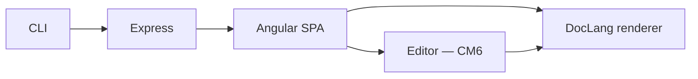

# How it works

A conceptual tour. For topic-by-topic deep dives — server,
frontend, editor, renderer, wiki mode, themes, security — see the
[architecture folder](./architecture/overview.md).

## The five layers



1. **CLI** ([`server/bin/file-viewer.ts`](https://github.com/MorizMensi/grove/blob/main/server/bin/file-viewer.ts))
   - Parses argv: folder, `--port`, `--no-open`, `--allow-edits`,
     `--git-commit`, `--disable-security`.
   - Refuses `--git-commit` without `--allow-edits`.
   - Validates the docs folder exists and is a directory.
   - With `--git-commit`, validates the worktree and git identity.
   - Calls `createApp(docsDir, options)` and `.listen(port)`.
   - Full reference: [reference/cli](./reference/cli.md).

2. **Express** ([`server/index.ts`](https://github.com/MorizMensi/grove/blob/main/server/index.ts))
   - Mounts four JSON APIs:
     [`/api/documents`](./reference/http-api.md#get-apidocuments)
     (listing + raw + write routes),
     [`/api/capabilities`](./reference/http-api.md#get-apicapabilities)
     (platform + flags probe), and
     [`/api/open`](./reference/http-api.md#post-apiopen)
     (external tool). Request bodies are validated with zod.
   - Write routes pass through
     `requireEdits → csrfOrigin → jsonOnly → express.json(10mb)`.
   - Paths go through `ensureInside` (`server/path-sandbox.ts`) —
     lexical containment plus `realpath` resolution.
   - Statically serves the built Angular bundle (the SPA).
   - Statically serves the docs folder at `/_content/` with
     `dotfiles: 'deny'`, `fallthrough: false`, and a strict CSP
     on HTML/SVG responses.
   - Falls back to `index.html` for all unknown paths (the SPA
     catch-all).
   - Deep dive: [architecture/server](./architecture/server.md).

3. **Angular SPA** ([`frontend/src/app/`](https://github.com/MorizMensi/grove/tree/main/frontend/src/app))
   - A single standalone component,
     `DocumentShellComponent`, handles every URL under the flat
     catch-all route `/**`.
   - It reads the current URL segments, decides whether to show
     a directory listing, a file preview, or (under `--allow-edits`)
     an edit surface:
     - Directory → `GET /api/documents?path=…`
     - File content → `GET /_content/<path>.<ext>` (relative,
       resolves via `<base href>`)
     - Edit mode → `GET /api/documents/raw` then mount
       `<grove-editor>`
   - A `CapabilitiesService` caches `/api/capabilities` so action
     buttons, the pencil toggle, and the auto-commit pill render
     only when they'd work.
   - Deep dive: [architecture/frontend](./architecture/frontend.md).

4. **DocLang renderer** ([`frontend/src/app/shared/doclang/`](https://github.com/MorizMensi/grove/tree/main/frontend/src/app/shared/doclang))
   - The raw markdown is fed into `<md-node>`.
   - `md-to-doclang.ts` parses it with remark (GFM + math) and
     converts the mdast tree into a canonical *DocLang* `DlNode`
     tree — Grove's internal document format.
   - `<dl-node>` recursively renders the DocLang tree into the
     DOM.
   - Highlighting (`highlight.service`), KaTeX rendering
     (`katex.service`), and Mermaid rendering (`mermaid.service`)
     are all lazy-loaded and cached.
   - Deep dive: [architecture/doclang](./architecture/doclang.md).

5. **Editor** (CodeMirror 6 + `StateField<DecorationSet>`)
   - `features/editor/editor.component.ts` hosts an
     `EditorView` over the same markdown source.
   - `hybrid-markdown.ts` walks the Lezer-markdown parse tree and
     produces decorations that hide inline syntax (`**`, `_`, `` ` ``,
     link brackets, heading `#`) whenever the caret is outside —
     and reveal them the moment it enters.
   - Block-level structures render through the DocLang pipeline
     via `DlBlockWidget`, so edit mode is visually identical to
     view mode except when the caret is touching something.
   - Save is explicit (`⌘S`); a `SaveService` sends
     `PUT /api/documents` with `If-Unmodified-Since` and handles
     409 conflicts with a Reload / Overwrite / Cancel banner.
   - Deep dive: [architecture/editor](./architecture/editor.md).

## Why DocLang?

Every markdown renderer eventually needs a structured intermediate
form: raw text in one side, DOM out the other. Grove's `DlNode`
tree is that intermediate. It's a recursive structure with typed
nodes for headings, paragraphs, code blocks, tables, etc., plus a
small set of styling hints (color, background, icon, alignment).

Using an explicit tree instead of server-rendering HTML buys us
**four** things:

1. **Safety** — every link and image URL is filtered through
   `isSafeUrl()` during both conversion and render. Unsafe
   schemes (`javascript:`, `data:`, `file:`, `vbscript:`) never
   make it to the DOM. See
   [architecture/security](./architecture/security.md).
2. **Re-render without re-parse** — navigation between files
   re-renders the tree without re-hitting the parser.
3. **Non-markdown sources** — the same renderer can consume
   other formats in the future (JSON descriptions, wiki syntax,
   etc.) without touching the rendering code.
4. **Editor reuse** — block widgets inside the CodeMirror editor
   mount the same `DlNodeComponent` used in view mode. View and
   edit are pixel-identical for anything the caret isn't touching
   because they share the renderer.

## The write path

```mermaid
sequenceDiagram
  participant U as User
  participant E as Editor (CM6)
  participant SS as SaveService
  participant MW as requireEdits + csrfOrigin + jsonOnly
  participant H as PUT handler
  participant PS as path-sandbox
  participant FS as Filesystem
  participant G as git

  U->>E: ⌘S
  E->>SS: save(path, content, mtime)
  SS->>MW: PUT /api/documents?path=…<br/>If-Unmodified-Since: mtime
  MW->>H: allowed
  H->>PS: ensureInside(docsDir, path)
  PS-->>H: absPath
  H->>FS: stat — check mtime
  Note over H: second-precision compare
  H->>FS: atomicWrite (tmp + rename)
  FS-->>H: new mtime
  H->>G: git add + commit (if --git-commit)
  G-->>H: committed / nothing-to-commit
  H-->>SS: 200 { mtime }
  SS-->>E: new mtime; "Saved" announced
```

Every gate in front of the filesystem is load-bearing:

- `requireEdits` is the actual edit authorization, not the UI
  pencil.
- `csrfOrigin` blocks drive-by writes from hostile tabs.
- `jsonOnly` rejects non-JSON bodies before `express.json` sees
  them.
- `express.json({limit: '10mb'})` caps write bodies.
- `ensureInside` closes path traversal and symlink escapes.
- `If-Unmodified-Since` (second precision) detects concurrent
  modifications.
- `atomicWrite` preserves the old contents on failure.
- `git commit --only -- <rel>` scopes auto-commits to the changed
  file.

## Wiki mode

When Grove is built with the `wiki` Angular configuration, the
bundle has three compile-time differences:

- `DocumentService` reads directory listings from a pre-computed
  `wiki-manifest.json` instead of `GET /api/documents`.
- `CapabilitiesService` returns a static
  `{ terminal: false, claude: false, edits: false, gitCommit: false }`
  object, so the action buttons never render and the pencil never
  appears.
- All write paths are dead code — `SaveService`, `DocumentService`
  write methods, and sidebar CRUD affordances are behind a
  capabilities gate that never opens.

Everything else — routing, rendering, styling — is the same
code path. That's why
[`https://morizmensi.github.io/grove/`](https://morizmensi.github.io/grove/)
looks identical to `grove ~/notes` on your laptop (minus the
pencil, which requires `--allow-edits`).

The `grove build-wiki` CLI subcommand ties the two modes
together: it walks a docs folder, generates a manifest, copies
the pre-built wiki bundle, rewrites the `<base href>`
placeholder, and produces a ready-to-upload GitHub Pages
artifact.

Full pipeline: [architecture/wiki-mode](./architecture/wiki-mode.md).
User-facing guide: [wiki-for-other-repos](./wiki-for-other-repos.md).

## Next

- [Architecture overview](./architecture/overview.md) — source
  layout, per-layer deep dives, and mermaid diagrams
- [Editor architecture](./architecture/editor.md) — CodeMirror 6,
  StateField, block widgets, SaveService
- [Security model](./architecture/security.md) — the gates above
  in more detail
- [Reference](./reference/overview.md) — CLI, HTTP API, env vars,
  scripts, types, file types
- [Back to docs home](./overview.md)
