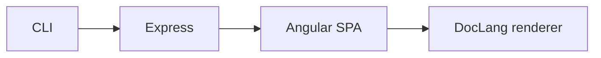

# How it works

A conceptual tour. For topic-by-topic deep dives — server,
frontend, renderer, wiki mode, themes, security — see the
[architecture folder](./architecture/overview.md).

## The four layers

1. **CLI** ([`server/bin/file-viewer.ts`](https://github.com/MorizMensi/grove/blob/main/server/bin/file-viewer.ts))
   - Parses argv, validates the folder, chooses a port.
   - Calls `createApp(docsDir)` and `.listen(port)`.
   - Full reference: [reference/cli](./reference/cli.md).

2. **Express** ([`server/index.ts`](https://github.com/MorizMensi/grove/blob/main/server/index.ts))
   - Mounts three JSON APIs:
     [`/api/documents`](./reference/http-api.md#get-apidocuments)
     (listing),
     [`/api/capabilities`](./reference/http-api.md#get-apicapabilities)
     (platform probe), and
     [`/api/open`](./reference/http-api.md#post-apiopen)
     (external tool). Request bodies are validated with zod.
   - Statically serves the built Angular bundle (the SPA).
   - Statically serves the docs folder at `/_content/`, so the
     SPA can fetch raw markdown via relative URLs.
   - Falls back to `index.html` for all unknown paths (the SPA
     catch-all), so client-side routes like `/some/deep/page`
     always land on the SPA.
   - Deep dive: [architecture/server](./architecture/server.md).

3. **Angular SPA** ([`frontend/src/app/`](https://github.com/MorizMensi/grove/tree/main/frontend/src/app))
   - A single standalone component,
     `DocumentShellComponent`, handles every URL under the flat
     catch-all route `/**`.
   - It reads the current URL segments, decides whether to show
     a directory listing or a file preview, and fetches
     accordingly:
     - Directory → `GET /api/documents?path=…`
     - File content → `GET /_content/<path>.<ext>` (relative,
       resolves via `<base href>`)
   - A tiny `CapabilitiesService` caches `/api/capabilities` so
     the action buttons know which platforms they work on.
   - Deep dive: [architecture/frontend](./architecture/frontend.md).

4. **DocLang renderer** ([`frontend/src/app/shared/doclang/`](https://github.com/MorizMensi/grove/tree/main/frontend/src/app/shared/doclang))
   - The raw markdown is fed into `<md-node>`.
   - `md-to-doclang.ts` parses it with remark (GFM + math) and
     converts the mdast tree into a canonical *DocLang* `DlNode`
     tree — Grove's internal document format.
   - `<dl-node>` recursively renders the DocLang tree into the
     DOM.
   - Highlighting (`highlight.service`), KaTeX rendering
     (`katex.service`), and Mermaid rendering (`mermaid.service`)
     are all lazy-loaded and cached.
   - Deep dive: [architecture/doclang](./architecture/doclang.md).

## Why DocLang?

Every markdown renderer eventually needs a structured
intermediate form: raw text in one side, DOM out the other.
Grove's `DlNode` tree is that intermediate. It's a recursive
structure with typed nodes for headings, paragraphs, code
blocks, tables, etc., plus a small set of styling hints (color,
background, icon, alignment).

Using an explicit tree instead of server-rendering HTML buys us
three things:

1. **Safety** — every link and image URL is filtered through
   `isSafeUrl()` during both conversion and render. Unsafe
   schemes (`javascript:`, `data:`, `file:`, `vbscript:`) never
   make it to the DOM. See
   [architecture/security](./architecture/security.md).
2. **Re-render without re-parse** — navigation between files
   re-renders the tree without re-hitting the parser.
3. **Non-markdown sources** — the same renderer can consume
   other formats in the future (JSON descriptions, wiki syntax,
   etc.) without touching the rendering code.

## Wiki mode

When Grove is built with the `wiki` Angular configuration, the
bundle has two compile-time differences:

- `DocumentService` reads directory listings from a pre-computed
  `wiki-manifest.json` instead of `GET /api/documents`.
- `CapabilitiesService` returns a static
  `{terminal: false, zed: false, claude: false}` object, so the
  action buttons never render.

Everything else — routing, rendering, styling — is the same
code path. That's why
[`https://morizmensi.github.io/grove/`](https://morizmensi.github.io/grove/)
looks identical to `grove ~/notes` on your laptop.

The `grove build-wiki` CLI subcommand ties the two modes
together: it walks a docs folder, generates a manifest, copies
the pre-built wiki bundle, rewrites the `<base href>`
placeholder, and produces a ready-to-upload GitHub Pages
artifact.

Full pipeline: [architecture/wiki-mode](./architecture/wiki-mode.md).
User-facing guide: [wiki-for-other-repos](./wiki-for-other-repos.md).

## Next

- [Architecture overview](./architecture/overview.md) — source
  layout, per-layer deep dives, and mermaid diagrams
- [Reference](./reference/overview.md) — CLI, HTTP API, env vars,
  scripts, types, file types
- [Back to docs home](./overview.md)
