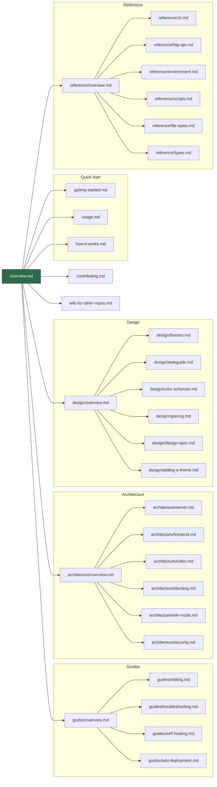

# Grove

A **local markdown wiki — and Typora-style editor — for any
folder.** Point it at `~/notes` or a repo's `docs/`, and get a
browseable Angular SPA with live markdown rendering, syntax
highlighting, math, diagrams, and media previews. Pass
`--allow-edits` and the same surface becomes an editor that writes
back to the filesystem. All local, no database, no cloud.

> This wiki is Grove rendering its own docs. Everything you see
> here — the sidebar, the code blocks, the table rendering, the
> link resolution — is exactly what you get when you run
> `npx grovemd ~/notes` on your own machine.

## Documentation map

## Start here

- **New user?** → [Getting started](./getting-started.md)
- **Day-to-day reading?** → [Usage guide](./usage.md)
- **Editing markdown?** → [Editing guide](./guides/editing.md)
- **Curious how it works?** → [How it works](./how-it-works.md)
- **Want to host Grove for your own repo?** →
  [Use Grove for your own wiki](./wiki-for-other-repos.md)
- **Contributing?** → [Contributing guide](./contributing.md)

## Deeper dives

- **[Architecture overview](./architecture/overview.md)** — layered
  tour of the server, frontend, editor, DocLang renderer, wiki
  bundle, theme system, and security model.
- **[Reference](./reference/overview.md)** — mechanical reference for
  the CLI, HTTP API, environment variables, npm scripts, supported
  file types, and shared types.
- **[Guides](./guides/overview.md)** — editing, troubleshooting,
  self-hosted deploys, and GitHub Pages wiki deployment.

## Design system

- **[Design overview](./design/overview.md)** — landing page for
  the theming and visual-design section
- **[Design spec](./design/design-spec.md)** — designer handoff:
  propose a new palette without reading code
- **[Adding a theme](./design/adding-a-theme.md)** — developer
  how-to for turning a palette proposal into a working theme
- **[Themes](./design/themes.md)** — runtime theme architecture
- **[Style guide](./design/styleguide.md)** — narrative reference
  for Grove's visual and structural design system
- **[Color schemes](./design/color-schemes.md)** — every palette,
  token, theme × mode combination, and syntax highlight shade
- **[Spacing, type, and motion](./design/spacing.md)** — spacing
  steps, radii, font sizes, shadows, durations, breakpoints

## Highlights

### Reading

- **Markdown + GFM** — tables, task lists, strikethrough, footnotes
- **Syntax highlighting** via highlight.js (190+ languages)
- **Math** via KaTeX (`$inline$`, `$$block$$`)
- **Diagrams** via Mermaid
- **Media previews** — images, video, audio, PDF, SVG, sandboxed HTML
- **Anchor navigation** — GFM-style heading IDs
- **Internal links** — relative markdown links route through the SPA

### Writing (opt-in, `--allow-edits`)

- **Typora-style editor** — CodeMirror 6 with a `StateField` that
  hides inline syntax outside the caret
- **Live block widgets** for fenced code, tables, Mermaid, images
- **Explicit save** with `If-Unmodified-Since` conflict detection
- **Atomic writes** — tmp + rename
- **Sidebar CRUD** — New file, New folder, Delete with focus-trapped
  confirm modal
- **Git auto-commit** (`--git-commit`) — one
  `grove: <verb> <rel>` commit per successful write

### Security

- **Path containment with `realpath`** — rejects symlink escapes,
  sibling-prefix bypass, `..` traversal, NUL bytes
- **Edits gate** — middleware, not UI hiding
- **CSRF via Origin/Host equality** on every state-changing verb
- **Per-route body parser** with explicit 10 MB JSON cap on writes
- **CSP sandbox** on `/_content/` HTML/SVG responses
- **URL filter** called four times per render

Full security treatment:
[architecture/security](./architecture/security.md).

Grove is [open source (MIT)](https://github.com/MorizMensi/grove)
and published on npm as
[`grovemd`](https://www.npmjs.com/package/grovemd). The installed
CLI is named `grove`.
