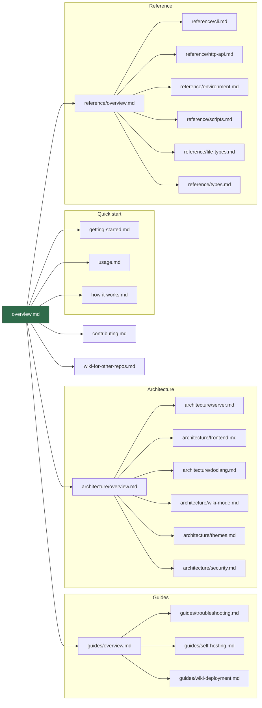

# Grove

A **local markdown wiki for any folder** — point it at `~/notes`
or a repo's `docs/`, and get a browseable Angular SPA with live
markdown rendering, syntax highlighting, math, diagrams, and media
previews. All static, no database, no cloud.

> This wiki is Grove rendering its own docs. Everything you see
> here — the sidebar, the code blocks, the table rendering, the
> link resolution — is exactly what you get when you run
> `npx grovemd ~/notes` on your own machine.

## Documentation map

## Start here

- **New user?** → [Getting started](./getting-started.md)
- **Day-to-day usage?** → [Usage guide](./usage.md)
- **Curious how it works?** → [How it works](./how-it-works.md)
- **Want to host Grove for your own repo?** →
  [Use Grove for your own wiki](./wiki-for-other-repos.md)
- **Contributing?** → [Contributing guide](./contributing.md)

## Deeper dives

- **[Architecture overview](./architecture/overview.md)** — layered
  tour of the server, frontend, DocLang renderer, wiki bundle,
  theme system, and security model.
- **[Reference](./reference/overview.md)** — mechanical reference for
  the CLI, HTTP API, environment variables, npm scripts, supported
  file types, and shared types.
- **[Guides](./guides/overview.md)** — troubleshooting, self-hosted
  deploys, and GitHub Pages wiki deployment.

## Design system

- **[Style guide](./styleguide.md)** — narrative reference for
  Grove's visual and structural design system
- **[Color schemes](./color-schemes.md)** — every palette, token,
  theme × mode combination, and syntax highlight shade
- **[Spacing, type, and motion](./spacing.md)** — spacing steps,
  radii, font sizes, shadows, durations, breakpoints

## Highlights

- **Markdown + GFM** — tables, task lists, strikethrough, footnotes
- **Syntax highlighting** via highlight.js (190+ languages) —
  see [reference/file-types](./reference/file-types.md)
- **Math** via KaTeX (`$inline$`, `$$block$$`) —
  see [architecture/doclang](./architecture/doclang.md)
- **Diagrams** via Mermaid —
  see [architecture/doclang](./architecture/doclang.md)
- **Media previews** — images, video, audio, pdf, svg —
  see [reference/file-types](./reference/file-types.md)
- **Anchor navigation** — GFM-style heading IDs, fragment scrolling —
  see [architecture/frontend](./architecture/frontend.md#anchor-navigation)
- **Internal links** — relative markdown links route through the SPA —
  see [architecture/doclang](./architecture/doclang.md#link-resolution)

Grove is [open source (MIT)](https://github.com/MorizMensi/grove)
and published on npm as
[`grovemd`](https://www.npmjs.com/package/grovemd). The installed
CLI is named `grove`.
