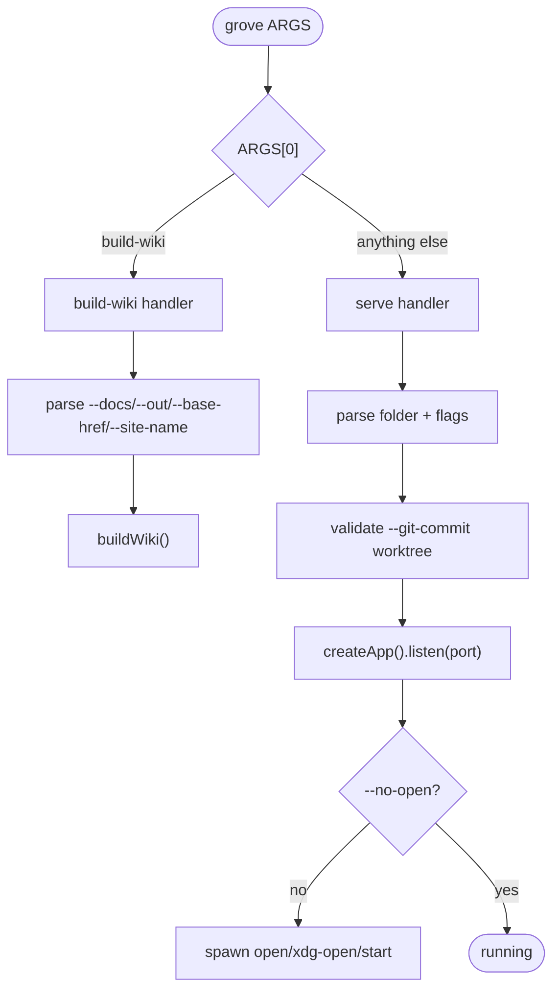

# CLI reference

Source:
[`server/bin/file-viewer.ts`](https://github.com/MorizMensi/grove/blob/main/server/bin/file-viewer.ts)

Grove exposes **one binary** named `grove` (published as
`grovemd` on npm) with **two subcommands**:

- The default serve mode — `grove [folder] [options]`
- `grove build-wiki` — build a static GitHub-Pages-ready wiki

## Dispatch



## `grove [folder] [options]`

Starts the live server. `folder` defaults to the current
directory if omitted, so `cd ~/notes && grove` works.

| Option | Default | Description |
| --- | --- | --- |
| `--port <number>` | `3000` | Port to listen on. Must be 1–65535. Invalid values exit 1. |
| `--no-open` | off | Do not auto-open the browser on boot. |
| `--allow-edits` | off | Enable in-browser editing of `.md` files. Unlocks PUT/POST/DELETE on `/api/documents`. |
| `--git-commit` | off | Commit every successful write as `grove: <verb> <rel>`. Requires `--allow-edits`. Requires `docsDir` to be inside a git worktree with `user.name` and `user.email` configured — validated at startup. |
| `--disable-security <csv>` | off | **UNSAFE.** Comma-separated list of named security escape hatches. May be repeated. Prints a stderr warning at startup whenever any feature is disabled. See [below](#--disable-security-csv). |
| `-h`, `--help` | — | Print help and exit. |

Positional arguments and unknown flags are tolerated — the first
positional becomes the folder; unknown flags are currently ignored
except where they consume the next argument (`--port`,
`--disable-security`). This may tighten in a later release.

### Behavior

1. Parse flags.
2. Refuse `--git-commit` without `--allow-edits` — exit 1 with
   `Error: --git-commit requires --allow-edits.`
3. Resolve `folder` to an absolute path (defaults to `.`).
4. `stat()` the path — must exist and be a directory, else exit 1.
5. If `--git-commit` is set, validate the worktree and git identity
   (`validateGitRepo`). Any failure exits 1 with an actionable
   message (see [git-commit validation](#git-commit-validation)).
6. `createApp(absolutePath, { allowEdits, gitCommit, disabledSecurity })`
   → Express app.
7. `app.listen(port, …)` — prints:
   ```
   Grove serving "<absolutePath>"
   Editing enabled (--allow-edits).          [if --allow-edits]
   Auto-commit enabled (--git-commit).       [if --git-commit]
   WARNING: security features disabled: …    [if any --disable-security]
   Open http://localhost:<port>
   ```
   The `WARNING:` line goes to **stderr**; all others go to stdout.
8. Unless `--no-open` was passed, spawn a platform-appropriate
   open command: `open` (darwin), `start` (win32), `xdg-open`
   (linux / everything else).
9. Install `SIGINT` / `SIGTERM` handlers that call
   `server.close()` and force-exit after 3 seconds.

### Examples

```bash
grove
grove ~/notes
grove ~/notes --port 8080
grove . --no-open
grove ~/vault --allow-edits
grove ~/vault --allow-edits --git-commit
grove ~/vault --allow-edits --disable-security allow-symlinks
grove ~/vault --allow-edits --disable-security allow-symlinks,foo   # exit 1 — unknown flag
```

### `--allow-edits`

Flips the server from read-only to a full CRUD surface on
`/api/documents`:

| Verb | Path | With `--allow-edits` | Without |
| --- | --- | --- | --- |
| `GET` | `/api/documents` | 200 listing | 200 listing |
| `GET` | `/api/documents/raw` | 200 content + mtime | **404** — route not registered without the flag? No — route always present, returns raw content either way. |
| `PUT` | `/api/documents` | 200 / 409 / 413 / 415 | **403** `edits-disabled` |
| `POST` | `/api/documents` | 201 / 409 | **403** `edits-disabled` |
| `DELETE` | `/api/documents` | 204 / 409 / 404 | **403** `edits-disabled` |
| `GET` | `/api/capabilities` | `supports.edits = true` | `supports.edits = false` |

The UI pencil, sidebar inline `+`, and context-menu create/delete
items are all gated on `supports.edits`. Hiding them is cosmetic —
the real gate is `requireEdits(allowEdits)` middleware in
`server/edits-middleware.ts`.

### `--git-commit`

Requires `--allow-edits`. When set, every successful write on
`/api/documents` (PUT, POST for files, DELETE for files) triggers:

```
git -C <docsDir> add -- <rel>
git -C <docsDir> commit -m "grove: <verb> <rel>" --only -- <rel>
```

`<verb>` is one of `edit`, `create`, `delete`. `mkdir` and `rmdir`
(directory ops) are not committed because empty directories are not
tracked by git. Re-saving identical content, or deleting a path
already gone in the index, produces git's "nothing to commit"
diagnostic, which is **swallowed** — the disk op already succeeded
and there is nothing meaningful to version.

Commits are scoped to the single changed file via
`commit --only -- <rel>`, so uncommitted changes elsewhere in the
docs repo are not accidentally swept into a Grove commit.

Any other git failure surfaces as `500 git-failed` **after** the
disk write has already succeeded. The client treats it as a
non-fatal warning. Rolling back the write on git failure was
considered and rejected — a visible warning is safer than an
inconsistent on-disk state.

#### `--git-commit` validation

On startup, `validateGitRepo(docsDir)` checks, in order:

1. `git --version` runs — else `git binary not found on PATH`.
2. `git -C <docsDir> rev-parse --is-inside-work-tree` — else
   `"<docsDir>" is not inside a git worktree. Run \`git init\` there
   or remove the flag.`
3. `git -C <docsDir> config --get user.name` — else
   `git user.name is not configured.`
4. `git -C <docsDir> config --get user.email` — else
   `git user.email is not configured.`

Any failure exits 1 before the server starts listening. Users who
enable `--git-commit` never hit a silent no-op at save time.

### `--disable-security <csv>`

**This flag is unsafe.** Every entry is an explicit escape hatch.
Grove prints a stderr warning whenever any feature is disabled.

Invocation:

```bash
grove . --allow-edits --disable-security allow-symlinks
grove . --allow-edits --disable-security allow-symlinks,other-flag
grove . --allow-edits --disable-security allow-symlinks --disable-security other-flag
```

Repeat invocations merge into the same set. Empty input
(`--disable-security ,,`) or unknown tokens exit 1 with a listing of
valid values.

Valid values:

| Flag | Effect |
| --- | --- |
| `allow-symlinks` | `ensureInside` still requires the addressed (lexical) path to be contained in `docsDir`, but skips the realpath containment check. Symlinks inside `docsDir` whose targets live outside `docsDir` will resolve. `..` traversal and sibling-prefix bypass stay blocked. |

Source: [`server/security-options.ts`](https://github.com/MorizMensi/grove/blob/main/server/security-options.ts).
Parsing is covered by `server/security-options.test.ts`; containment
behaviour is covered by `server/path-sandbox.test.ts`.

## `grove build-wiki`

Builds a static wiki bundle from a folder of markdown files.

```
grove build-wiki --docs <path> [--out <path>] [--base-href <href>] [--site-name <name>]
```

| Option | Default | Description |
| --- | --- | --- |
| `--docs <path>` | **required** | Path to the markdown folder to render. |
| `--out <path>` | `dist-wiki` | Output directory. **Wiped before writing.** |
| `--base-href <href>` | `/` | Deploy base path. Leading and trailing slashes are normalized. |
| `--site-name <name>` | — | Brand text shown in the breadcrumb bar and browser tab title. Defaults to `"Grove"` when rendered. |
| `-h`, `--help` | — | Print help and exit. |

Unknown options exit 1 with `Unknown option: <arg>`.

The wiki bundle ships the frontend as **read-only** — no
`--allow-edits` flag exists on `build-wiki`, and the wiki-mode
`CapabilitiesService` hard-codes `supports.edits = false`. The
built-in pencil toggle, sidebar `+`, and context menu never render
in wiki deployments.

### Behavior

1. Validate `--docs` exists and is a directory.
2. Normalize `--base-href` to have a leading and trailing slash.
3. Locate the pre-built wiki bundle at
   `dist/frontend/wiki/index.html`. If missing, fail with:

   ```
   Grove wiki bundle not found at <path>.
   Did you run `npm run build:wiki` (or `npm run build:all`) first?
   ```

4. Destructively wipe `--out` and recreate it.
5. Copy the bundle into `--out`.
6. Rewrite the `<base href>` placeholder in `index.html` and
   produce `404.html` with the same content.
7. Walk the docs folder to produce `wiki-manifest.json`.
8. Copy the docs folder into `<out>/_content/`.

Full architectural context: [architecture/wiki-mode](../architecture/wiki-mode.md).

### Examples

```bash
# Grove's own wiki (rendered to /grove/)
grove build-wiki --docs docs --out dist-wiki --base-href /grove/ --site-name "Grove"

# Local preview (base-href is /)
grove build-wiki --docs docs --out /tmp/preview --base-href /
```

## Exit codes

| Code | When |
| --- | --- |
| `0` | success |
| `1` | any argument validation error, missing folder, missing bundle, `--git-commit` validation failure, `--disable-security` parse failure, or `buildWiki()` exception |

## See also

- [HTTP API reference](./http-api.md)
- [Environment variables](./environment.md)
- [npm scripts](./scripts.md)
- [Server layer](../architecture/server.md)
- [Wiki bundle mode](../architecture/wiki-mode.md)
- [Editor architecture](../architecture/editor.md)
- [Editing guide](../guides/editing.md)
- [Back to reference index](./overview.md)
