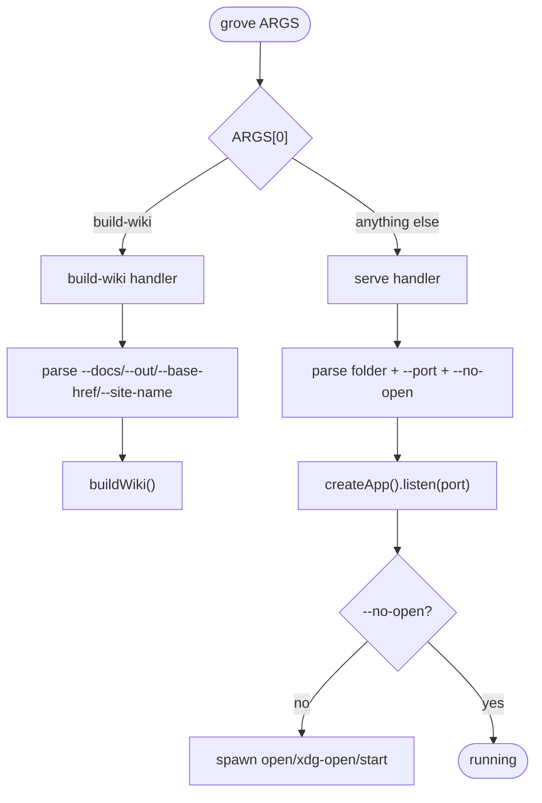

# CLI reference

Source:
[`server/bin/file-viewer.ts`](https://github.com/MorizMensi/grove/blob/main/server/bin/file-viewer.ts)

Grove exposes **one binary** named `grove` (published as
`grovemd` on npm) with **two subcommands**:

- The default serve mode — `grove [folder] [options]`
- `grove build-wiki` — build a static GitHub-Pages-ready wiki

## Dispatch



## `grove [folder] [options]`

Starts the live server. `folder` defaults to the current
directory if omitted, so `cd ~/notes && grove` works.

| Option | Default | Description |
| --- | --- | --- |
| `--port <number>` | `3000` | Port to listen on. Must be 1–65535. Invalid values exit 1. |
| `--no-open` | off | Do not auto-open the browser on boot. |
| `-h`, `--help` | — | Print help and exit. |

Unknown options are tolerated (the first positional becomes the
folder; unknown flags are currently ignored). This will
tighten in a later release.

### Behavior

1. Resolve `folder` to an absolute path.
2. `stat()` the path — must exist and be a directory, else exit 1.
3. `createApp(absolutePath)` → Express app.
4. `app.listen(port, …)` — prints two lines:
   ```
   Grove serving "<absolutePath>"
   Open http://localhost:<port>
   ```
5. Unless `--no-open` was passed, spawn a platform-appropriate
   open command: `open` (darwin), `start` (win32), `xdg-open`
   (linux / everything else).
6. Install `SIGINT` / `SIGTERM` handlers that call
   `server.close()` and force-exit after 3 seconds.

### Examples

```bash
grove
grove ~/notes
grove ~/notes --port 8080
grove . --no-open
```

### Environment variables

See [environment.md](./environment.md) for the full list. The
relevant one at runtime is `ZED_BIN`, which overrides how the
`/api/open` handler spawns Zed.

## `grove build-wiki`

Builds a static wiki bundle from a folder of markdown files.

```
grove build-wiki --docs <path> [--out <path>] [--base-href <href>] [--site-name <name>]
```

| Option | Default | Description |
| --- | --- | --- |
| `--docs <path>` | **required** | Path to the markdown folder to render. |
| `--out <path>` | `dist-wiki` | Output directory. **Wiped before writing.** |
| `--base-href <href>` | `/` | Deploy base path. Leading and trailing slashes are normalized. |
| `--site-name <name>` | — | Brand text shown in the breadcrumb bar and browser tab title. Defaults to `"Grove"` when rendered. |
| `-h`, `--help` | — | Print help and exit. |

Unknown options exit 1 with `Unknown option: <arg>`.

### Behavior

1. Validate `--docs` exists and is a directory.
2. Normalize `--base-href` to have a leading and trailing slash.
3. Locate the pre-built wiki bundle at
   `dist/frontend/wiki/index.html`. If missing, fail with:

   ```
   Grove wiki bundle not found at <path>.
   Did you run `npm run build:wiki` (or `npm run build:all`) first?
   ```

4. Destructively wipe `--out` and recreate it.
5. Copy the bundle into `--out`.
6. Rewrite the `<base href>` placeholder in `index.html` and
   produce `404.html` with the same content.
7. Walk the docs folder to produce `wiki-manifest.json`.
8. Copy the docs folder into `<out>/_content/`.

Full architectural context: [architecture/wiki-mode](../architecture/wiki-mode.md).

### Examples

```bash
# Grove's own wiki (rendered to /grove/)
grove build-wiki --docs docs --out dist-wiki --base-href /grove/ --site-name "Grove"

# Local preview (base-href is /)
grove build-wiki --docs docs --out /tmp/preview --base-href /
```

## Exit codes

| Code | When |
| --- | --- |
| `0` | success |
| `1` | any argument validation error, missing folder, missing bundle, or `buildWiki()` exception |

## See also

- [HTTP API reference](./http-api.md)
- [Environment variables](./environment.md)
- [npm scripts](./scripts.md)
- [Server layer](../architecture/server.md)
- [Wiki bundle mode](../architecture/wiki-mode.md)
- [Back to reference index](./overview.md)
