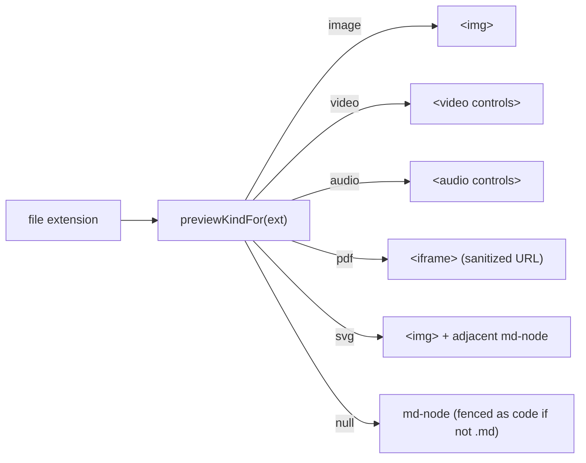

# File types

Grove classifies every file entry three ways:

1. **Preview kind** — which widget the document shell uses.
2. **Sidebar icon** — which Bootstrap Icons class is shown.
3. **Syntax highlighting** — which highlight.js grammar wraps
   the file when it is displayed as code.

Source:
[`frontend/src/app/core/constants/file-types.ts`](https://github.com/MorizMensi/grove/blob/main/frontend/src/app/core/constants/file-types.ts)
(preview + icons),
[`frontend/src/app/shared/doclang/highlight.service.ts`](https://github.com/MorizMensi/grove/blob/main/frontend/src/app/shared/doclang/highlight.service.ts)
(grammars).

## Preview widget matrix



<!-- AUTO-GENERATED -->

| Kind | Extensions | Widget |
| --- | --- | --- |
| **Image** | `png`, `jpg`, `jpeg`, `gif`, `bmp`, `heic`, `tiff`, `raw`, `webp` | `` with `class="media-preview"` |
| **Video** | `mp4`, `mov`, `webm` | `<video controls>` |
| **Audio** | `mp3`, `aac`, `wav`, `m4p`, `ogg` | `<audio controls>` |
| **PDF** | `pdf` | `<iframe>` with sanitized URL |
| **SVG** | `svg` | `` **and** the adjacent `md-node` renders the same file as text (for simultaneous visual + source view) |
| **Markdown** | `md` | `<md-node>` |
| **Everything else** | `*` | Wrapped in a fenced code block and fed through `<md-node>` / `<dl-node>`; highlight.js picks the grammar if the extension matches one of the registered languages |

<!-- /AUTO-GENERATED -->

See `previewKindFor()` in
[`file-types.ts`](https://github.com/MorizMensi/grove/blob/main/frontend/src/app/core/constants/file-types.ts)
for the exact logic.

## Sidebar icons

Each directory entry gets a Bootstrap Icons class:

- **Directories** → `bi-folder-fill`
- **Files with a known extension** → `bi-filetype-<ext>`
- **Everything else** → `bi-file-earmark`

<!-- AUTO-GENERATED -->

Known extensions (have a dedicated `bi-filetype-*` icon):

```
aac, ai, bmp, cs, css, csv, doc, docx, exe, gif, heic, html,
java, jpg, js, json, jsx, key, md, mdx, m4p, mov, mp3, mp4,
otf, pdf, php, png, ppt, pptx, psd, py, raw, rb, sass, scss,
sh, sql, svg, tiff, tsx, ttf, txt, wav, woff, xls, xlsx, xml,
yml
```

<!-- /AUTO-GENERATED -->

To add one, append the extension to `FILETYPE_ICONS` in
`file-types.ts`. Bootstrap Icons ships a fixed set; unknown
extensions silently fall back to `bi-file-earmark`.

## Syntax highlighting grammars

highlight.js is imported from its **core** entry
(`highlight.js/lib/core`) and Grove registers only the
grammars it actually ships. This keeps the bundle small.

<!-- AUTO-GENERATED -->

| Registered name | Language | Alias(es) |
| --- | --- | --- |
| `json` | JSON | — |
| `typescript` | TypeScript | `ts` |
| `javascript` | JavaScript | `js` |
| `xml` | XML / HTML | `html` |
| `css` | CSS | — |
| `bash` | Bash | `sh`, `shell` |
| `python` | Python | `py` |
| `java` | Java | — |
| `yaml` | YAML | `yml` |
| `sql` | SQL | — |

<!-- /AUTO-GENERATED -->

Aliases are resolved in `HighlightService.highlight()` via a
small lookup table before calling `hljs.highlight()`.

Everything else (rust, go, c, lua, elixir, …) renders as
**plain code** — no highlighting, no error. The display
language label falls back to the raw `language` string the
markdown author wrote.

### Adding a grammar

1. Import the language module from
   `highlight.js/lib/languages/<name>`.
2. Add it to the `languages` map in
   [`highlight.service.ts`](https://github.com/MorizMensi/grove/blob/main/frontend/src/app/shared/doclang/highlight.service.ts).
3. Register any aliases in the `aliasMap` and the
   `registered` set.
4. (Optional) Add a pretty display name to
   `DlNodeComponent.LANG_DISPLAY`.

Bundle-size tradeoff: every registered grammar is bundled
eagerly. There is currently no dynamic import of grammars on
demand.

## Display-name pretty printer

`DlNodeComponent.LANG_DISPLAY` maps raw language strings to
display labels shown in the top-right of each code block:

```
ts → TypeScript     typescript → TypeScript
js → JavaScript     javascript → JavaScript
html → HTML         xml → XML
css → CSS           scss → SCSS
json → JSON         yaml → YAML     yml → YAML
bash → Bash         sh → Shell      shell → Shell
python → Python     py → Python
java → Java         sql → SQL
```

Unlisted grammars fall back to the raw string.

## See also

- [DocLang renderer](../architecture/doclang.md) — where the
  grammars are actually invoked
- [Usage](../usage.md) — the user-facing feature catalog
- [Shared types](./types.md)
- [Back to reference index](./index.md)
