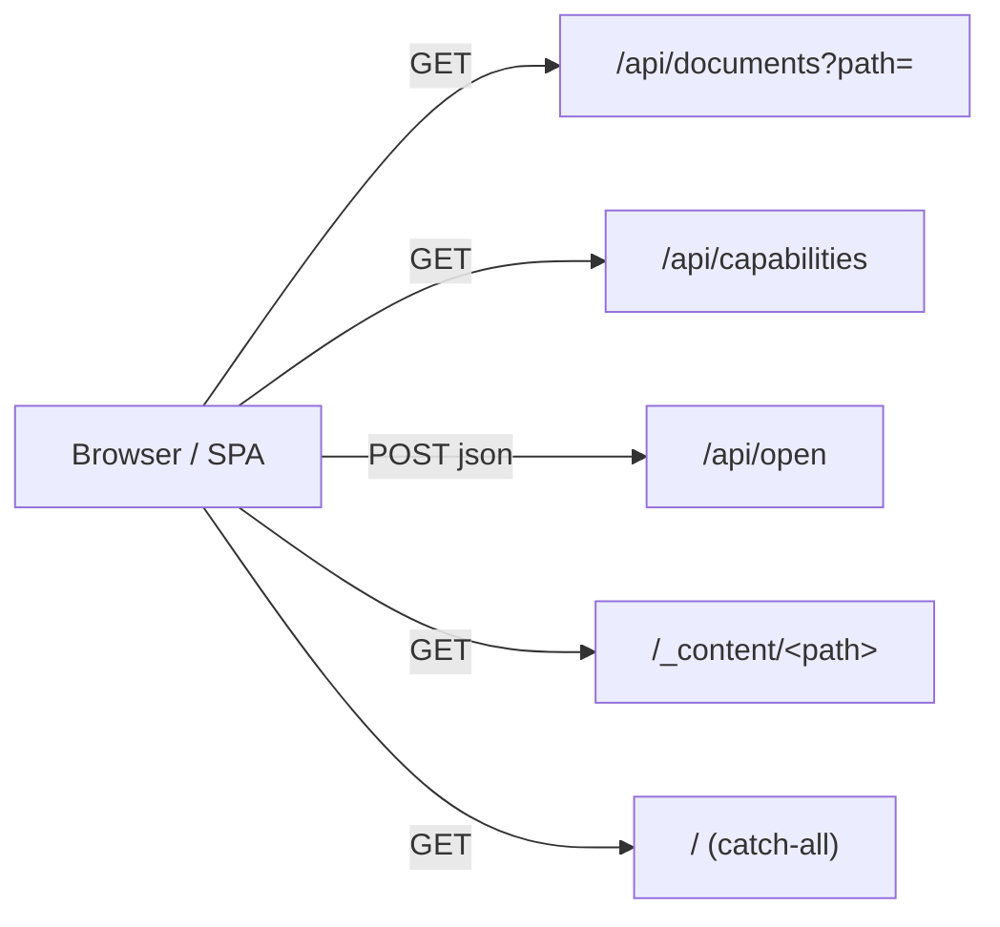

# HTTP API reference

Grove's server speaks three JSON routes and one static-file
mount. Everything below is mechanical — see
[architecture/server](../architecture/server.md) for how the
routes wire together.

## Surface



## `GET /api/documents`

List a directory inside the docs root.

Source:
[`server/documents.ts`](https://github.com/MorizMensi/grove/blob/main/server/documents.ts)

### Request

| Query | Type | Required | Description |
| --- | --- | --- | --- |
| `path` | string | no | Directory path relative to the docs root. Default: empty = root. Must not contain `..` or start with `/`. |

### Response 200

```json
{
  "path": "architecture",
  "entries": [
    { "name": "index", "type": "file", "extension": "md" },
    { "name": "server", "type": "file", "extension": "md" },
    { "name": "..." , "type": "directory" }
  ]
}
```

Shape: `DocumentListing` — see
[types.md](./types.md#documentlisting).

Ordering: directories first, then files, alphabetical within
each group.

Hidden files (dot-prefixed) are omitted.

### Response 400

```json
{ "error": "Invalid path" }
```

Emitted when `path` contains `..` or starts with `/`, or when
the resolved absolute path escapes the docs root.

### Response 404

```json
{ "error": "Directory not found" }
```

or

```json
{ "error": "Not a directory" }
```

## `GET /api/capabilities`

Probe the host to find out which `/api/open` actions work.

Source:
[`server/capabilities.ts`](https://github.com/MorizMensi/grove/blob/main/server/capabilities.ts)

### Request

No parameters.

### Response 200

```json
{
  "platform": "darwin",
  "supports": {
    "terminal": true,
    "zed": true,
    "claude": true
  }
}
```

| Field | Type | Meaning |
| --- | --- | --- |
| `platform` | `NodeJS.Platform` | Value of `process.platform`. |
| `supports.terminal` | boolean | `true` on darwin only. |
| `supports.zed` | boolean | `true` if Grove can resolve a Zed install. See [environment#zed_bin](./environment.md#zed_bin). |
| `supports.claude` | boolean | `true` on darwin only. |

## `POST /api/open`

Open the given path in an external tool.

Source:
[`server/open.ts`](https://github.com/MorizMensi/grove/blob/main/server/open.ts)

### Request

Content-Type: `application/json`

```json
{
  "action": "terminal" | "zed" | "claude",
  "path": "some/relative/path"
}
```

Validation (zod schema
[`shared/types/open.ts`](https://github.com/MorizMensi/grove/blob/main/shared/types/open.ts)):

- `action` must be one of the three enum values.
- `path` must be a string, must not contain `..`, must not start
  with `/`.

The resolved absolute path must still be inside the docs root
(re-checked at the router layer).

### Per-action semantics

| Action | Platform | What it does | Requires directory? |
| --- | --- | --- | --- |
| `terminal` | darwin only | `open -a Terminal <dir>` | yes |
| `zed` | any | Launches Zed against the given path. See the resolver below. | no — can be a file |
| `claude` | darwin only | Drives Terminal.app via `osascript` to spawn `cd "<dir>" && claude`. | yes |

Zed resolver priority (see
[zed-resolver.ts](https://github.com/MorizMensi/grove/blob/main/server/zed-resolver.ts)):

1. `ZED_BIN` env var
2. `open -a Zed` via LaunchServices on darwin (if `Zed.app` exists)
3. `/usr/local/bin/zed`
4. `/opt/homebrew/bin/zed`
5. `~/.local/bin/zed`
6. Bare `zed` on `PATH` (unverified — not advertised in capabilities)

### Response 200

```json
{ "ok": true }
```

### Response 400

Zod validation error shape (Zod's own
`z.ZodError.format()` output) or:

```json
{ "error": "Invalid path" }
```

or

```json
{ "error": "Path is not a directory" }
```

### Response 404

```json
{ "error": "Path not found" }
```

### Response 500

```json
{ "error": "Failed to open: <execFile error message>" }
```

When Zed is missing, the message is suffixed with
`— Zed not found. Install Zed or set the ZED_BIN env var.`

### Response 501

```json
{ "error": "Action \"<action>\" is not supported on platform \"<platform>\"." }
```

Emitted when an action is invoked on a platform that does not
support it. The capability endpoint should have hidden the
button, but the server is still defensive.

## `GET /_content/<path>`

Static mount over the docs root.

Source:
[`server/index.ts`](https://github.com/MorizMensi/grove/blob/main/server/index.ts),
prefix constant in
[`shared/content-url.ts`](https://github.com/MorizMensi/grove/blob/main/shared/content-url.ts)

- Backed by `express.static(docsDir, { redirect: false })`.
- URL prefix: `/_content/` — chosen to never collide with
  user-chosen folder names.
- Used by the SPA to fetch raw markdown (`.md`), images, video,
  audio, pdf, svg, and other content bytes.
- In **wiki mode** the same prefix exists under the output
  directory, so the same relative URL works both live and static.
- Does not follow symlink redirects (`redirect: false`).

## `GET /` (catch-all)

Every unmatched path returns `dist/frontend/browser/index.html`
so the Angular router can handle it client-side.

Source: `server/index.ts`:

```ts
app.get('/{*splat}', (_req, res) => {
  res.sendFile(join(frontendDir, 'index.html'));
});
```

Note the Express 5 named-wildcard syntax.

## See also

- [CLI reference](./cli.md)
- [Environment variables](./environment.md)
- [Shared types](./types.md)
- [Server layer](../architecture/server.md)
- [Security model](../architecture/security.md)
- [Back to reference index](./index.md)
