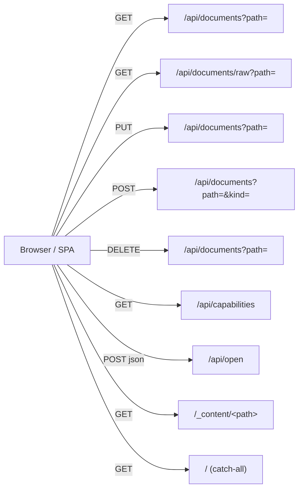

# HTTP API reference

Grove's server speaks a small JSON API, a static content mount, and a
SPA catch-all. Every route below is mechanical — see
[architecture/server](../architecture/server.md) for how the routes
wire together and [architecture/security](../architecture/security.md)
for the middleware chain on write routes.

## Surface



## Middleware chain

Write routes all share the same prefix chain, declared explicitly in
`server/documents.ts`:

```
requireEdits(allowEdits)   # 403 edits-disabled if --allow-edits absent
  → csrfOrigin             # 403 bad-origin on Origin/Host mismatch
  → jsonOnly               # 415 unsupported-media-type if not JSON (PUT)
  → express.json({limit:'10mb'})  # 413 too-large if body exceeds (PUT)
  → jsonErrorHandler       # maps parse errors to {error: 'bad-json'}
  → handler
```

The order matters:

1. `requireEdits` runs first so a disabled server never parses a body.
2. `csrfOrigin` runs before body parsing so drive-by POSTs are rejected
   cheaply.
3. `jsonOnly` runs before `express.json` — without it, non-JSON bodies
   produce an empty `req.body = {}` instead of 415.
4. `jsonErrorHandler` catches `entity.too.large` and
   `entity.parse.failed` from `express.json` and normalizes them to
   Grove's error vocabulary.

There is **no app-level** `express.json()`. Each write route declares
its own parser so size-cap policy is visible at the route definition.
`/api/open` gets the default 100 KB limit; `PUT /api/documents` gets
10 MB.

## `GET /api/documents`

List a directory inside the docs root.

Source:
[`server/documents.ts`](https://github.com/MorizMensi/grove/blob/main/server/documents.ts)

### Request

| Query | Type | Required | Description |
| --- | --- | --- | --- |
| `path` | string | no | Directory path relative to the docs root. Default: empty = root. Validated via `ensureInside(docsDir, …)`. |

### Response 200

```json
{
  "path": "architecture",
  "entries": [
    { "name": "index", "type": "file", "extension": "md" },
    { "name": "server", "type": "file", "extension": "md" },
    { "name": "guides", "type": "directory" }
  ]
}
```

Shape: `DocumentListing` — see
[types.md](./types.md#documentlisting).

Ordering: directories first, then files, alphabetical within each
group. Hidden files (dot-prefixed) are omitted. Entries that are
neither a regular file nor a directory (sockets, device nodes, FIFOs)
are also dropped.

### Response 403

```json
{ "error": "forbidden" }
```

Emitted when `ensureInside` rejects the path (traversal, symlink
escape, NUL byte, sibling-prefix bypass).

### Response 404

```json
{ "error": "Directory not found" }
```

or

```json
{ "error": "Not a directory" }
```

## `GET /api/documents/raw`

Fetch raw file content plus the current `mtime` for conflict
detection.

### Request

| Query | Type | Required | Description |
| --- | --- | --- | --- |
| `path` | string | yes | File path relative to the docs root. `ensureInside` runs with `allowMissing: true` so a path inside `docsDir` that points at a non-existent file surfaces as 404 rather than 403. |

### Response 200

```json
{
  "content": "# Hello\n\nSome text.\n",
  "mtime": 1714654321987.654
}
```

Shape: `RawDocumentResponse`. Headers include:

- `Last-Modified: <UTC string>` — derived from `mtime`.
- `ETag: W/"<mtime-ms-floor>-<size>"` — weak, because clients must
  not treat it as byte-exact after an atomic rename.

`mtime` is the full `stat.mtimeMs` value (fractional ms). Clients
pass it verbatim as the `If-Unmodified-Since` header on the next
`PUT`. See [architecture/server](../architecture/server.md#conflict-detection)
for why millisecond precision matters.

### Response 403 / 404

Same shapes as `GET /api/documents`. `404` also covers
`{ error: "not-a-file" }` for paths that resolve to a directory.

## `PUT /api/documents`

Update a file's contents. Gated by `--allow-edits`.

### Request

```
PUT /api/documents?path=notes/2026-04-21.md HTTP/1.1
Content-Type: application/json
If-Unmodified-Since: 1714654321987.654   # decimal ms or HTTP-date
Content-Length: …

{"content": "# Updated\n\nNew text.\n"}
```

| Header | Required | Description |
| --- | --- | --- |
| `Content-Type` | yes | Must be `application/json`. Other types → 415. |
| `If-Unmodified-Since` | yes | Decimal milliseconds since the Unix epoch **or** an RFC 9110 HTTP-date. Missing or unparseable → 400. |
| `Origin` | yes | Must match `Host`. Missing or mismatched → 403. |

Query: `path=<relative path>`.

Body: `{ content: string }`. Any other shape → 400 `bad-body`.
Maximum body size is 10 MB JSON; larger → 413 `too-large`.

### Semantics

1. `ensureInside` resolves the target. Failure → 403 `forbidden`.
2. `stat(absPath)` — must exist and be a regular file. Else 404
   `not-found` or 409 `not-a-file`.
3. Compare `If-Unmodified-Since` to `mtimeMs` at **second** precision
   (HTTP dates have only second granularity; comparing ms-precision
   against a second-precision parsed date would spuriously trip
   within the same second of a save). `currentSec > expectedSec` →
   409 `stale` with the current `mtime` in the body.
4. `atomicWrite(absPath, body.content)` — writes to
   `<absPath>.grove-<suffix>.tmp` and `rename()`s into place on the
   same filesystem. On failure, the tmp file is unlinked.
5. Re-stat and return the new `mtime`.
6. If `--git-commit` is on, run `git add` + `git commit` scoped to
   the changed file. "Nothing to commit" is swallowed; any other git
   failure returns `500 git-failed` **after** the disk write
   succeeded.

### Response 200

```json
{ "mtime": 1714654322450.12 }
```

Shape: `SaveDocumentResponse`.

### Response 400

- `{ "error": "bad-body" }` — `content` missing or not a string.
- `{ "error": "missing-if-unmodified-since" }`
- `{ "error": "bad-if-unmodified-since" }`

### Response 403

- `{ "error": "edits-disabled" }` — `--allow-edits` not set.
- `{ "error": "bad-origin" }` — `Origin` missing or host mismatch.
- `{ "error": "forbidden" }` — `ensureInside` rejected the path.

### Response 409

- `{ "error": "stale", "mtime": <current-ms> }` — on-disk file has
  been modified since the client's last read.
- `{ "error": "not-a-file" }`

### Response 413

`{ "error": "too-large" }` — JSON body exceeded 10 MB.

### Response 415

`{ "error": "unsupported-media-type" }` — `Content-Type` was not
`application/json`.

### Response 500

`{ "error": "git-failed", "mtime": <current-ms> }` — disk write
succeeded but the subsequent `git add`/`git commit` failed with
something other than "nothing to commit".

## `POST /api/documents`

Create a new file (empty body) or a new empty directory.

### Request

| Query | Type | Required | Description |
| --- | --- | --- | --- |
| `path` | string | yes | Target path relative to the docs root. The basename is the new entry's name. |
| `kind` | `"file"` \| `"dir"` | no | Default `"file"`. |

No body.

Name validation (`isValidName` in `documents.ts`):

- Non-empty, not `.` or `..`.
- No leading `.` (dotfiles are hidden by listing).
- No `/`, `\`, or `\0`.
- UTF-8 byte length ≤ 255.
- Windows-reserved names (`CON`, `PRN`, `aux`, etc.) are **not**
  blocked — Grove targets macOS and Linux.

### Semantics

1. `ensureInside` resolves the **parent** directory. If the parent
   is missing, returns 409 `parent-missing` rather than 403
   `forbidden` so the UI can offer a clear "Create the folder first."
2. `stat(parent)` — must exist and be a directory. Else 409
   `parent-missing`.
3. For `kind=file`: `writeFile(absPath, '', { flag: 'wx' })`. The
   `wx` flag makes `writeFile` fail with `EEXIST` if the target
   already exists, giving atomic create-or-conflict without a
   separate stat.
4. For `kind=dir`: `mkdir(absPath)`.
5. File creates trigger `git add` + `git commit` under
   `--git-commit`. Directory creates do **not** — empty directories
   are not tracked by git, so a `grove: mkdir` commit would be a
   misleading no-op.

### Response 201

File:

```json
{ "mtime": 1714654322987.0 }
```

Directory:

```json
{}
```

Shape: `CreateEntryResponse`. `mtime` is omitted for directories.

### Response 400

- `{ "error": "bad-kind" }` — `kind` was not `"file"` or `"dir"`.
- `{ "error": "bad-name" }` — `isValidName` rejected the basename.

### Response 403

- `{ "error": "edits-disabled" }`
- `{ "error": "bad-origin" }`

### Response 409

- `{ "error": "exists" }` — target already exists.
- `{ "error": "parent-missing" }` — parent directory doesn't exist
  (either lexically outside `docsDir` or `stat` returned `ENOENT`).

### Response 500

`{ "error": "git-failed", "mtime": <ms> }` — same semantics as PUT.

## `DELETE /api/documents`

Delete a file or empty directory.

### Request

| Query | Type | Required | Description |
| --- | --- | --- | --- |
| `path` | string | yes | Path relative to the docs root. `ensureInside` runs with `allowMissing: true`. |

No body.

### Semantics

1. `ensureInside` resolves the path. Failure → 403 `forbidden`.
2. Refuse to delete `docsDir` itself — 403 `forbidden`.
3. `stat` the target. Missing → 404 `not-found`.
4. `rmdir` if a directory, `unlink` if a file. Non-empty
   directories → 409 `not-empty`.
5. File deletes trigger `git add` + `git commit` under
   `--git-commit`. Directory deletes do not (empty directories
   untracked).

### Response 204

Empty body on success.

### Response 403

- `{ "error": "edits-disabled" }`
- `{ "error": "bad-origin" }`
- `{ "error": "forbidden" }` — includes the `docsDir` self-delete
  guard.

### Response 404

`{ "error": "not-found" }`

### Response 409

`{ "error": "not-empty" }` — non-empty directory.

## `GET /api/capabilities`

Probe the host for which features are supported. The SPA calls this
once at bootstrap and hides buttons that would otherwise return 403
or 501.

Source:
[`server/capabilities.ts`](https://github.com/MorizMensi/grove/blob/main/server/capabilities.ts)

### Request

No parameters.

### Response 200

```json
{
  "platform": "darwin",
  "supports": {
    "terminal": true,
    "claude": true,
    "edits": true,
    "gitCommit": false
  }
}
```

| Field | Type | Meaning |
| --- | --- | --- |
| `platform` | `NodeJS.Platform` | Value of `process.platform`. |
| `supports.terminal` | boolean | `true` on darwin only. |
| `supports.claude` | boolean | `true` on darwin only. |
| `supports.edits` | boolean | Reflects `--allow-edits`. The real gate is `requireEdits` middleware — this field is only for UI hiding. |
| `supports.gitCommit` | boolean | Reflects `--git-commit`. Controls the "auto-commit" pill in the status bar. |

> The previous `supports.zed` field was **removed** when Zed
> integration was retired in favour of the in-browser editor. Any
> lingering frontend reference to `'zed'` is a bug.

## `POST /api/open`

Open the given path in an external tool. Always requires a JSON body
and an `Origin` that matches `Host` (enforced implicitly by the
default body parser; the handler itself runs `OpenRequestSchema`).

Source:
[`server/open.ts`](https://github.com/MorizMensi/grove/blob/main/server/open.ts)

### Request

Content-Type: `application/json`

```json
{
  "action": "terminal" | "claude",
  "path": "some/relative/path"
}
```

Validation (zod schema
[`shared/types/open.ts`](https://github.com/MorizMensi/grove/blob/main/shared/types/open.ts)):

- `action` must be `"terminal"` or `"claude"`. `"zed"` no longer
  exists; a request with `action: 'zed'` returns 400 with the zod
  error shape.
- `path` must be a string, must not contain `..`, must not start with
  `/`.

The resolved absolute path must still sit inside the docs root
(`ensureInside` runs at the router layer; symlinks are blocked unless
`--disable-security allow-symlinks` was passed).

### Per-action semantics

| Action | Platform | What it does | Requires directory? |
| --- | --- | --- | --- |
| `terminal` | darwin only | `open -a Terminal <dir>` | yes |
| `claude` | darwin only | Drives Terminal.app via `osascript` to spawn `cd "<dir>" && claude`. | yes |

Both actions call `execFile(file, argv)`. The AppleScript `claude`
payload is the one string-building exception; the path is backslash +
quote escaped and the containment check is the load-bearing safety.

### Response 200

```json
{ "ok": true }
```

### Response 400

Zod validation error shape (Zod's own `z.ZodError.format()` output)
or `{ "error": "Path is not a directory" }`.

### Response 403

`{ "error": "forbidden" }` — `ensureInside` rejected the path.

### Response 404

`{ "error": "Path not found" }`

### Response 500

```json
{ "error": "Failed to open: <execFile error message>" }
```

### Response 501

```json
{ "error": "Action \"<action>\" is not supported on platform \"<platform>\"." }
```

Emitted when an action is invoked on a platform that does not
support it (e.g., `terminal` on Linux). The capability endpoint
should have hidden the button, but the server is still defensive.

## `GET /_content/<path>`

Static mount over the docs root.

Source:
[`server/index.ts`](https://github.com/MorizMensi/grove/blob/main/server/index.ts),
prefix constant in
[`shared/content-url.ts`](https://github.com/MorizMensi/grove/blob/main/shared/content-url.ts)

- Backed by
  `express.static(docsDir, { redirect: false, dotfiles: 'deny', fallthrough: false })`.
- URL prefix: `/_content/` — chosen to never collide with
  user-chosen folder names.
- Used by the SPA to fetch raw markdown (`.md`), images, video,
  audio, PDF, SVG, HTML, and other content bytes.
- In **wiki mode** the same prefix exists under the output
  directory, so the same relative URL works both live and static.
- `dotfiles: 'deny'` returns 403 on `.env`, `.git/config`, etc.
  `fallthrough: false` ensures the 403 is surfaced instead of
  masked by the Angular catch-all turning `/_content/.env` into
  `index.html`.
- HTML (`.html`, `.htm`) and SVG responses get:

  ```
  Content-Security-Policy: sandbox allow-same-origin; script-src 'none'; object-src 'none'; base-uri 'none'
  X-Content-Type-Options: nosniff
  ```

  The `allow-same-origin` token is load-bearing: without it the
  browser forces the response into an opaque origin, which blocks
  the parent frame from reading `iframe.contentDocument` and
  injecting theme CSS variables. Scripts remain blocked by
  `script-src 'none'` and by the absence of `allow-scripts` on both
  the iframe sandbox attribute and the CSP sandbox directive.

## `GET /` (catch-all)

Every unmatched path returns `dist/frontend/browser/index.html` so
the Angular router can handle it client-side.

```ts
app.get('/{*splat}', (_req, res) => {
  res.sendFile(join(frontendDir, 'index.html'));
});
```

Note the Express 5 named-wildcard syntax.

## Error vocabulary

Every error body is a `{ error: string }` object — clients match on
the constant. No stack traces or absolute paths leak to the client.
The full list, grouped by the layer that emits it:

| Layer | Code | HTTP |
| --- | --- | --- |
| `requireEdits` | `edits-disabled` | 403 |
| `csrfOrigin` | `bad-origin` | 403 |
| `ensureInside` | `forbidden` | 403 |
| `jsonOnly` | `unsupported-media-type` | 415 |
| `express.json` | `too-large` | 413 |
| `express.json` | `bad-json` | 400 |
| documents — PUT | `bad-body`, `missing-if-unmodified-since`, `bad-if-unmodified-since` | 400 |
| documents — PUT | `stale`, `not-a-file` | 409 |
| documents — POST | `bad-kind`, `bad-name` | 400 |
| documents — POST | `exists`, `parent-missing` | 409 |
| documents — DELETE | `not-empty` | 409 |
| documents — any | `not-found` | 404 |
| git | `git-failed` | 500 |
| open | zod `z.ZodError.format()` | 400 |
| open | `Path not found` | 404 |
| open | `Path is not a directory` | 400 |
| open | unsupported platform | 501 |

## See also

- [CLI reference](./cli.md)
- [Environment variables](./environment.md)
- [Shared types](./types.md)
- [Server layer](../architecture/server.md)
- [Security model](../architecture/security.md)
- [Editor architecture](../architecture/editor.md)
- [Back to reference index](./overview.md)
