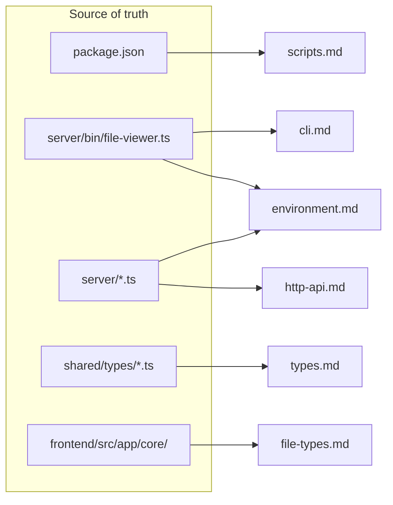

# Reference

Mechanical reference material generated from the source of
truth in `server/`, `shared/`, `frontend/`, and `package.json`.

## Pages

- **[CLI](./cli.md)** — `grove` + `grove build-wiki` full flag list
- **[HTTP API](./http-api.md)** — `/api/documents`, `/api/open`,
  `/api/capabilities`, `_content/*`
- **[Environment variables](./environment.md)** — every env var
  Grove reads
- **[npm scripts](./scripts.md)** — every script in the root
  `package.json`
- **[File types](./file-types.md)** — preview matrix, icon set,
  syntax-highlight grammars
- **[Shared types](./types.md)** — the TypeScript contracts
  shared between server and frontend

## Where things live

## See also

- [Architecture overview](../architecture/index.md)
- [Guides](../guides/index.md)
- [Back to docs home](../index.md)
