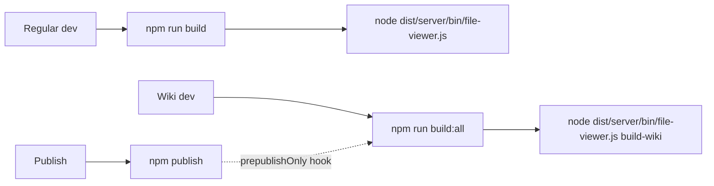

# npm scripts

Scripts defined in the root
[`package.json`](https://github.com/MorizMensi/grove/blob/main/package.json).
The `frontend/` workspace has its own `package.json` but no
custom scripts beyond Angular CLI defaults.

<!-- AUTO-GENERATED -->

| Command | Description |
| --- | --- |
| `npm run build:frontend` | Angular production build. Runs `ng build --configuration production` inside `frontend/`, producing `dist/frontend/browser/`. |
| `npm run build:server` | TypeScript compile for the server + shared types. Runs `tsc -p tsconfig.json`, producing `dist/server/` and `dist/shared/`. |
| `npm run build` | Full dev build: `build:frontend` then `build:server`. This is what you run before `node dist/server/bin/file-viewer.js`. |
| `npm run build:wiki` | Angular wiki build. Runs `ng build --configuration wiki`, producing `dist/frontend/wiki/` with the `/__GROVE_BASE__/` placeholder in `index.html`. |
| `npm run build:all` | Runs `build` and then `build:wiki`. Required before `grove build-wiki`. |
| `npm run prepublishOnly` | Runs `build:all`. npm runs it automatically before publishing the package. |

<!-- /AUTO-GENERATED -->

## When to run which



Rules of thumb:

- **Touching `server/` only** → `npm run build:server`
- **Touching `frontend/` only** → `cd frontend && npx ng build
  --configuration development --watch` (interactive) or
  `npm run build:frontend` (one-shot).
- **Touching anything + testing end-to-end** → `npm run build`
- **Testing wiki mode** → `npm run build:all` plus a
  `grove build-wiki` invocation.
- **Publishing** → `npm publish` (which runs `prepublishOnly`).

## Pre-publish hook

`prepublishOnly` runs automatically on `npm publish`. It calls
`build:all`, which guarantees both the server bundle and the
wiki bundle ship in the tarball. The `files` field in
`package.json` is limited to `"dist/"`, so anything outside
`dist/` (source trees, tests, docs) is excluded.

Package metadata:

- **Name**: `grovemd` (the unscoped `grove` name is held by a
  dormant package)
- **Bin**: `grove` → `dist/server/bin/file-viewer.js`
- **Engines**: Node `>=20`

## Watch-mode development

Angular:

```bash
cd frontend
npx ng build --configuration development --watch
```

Server:

```bash
# no built-in watcher — either re-run tsc, or use nodemon:
npx tsc -p tsconfig.json --watch
```

A concurrent dev loop (server watch + frontend watch + server
restart) is not provided out of the box. Most contributors run
one watch for whichever layer they're touching.

## CI

The `build.yml` workflow runs `npm run build` and verifies the
output tree. The `pages.yml` workflow runs `build-wiki.yml`
(which runs `npm run build:all` via `workflow_call`). See
[architecture/wiki-mode](../architecture/wiki-mode.md#github-actions-pipeline).

## See also

- [CLI reference](./cli.md)
- [Contributing](../contributing.md)
- [Architecture overview](../architecture/overview.md)
- [Back to reference index](./overview.md)
