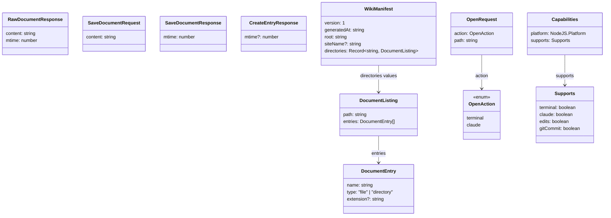

# Shared types

TypeScript contracts shared between the Express server and the
Angular frontend. Source:
[`shared/`](https://github.com/MorizMensi/grove/tree/main/shared).

## Import paths

| Consumer | Import form |
| --- | --- |
| Server (`server/*.ts`) | `from '../shared/types/<name>.js'` (relative) |
| Frontend (`frontend/src/app/**`) | `from '@shared/types/<name>'` (ts path alias) |

The frontend alias is declared in `frontend/tsconfig.json`; the
server uses direct relative imports because `dist/server/*.js`
and `dist/shared/*.js` are siblings after compilation. See
[architecture/index](../architecture/overview.md#source-roots).

The server-side import path uses `.js` extensions on TS sources
(`NodeNext` module resolution). Do not switch to `.ts` extensions or
bare imports — the TypeScript compiler preserves the `.js` suffix in
the emitted JavaScript, and Node's ESM loader requires it.

## Index



## `DocumentEntry`

File:
[`shared/types/documents.ts`](https://github.com/MorizMensi/grove/blob/main/shared/types/documents.ts)

```ts
export interface DocumentEntry {
  name: string;                      // stem (no extension)
  type: 'file' | 'directory';
  extension?: string;                // lower-case, no leading dot
}
```

Consumer behaviour:

- The **frontend** uses `type` + `extension` to pick an icon
  (see [file-types](./file-types.md)) and to build routerLink /
  query-param pairs for listings and sidebars.
- The **server** returns entries in this shape from
  `GET /api/documents`.
- The **wiki manifest builder** emits entries in this shape
  inside `directories[<path>].entries`.

## `DocumentListing`

```ts
export interface DocumentListing {
  path: string;                      // relative to docs root
  entries: DocumentEntry[];          // sorted: dirs first, then alpha
}
```

Used as the response of
[`GET /api/documents`](./http-api.md#get-apidocuments) and as
the value type of `WikiManifest.directories`.

## `RawDocumentResponse`

```ts
export interface RawDocumentResponse {
  content: string;
  /** File mtime in milliseconds since the Unix epoch. */
  mtime: number;
}
```

Returned from
[`GET /api/documents/raw`](./http-api.md#get-apidocumentsraw). The
`mtime` is `stat.mtimeMs` — a fractional millisecond value on most
filesystems. The client stashes it verbatim and sends it back as
`If-Unmodified-Since` on the next save.

## `SaveDocumentRequest` / `SaveDocumentResponse`

```ts
export interface SaveDocumentRequest {
  content: string;
}

export interface SaveDocumentResponse {
  mtime: number;
}
```

Body and response of
[`PUT /api/documents`](./http-api.md#put-apidocuments). The server
does not echo the content — the client already has it.

## `CreateEntryKind` / `CreateEntryResponse`

```ts
export type CreateEntryKind = 'file' | 'dir';

export interface CreateEntryResponse {
  mtime?: number;   // present for files, omitted for directories
}
```

Used by [`POST /api/documents`](./http-api.md#post-apidocuments).
`mtime` is omitted on directory creates because empty directories
have no meaningful content-hash or change timestamp that clients
need to track for conflict detection.

## `OpenAction` / `OpenRequest`

File:
[`shared/types/open.ts`](https://github.com/MorizMensi/grove/blob/main/shared/types/open.ts)

Unlike the documents types, this module **exports a zod schema** as
well as the TypeScript type. The schema is used on the server for
request validation:

```ts
export const OpenActionSchema = z.enum(['terminal', 'claude']);
export type  OpenAction = z.infer<typeof OpenActionSchema>;

export const OpenRequestSchema = z.object({
  action: OpenActionSchema,
  path: z.string().refine(
    (p) => !p.includes('..') && !p.startsWith('/'),
    'Invalid path',
  ),
});
export type OpenRequest = z.infer<typeof OpenRequestSchema>;
```

The frontend only imports the type (not the runtime schema), so
zod is **server-only** at runtime. The one runtime export
(`OpenRequestSchema`) is pulled into the server via relative
import and never appears in the Angular bundle.

> `'zed'` was removed from `OpenActionSchema` when the in-browser
> editor replaced the Zed integration. A request with
> `{ action: 'zed' }` now returns 400 with the zod error format.
> Any frontend reference to `'zed'` is a bug.

## `Capabilities`

Lives on the server in
[`server/capabilities.ts`](https://github.com/MorizMensi/grove/blob/main/server/capabilities.ts)
and is re-declared structurally on the frontend in
[`core/services/capabilities.service.ts`](https://github.com/MorizMensi/grove/blob/main/frontend/src/app/core/services/capabilities.service.ts).

```ts
export interface Capabilities {
  platform: NodeJS.Platform;
  supports: {
    terminal: boolean;
    claude: boolean;
    /** Reflects --allow-edits. */
    edits: boolean;
    /** Reflects --git-commit. */
    gitCommit: boolean;
  };
}
```

Both interfaces are compatible by name only — there is no
compile-time guarantee. They are deliberately kept in sync; if you
add a new capability, update both at once, and also update
[`OpenActionSchema`](#openaction--openrequest) and the `buildExec`
dispatch in `server/open.ts` if the capability is an action.

### Capability semantics

| Field | Source of truth | UI effect |
| --- | --- | --- |
| `platform` | `process.platform` | Informational; displayed in debug overlays. |
| `supports.terminal` | darwin only | Show/hide Terminal button. |
| `supports.claude` | darwin only | Show/hide Claude Code button. |
| `supports.edits` | `--allow-edits` CLI flag | Show/hide pencil toggle, sidebar `+`, context-menu create/delete. |
| `supports.gitCommit` | `--git-commit` CLI flag | Show/hide "auto-commit" pill in status bar. |

The `supports.edits` field is **not** the security boundary — it
only controls UI visibility. The real gate is
`requireEdits(allowEdits)` middleware in
`server/edits-middleware.ts`, which returns
`403 edits-disabled` on every `PUT/POST/DELETE` when the flag is
absent.

## `WikiManifest`

File:
[`server/wiki/manifest.ts`](https://github.com/MorizMensi/grove/blob/main/server/wiki/manifest.ts)

```ts
export interface WikiManifest {
  version: 1;
  generatedAt: string;                          // ISO date
  root: string;                                 // always ""
  siteName?: string;                            // optional brand name
  directories: Record<string, DocumentListing>; // key = relative dir path
}
```

The `directories` map has a key `""` for the root and a key per
nested directory discovered during the walk. Each value is the
same `DocumentListing` shape the API would return for that path.

The manifest is declared structurally (no export) on the
frontend in `document.service.ts`. Like the capabilities type,
the two declarations are kept in sync by convention.

## `CONTENT_URL_PREFIX`

File:
[`shared/content-url.ts`](https://github.com/MorizMensi/grove/blob/main/shared/content-url.ts)

```ts
export const CONTENT_URL_PREFIX = '_content';
```

The single source of truth for the raw-docs URL namespace. Used
by:

- `server/index.ts` — Express static mount
- `server/wiki/build.ts` — wiki output directory structure
- `frontend/src/app/core/services/document.service.ts` — raw
  file fetch
- `frontend/src/app/features/document-shell/document-shell.component.ts`
  — media URL construction

Changing this constant changes the URL namespace everywhere at
once.

## Server-only types (not in `shared/`)

A handful of types are server-only and worth knowing:

### `CommitVerb`

`server/git.ts`:

```ts
export type CommitVerb = 'edit' | 'create' | 'delete' | 'mkdir' | 'rmdir';
```

Used by `commitChange(docsDir, absPath, verb)` to build the commit
message `grove: <verb> <rel>`. `mkdir` and `rmdir` are defined but
never invoked — directory ops short-circuit the git path. They
remain in the type so a future commit-on-mkdir policy change is a
one-line edit.

### `CommitOutcome`

```ts
export type CommitOutcome =
  | { status: 'committed' }
  | { status: 'nothing-to-commit' }
  | { status: 'failed'; reason: string };
```

Returned by `commitChange`. "Nothing to commit" is a first-class
outcome, not an error — re-saving identical content is a valid
workflow that should not surface a 500.

### `DisabledSecurity` / `DisabledSecuritySet`

`server/security-options.ts`:

```ts
export const DISABLED_SECURITY_VALUES = ['allow-symlinks'] as const;
export type DisabledSecurity = (typeof DISABLED_SECURITY_VALUES)[number];
export type DisabledSecuritySet = ReadonlySet<DisabledSecurity>;
```

Adding a new escape hatch: append to `DISABLED_SECURITY_VALUES`,
wire it through `CreateAppOptions`, and document it in
[`cli.md`](./cli.md#--disable-security-csv).

### `PathError`

`server/path-sandbox.ts`:

```ts
export type PathErrorCode = 'forbidden';

export class PathError extends Error {
  readonly code: PathErrorCode;
}
```

Thrown by `ensureInside`. Every path-consuming route catches
`PathError` and maps it to 403 `forbidden`. If the error is
anything else, the route re-throws to the default Express error
handler.

## See also

- [HTTP API reference](./http-api.md)
- [File types](./file-types.md)
- [DocLang renderer](../architecture/doclang.md)
- [Security model](../architecture/security.md)
- [Editor architecture](../architecture/editor.md)
- [Back to reference index](./overview.md)
