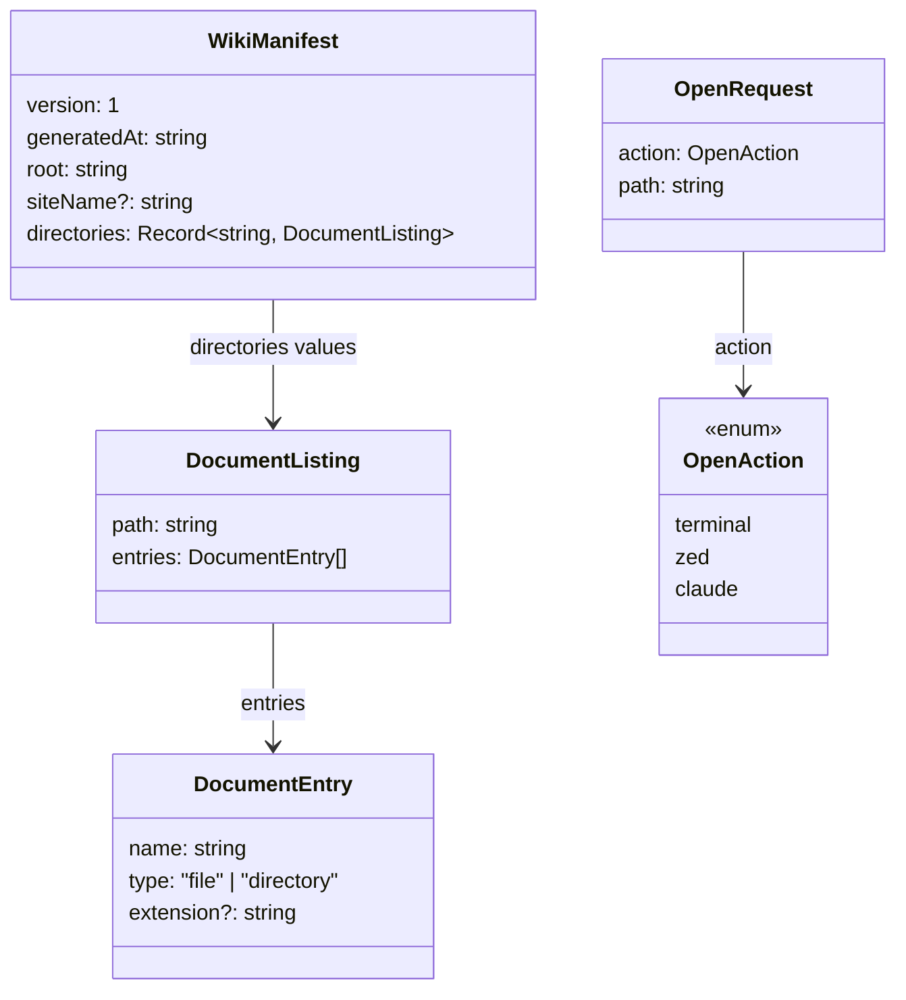

# Shared types

TypeScript contracts shared between the Express server and the
Angular frontend. Source:
[`shared/`](https://github.com/MorizMensi/grove/tree/main/shared).

## Import paths

| Consumer | Import form |
| --- | --- |
| Server (`server/*.ts`) | `from '../shared/types/<name>.js'` (relative) |
| Frontend (`frontend/src/app/**`) | `from '@shared/types/<name>'` (ts path alias) |

The frontend alias is declared in `frontend/tsconfig.json`; the
server uses direct relative imports because `dist/server/*.js`
and `dist/shared/*.js` are siblings after compilation. See
[architecture/index](../architecture/overview.md#source-roots).

## Index



## `DocumentEntry`

File:
[`shared/types/documents.ts`](https://github.com/MorizMensi/grove/blob/main/shared/types/documents.ts)

```ts
export interface DocumentEntry {
  name: string;                      // stem (no extension)
  type: 'file' | 'directory';
  extension?: string;                // lower-case, no leading dot
}
```

Consumer behavior:

- The **frontend** uses `type` + `extension` to pick an icon
  (see [file-types](./file-types.md)) and to build routerLink /
  query-param pairs for listings and sidebars.
- The **server** returns entries in this shape from
  `GET /api/documents`.
- The **wiki manifest builder** emits entries in this shape
  inside `directories[<path>].entries`.

## `DocumentListing`

```ts
export interface DocumentListing {
  path: string;                      // relative to docs root
  entries: DocumentEntry[];          // sorted: dirs first, then alpha
}
```

Used as the response of
[`GET /api/documents`](./http-api.md#get-apidocuments) and as
the value type of `WikiManifest.directories`.

## `OpenAction` / `OpenRequest`

File:
[`shared/types/open.ts`](https://github.com/MorizMensi/grove/blob/main/shared/types/open.ts)

Unlike the documents types, this module **exports a zod schema**
as well as the TypeScript type. The schema is used on the server
for request validation:

```ts
export const OpenActionSchema = z.enum(['terminal', 'zed', 'claude']);
export type  OpenAction = z.infer<typeof OpenActionSchema>;

export const OpenRequestSchema = z.object({
  action: OpenActionSchema,
  path: z.string().refine(
    (p) => !p.includes('..') && !p.startsWith('/'),
    'Invalid path',
  ),
});
export type OpenRequest = z.infer<typeof OpenRequestSchema>;
```

The frontend only imports the type (not the runtime schema), so
zod is **server-only** at runtime. The one runtime export
(`OpenRequestSchema`) is pulled into the server via relative
import and never appears in the Angular bundle.

## `Capabilities`

Not strictly in `shared/` — lives on the server in
[`server/capabilities.ts`](https://github.com/MorizMensi/grove/blob/main/server/capabilities.ts)
and is re-declared structurally on the frontend in
[`core/services/capabilities.service.ts`](https://github.com/MorizMensi/grove/blob/main/frontend/src/app/core/services/capabilities.service.ts).

```ts
export interface Capabilities {
  platform: NodeJS.Platform;
  supports: {
    terminal: boolean;
    zed: boolean;
    claude: boolean;
  };
}
```

Both interfaces are compatible by name only — there is no
compile-time guarantee. They are deliberately kept in sync; if
you add a new action, update both at once, and also update
[`OpenActionSchema`](#openaction--openrequest) and the
`buildExec` dispatch in `server/open.ts`.

## `WikiManifest`

File:
[`server/wiki/manifest.ts`](https://github.com/MorizMensi/grove/blob/main/server/wiki/manifest.ts)

```ts
export interface WikiManifest {
  version: 1;
  generatedAt: string;                          // ISO date
  root: string;                                 // always ""
  siteName?: string;                            // optional brand name
  directories: Record<string, DocumentListing>; // key = relative dir path
}
```

The `directories` map has a key `""` for the root and a key per
nested directory discovered during the walk. Each value is the
same `DocumentListing` shape the API would return for that path.

The manifest is declared structurally (no export) on the
frontend in `document.service.ts`. Like the capabilities type,
the two declarations are kept in sync by convention.

## `CONTENT_URL_PREFIX`

File:
[`shared/content-url.ts`](https://github.com/MorizMensi/grove/blob/main/shared/content-url.ts)

```ts
export const CONTENT_URL_PREFIX = '_content';
```

The single source of truth for the raw-docs URL namespace. Used
by:

- `server/index.ts` — Express static mount
- `server/wiki/build.ts` — wiki output directory structure
- `frontend/src/app/core/services/document.service.ts` — raw
  file fetch
- `frontend/src/app/features/document-shell/document-shell.component.ts`
  — media URL construction

Changing this constant changes the URL namespace everywhere at
once.

## See also

- [HTTP API reference](./http-api.md)
- [File types](./file-types.md)
- [DocLang renderer](../architecture/doclang.md)
- [Security model](../architecture/security.md)
- [Back to reference index](./overview.md)
