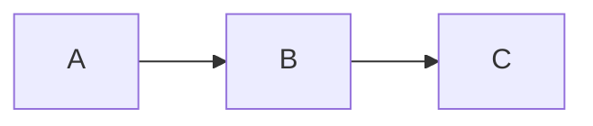

# Usage

A tour of what Grove renders and how you navigate it day to day.
For editing-specific workflows (pencil toggle, save, sidebar CRUD,
conflict handling), see the [Editing guide](./guides/editing.md).

## Browsing a folder

The root URL shows the top-level listing. Directories come first,
then files, both alphabetically. Clicking a directory navigates
into it; clicking a file opens the file view.

Breadcrumbs at the top let you jump back to any parent. The Grove
brand mark in the top-left is always a link to the root.

When viewing a file, an **"In this folder"** sidebar lists its
siblings so you can click between them without going back to the
parent listing.

## Supported markdown

Grove renders with [`remark`](https://github.com/remarkjs/remark)
using the GFM and math extensions, so the following all work:

- Headings with auto-generated anchor IDs
- Paragraphs, bold, italic, strikethrough, inline code
- Ordered and unordered lists, including nested lists
- [GFM task lists](https://github.github.com/gfm/#task-list-items-extension-)
  (`- [ ]` / `- [x]`)
- Tables with column alignment
- Blockquotes
- Fenced code blocks with language hints
- Footnotes (`[^1]`)
- Autolinks and inline links, including relative links between
  markdown files

## Code blocks

Fenced code blocks get syntax highlighting via
[highlight.js](https://highlightjs.org/) — 190+ languages
supported. The language hint after the opening fence picks the
grammar:

````markdown
```typescript
const x: number = 42;
```
````

A small **Copy** button appears in the top-right of every code
block.

## Math

Inline and block math use KaTeX:

```markdown
Inline: $E = mc^2$

Block:

$$
\int_0^\infty e^{-x^2}\,dx = \frac{\sqrt{\pi}}{2}
$$
```

In edit mode, **inline** math reveals its `$…$` markers when the
caret enters the span. **Block** math (`$$…$$`) stays as raw source
while editing and renders through KaTeX on save — block math as a
CM6 widget is tracked for a future release.

## Diagrams

Mermaid diagrams are rendered from `mermaid` code fences:

````markdown

````

Flowcharts, sequence, class, state, ER, C4, Gantt, and pie chart
types are all supported. In edit mode, Mermaid blocks render as
live block widgets inside the editor buffer — click the top half to
move your caret into the source, the bottom half to continue
below.

## Media previews

Grove previews media files inline when you navigate to them:

- **Images** — png, jpg, gif, webp, avif, svg
- **Video** — mp4, webm, mov
- **Audio** — mp3, m4a, wav, ogg
- **PDF** — rendered in an iframe
- **SVG** — rendered as an image; any markdown adjacent to it also
  renders
- **HTML** — rendered inside a sandboxed iframe with CSP
  `sandbox allow-same-origin; script-src 'none'`. Grove injects
  theme CSS variables so the preview matches the active theme.

The HTML preview is sandboxed at two levels: the iframe `sandbox`
attribute omits `allow-scripts`, and the response ships a
`Content-Security-Policy: sandbox …; script-src 'none'` header. The
invariant (never `allow-scripts`) is enforced at prepublish.

## Anchor navigation

Headings get auto-generated IDs based on a
[GitHub-compatible slug](https://github.com/Flet/github-slugger)
rule. Jumping to `file.md#security-notes` from a link (or the URL
bar) scrolls to the matching heading.

## Internal vs external links

- **Internal** (`./other.md`, `./sub/page.md`) — routed through the
  Angular router, no full page reload. Anchor suffixes work too
  (`./page.md#section`).
- **External** (`https://…`, `mailto:…`) — open in a new tab.
- Unsafe schemes (`javascript:`, `data:`, `file:`, `vbscript:`) are
  filtered out before rendering.

## Action buttons

The header shows action buttons depending on your platform and
capabilities (fetched from `GET /api/capabilities`):

| Button | When shown |
| --- | --- |
| **Edit** (pencil) | `supports.edits === true` (only with `--allow-edits`) and the current file is `.md` |
| **Terminal** | `supports.terminal === true` (darwin only) |
| **Claude Code** | `supports.claude === true` (darwin only) |
| **auto-commit** pill | `supports.gitCommit === true` (`--git-commit` set) |

On non-darwin platforms only the Edit button can appear. The
previous Zed button was removed when the in-browser editor landed.

## Editing (short version)

With `--allow-edits`:

- Click the **pencil** to enter edit mode.
- Type. Inline syntax reveals only when the caret is inside it.
- Press **⌘S** / **Ctrl+S** to save. "Saved" is announced via the
  live region.
- Right-click a sidebar row for **New file**, **New folder**,
  **Delete**.
- Click **Done** or press **Esc** to exit. Dirty buffers prompt
  Save / Discard / Cancel.

Full walkthrough: [Editing guide](./guides/editing.md).

## Search

Not yet. Use your browser's in-page search (`Cmd-F` / `Ctrl-F`) for
now — a real cross-page search index is on the roadmap.

## Keyboard

General navigation is standard browser behaviour (back, forward,
anchor scroll). The sidebar can be toggled with the collapse
button at the right edge of the file view.

In edit mode, the following additional keys are bound:

| Key | Action |
| --- | --- |
| `⌘S` / `Ctrl+S` | Save |
| `Esc` | Exit edit mode (dirty check) |
| `⌘Z` / `Ctrl+Z` | Undo |
| `⌘⇧Z` / `Ctrl+Y` | Redo |
| `⌘F` / `Ctrl+F` | Open CM6 find panel |
| `⌘G` / `Ctrl+G` | Find next |
| `Tab` in list | Indent list item |
| `Shift+Tab` in list | Dedent list item |

In the sidebar, with the context menu open:

| Key | Action |
| --- | --- |
| Right-click / `Shift+F10` | Open context menu |
| Arrow Up/Down | Move through menu items |
| Home/End | Jump to first/last item |
| Enter / Space | Activate menu item |
| Esc | Close menu, restore focus |
| `Alt+N` on directory | New file |
| `Delete` | Delete (with confirm modal) |

## See also

- [Getting started](./getting-started.md) — install + first run
- [Editing guide](./guides/editing.md) — full editor walkthrough
- [How it works](./how-it-works.md) — the CLI → Express →
  Angular flow
- [File types reference](./reference/file-types.md) — the
  full preview widget + highlight grammar matrix
- [DocLang renderer](./architecture/doclang.md) — how
  markdown becomes DOM
- [Troubleshooting](./guides/troubleshooting.md)
- [Back to docs home](./overview.md)
