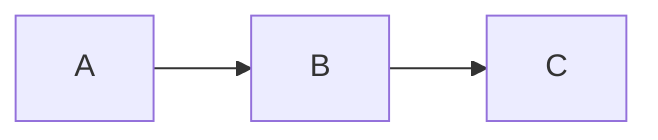

# Usage

A tour of what Grove renders and how you navigate it day to day.

## Browsing a folder

The root URL shows the top-level listing. Directories come first,
then files, both alphabetically. Clicking a directory navigates
into it; clicking a file opens the file view.

Breadcrumbs at the top let you jump back to any parent. The Grove
brand mark in the top-left is always a link to the root.

When viewing a file, an **"In this folder"** sidebar lists its
siblings so you can click between them without going back to the
parent listing.

## Supported markdown

Grove renders with [`remark`](https://github.com/remarkjs/remark)
using the GFM and math extensions, so the following all work:

- Headings with auto-generated anchor IDs
- Paragraphs, bold, italic, strikethrough, inline code
- Ordered and unordered lists, including nested lists
- [GFM task lists](https://github.github.com/gfm/#task-list-items-extension-)
  (`- [ ]` / `- [x]`)
- Tables with column alignment
- Blockquotes
- Fenced code blocks with language hints
- Footnotes (`[^1]`)
- Autolinks and inline links, including relative links between
  markdown files

## Code blocks

Fenced code blocks get syntax highlighting via
[highlight.js](https://highlightjs.org/) — 190+ languages
supported. The language hint after the opening fence picks the
grammar:

````markdown
```typescript
const x: number = 42;
```
````

A small **Copy** button appears in the top-right of every code
block.

## Math

Inline and block math use KaTeX:

```markdown
Inline: $E = mc^2$

Block:

$$
\int_0^\infty e^{-x^2}\,dx = \frac{\sqrt{\pi}}{2}
$$
```

## Diagrams

Mermaid diagrams are rendered from `mermaid` code fences:

````markdown

````

Flowcharts, sequence, class, state, ER, C4, Gantt, and pie chart
types are all supported.

## Media previews

Grove previews media files inline when you navigate to them:

- **Images** — png, jpg, gif, webp, avif, svg
- **Video** — mp4, webm, mov
- **Audio** — mp3, m4a, wav, ogg
- **PDF** — rendered in an iframe
- **SVG** — rendered as an image; any markdown adjacent to it also renders

## Anchor navigation

Headings get auto-generated IDs based on a
[GitHub-compatible slug](https://github.com/Flet/github-slugger)
rule. Jumping to `file.md#security-notes` from a link (or the URL
bar) scrolls to the matching heading.

## Internal vs external links

- **Internal** (`./other.md`, `./sub/page.md`) — routed through the
  Angular router, no full page reload. Anchor suffixes work too
  (`./page.md#section`).
- **External** (`https://…`, `mailto:…`) — open in a new tab.
- Unsafe schemes (`javascript:`, `data:`, `file:`, `vbscript:`) are
  filtered out before rendering.

## Action buttons

The header shows up to three action buttons depending on your
platform and capabilities (fetched from `GET /api/capabilities`):

- **Terminal** — open the current folder in a new Terminal window
- **Zed** — open the current folder (or file, when viewing a file)
  in Zed
- **Claude Code** — spawn a `claude` session in a Terminal window
  pointed at the current folder

On non-darwin platforms only **Zed** is available.

## Search

Not yet. Use your browser's in-page search (`Cmd-F` / `Ctrl-F`) for
now — a real cross-page search index is on the roadmap.

## Keyboard

The sidebar can be toggled with the collapse button at the right
edge of the file view. All other navigation is standard browser
behavior (back, forward, anchor scroll, etc.).

## See also

- [Getting started](./getting-started.md) — install + first run
- [How it works](./how-it-works.md) — the CLI → Express →
  Angular flow
- [File types reference](./reference/file-types.md) — the
  full preview widget + highlight grammar matrix
- [DocLang renderer](./architecture/doclang.md) — how
  markdown becomes DOM
- [Troubleshooting](./guides/troubleshooting.md)
- [Back to docs home](./index.md)
